<p align="center">
  
</p>

# NeoMind

> **Edge-Deployed LLM Agent Platform for IoT Automation**

NeoMind is a Rust-based edge AI platform that enables autonomous device management and automated decision-making through Large Language Models (LLMs).

[](https://github.com/camthink-ai/NeoMind/actions/workflows/build.yml)
[](LICENSE)
[](https://github.com/camthink-ai/NeoMind/releases)
[](https://www.rust-lang.org)
[](https://github.com/camthink-ai/NeoMind/releases)


<div align="center">
  <table>
    <tr>
      <td width="65%" align="center">
        <table width="100%">
          <tr>
            <td align="center">
              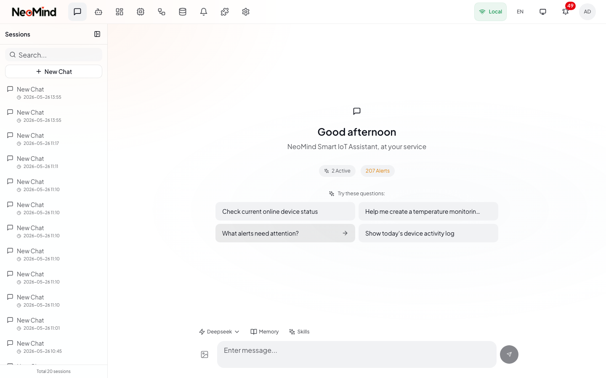
              <br/>
              <sub>Light Theme</sub>
            </td>
          </tr>
          <tr>
            <td align="center" style="padding-top: 10px;">
              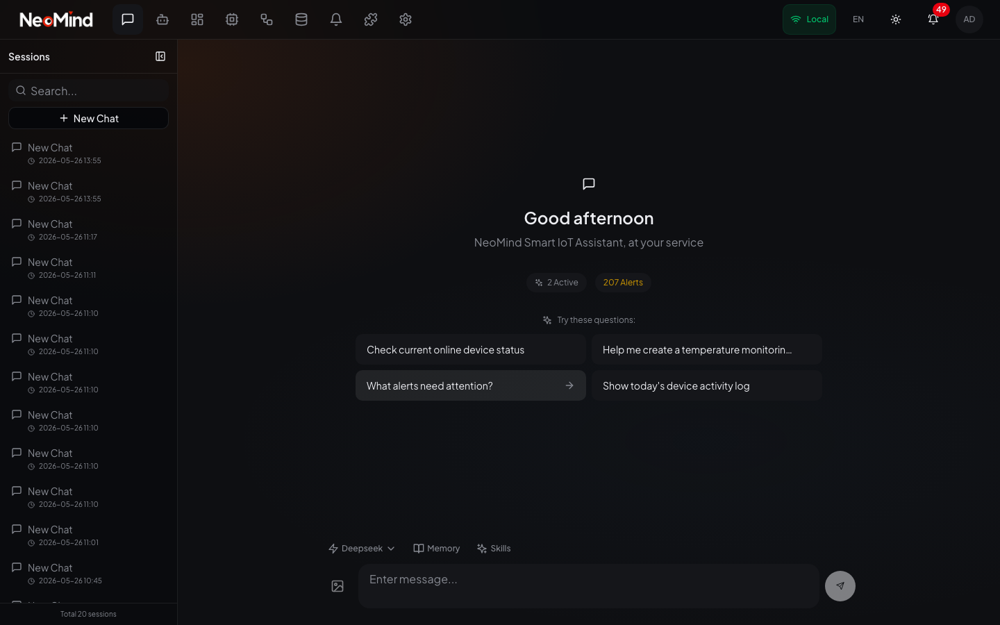
              <br/>
              <sub>Dark Theme</sub>
            </td>
          </tr>
        </table>
        <sub><b>💻 Desktop Application</b></sub>
      </td>
      <td width="35%" align="center" valign="top">
        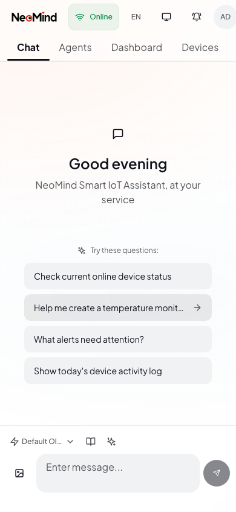
        <br/>
        <sub>📱 Mobile Web</sub>
      </td>
    </tr>
  </table>
</div>


## Features

### 🧠 LLM as System Brain
- **Interactive Chat**: Natural language interface for querying and controlling devices
- **AI Agents**: Autonomous agents with tool calling capabilities for automation
- **Focused & Free Mode**: Two execution modes — Focused Mode for scoped, single-pass monitoring tasks; Free Mode for multi-round open-ended reasoning
- **AI Metrics**: Agents can create and query custom time-series metrics (anomaly scores, predictions, derived indicators) via the `ai_metric` tool
- **Shell Tool**: Agents can execute system commands with login shell environment support
- **Skill System**: User-defined YAML+Markdown skills for scenario-driven agent operation guides
- **Aggregated Tools**: Token-efficient tool definitions that reduce context usage by 60%+
- **Multi-Backend Support**: Ollama, OpenAI, Anthropic, Google, xAI, Qwen, DeepSeek, GLM, MiniMax (including thinking model compatibility)

### 🔌 Modular Device Integration
- **MQTT Protocol**: Primary device integration with embedded broker, mTLS and CA certificate support
- **Device Discovery**: Automatic device detection and type registration
- **HTTP/Webhook**: Flexible device adapter options
- **Auto-Onboarding**: AI-assisted device registration from data samples

### ⚡ Event-Driven Architecture
- **Real-time Response**: Device changes automatically trigger rules and automations
- **Decoupled Design**: All components communicate via event bus
- **Multiple Transports**: REST API, WebSocket, SSE

### 📦 Complete Storage System
- **Time-Series**: Device metrics history and queries (redb)
- **State Storage**: Device states, automation execution records
- **LLM Memory**: Category-based memory system (Profile, Knowledge, Tasks, Evolution) with LLM-powered extraction and compression. Agent execution automatically discovers thresholds, baselines, and optimization insights as `system_evolution` memories.
- **Vector Search**: Semantic search across devices and rules
- **Data Explorer**: Unified interface for browsing and exploring time-series data

### 🧩 Unified Extension System (V2)
- **Dynamic Loading**: Runtime extension loading/unloading
- **Native & WASM**: Support for .so/.dylib/.dll and .wasm extensions
- **Device-Standard**: Extensions use same type system as devices
- **Process Isolation**: Secure execution with automatic recovery on crashes

### 🖥️ Desktop Application
- **Cross-Platform**: macOS, Windows, Linux native apps
- **Modern UI**: React 18 + TypeScript + Tailwind CSS
- **System Tray**: Background operation with quick access
- **Auto-Update**: Built-in update notifications
  

## 📸 More Screenshots

<details>
<summary>Click to view more interface screenshots</summary>

<br/>

**Login**
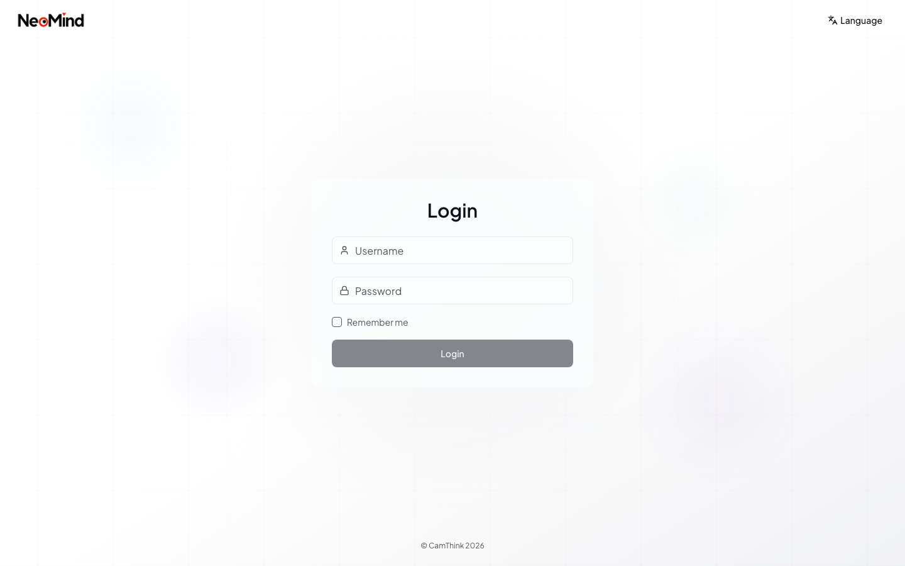

**Chat**
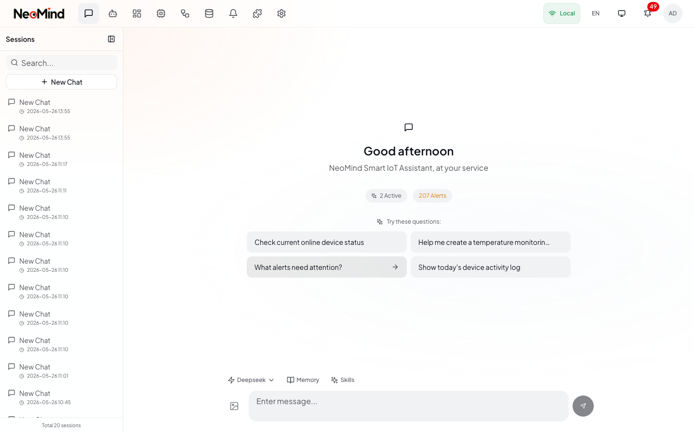

**AI Agent**
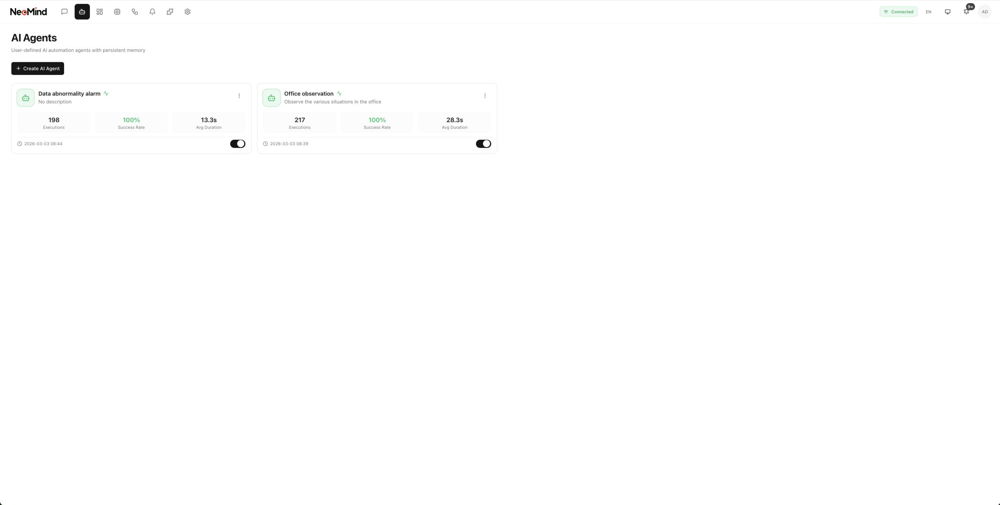
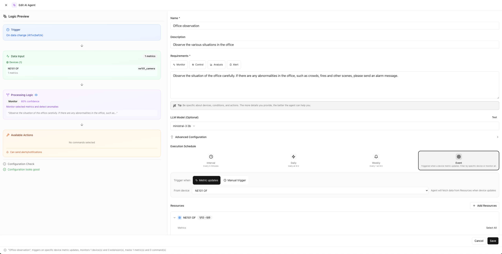
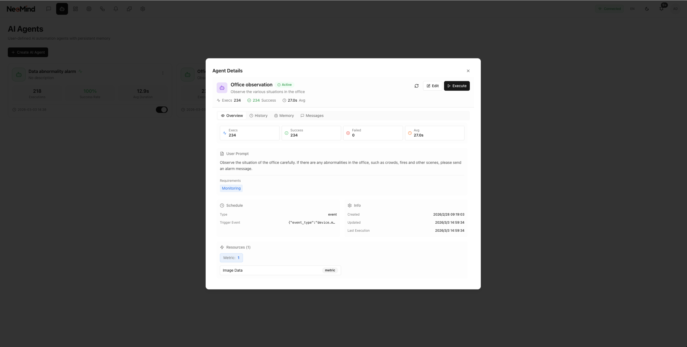

**Dashboard**


**Device Management**
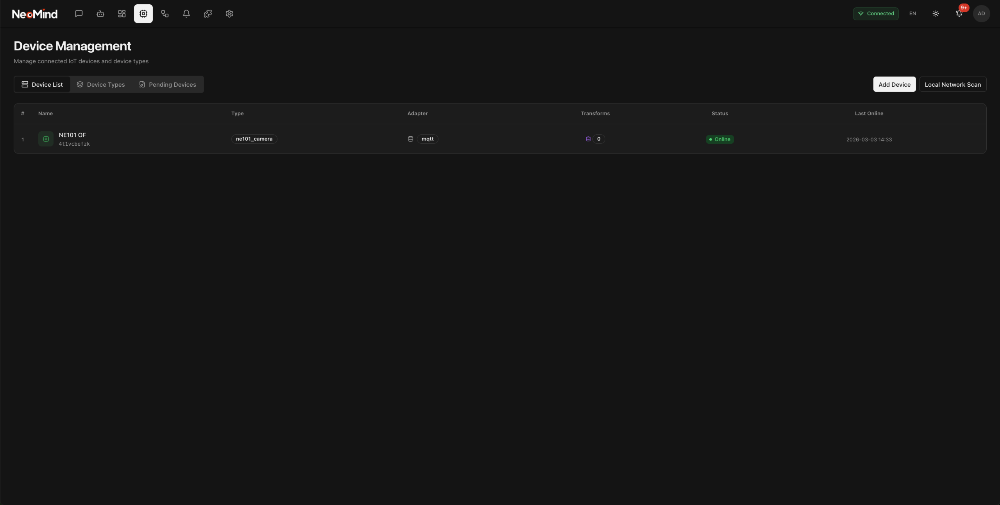
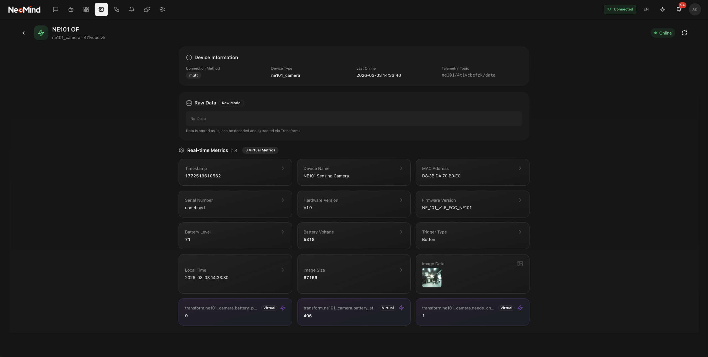
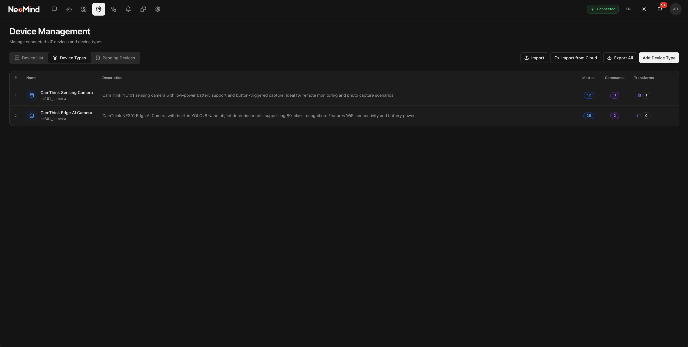
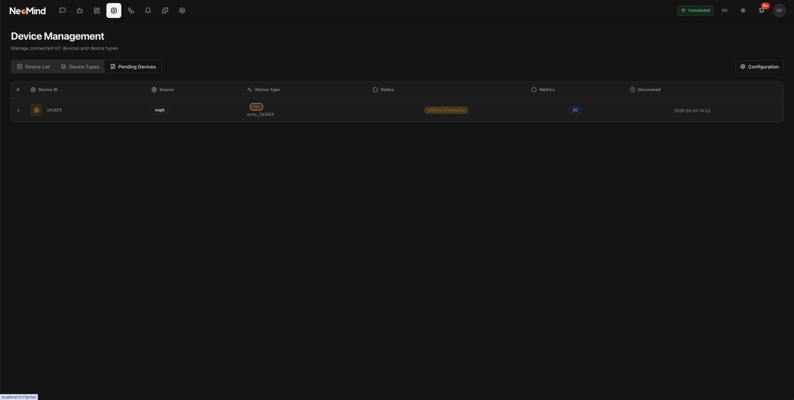

**Automation**

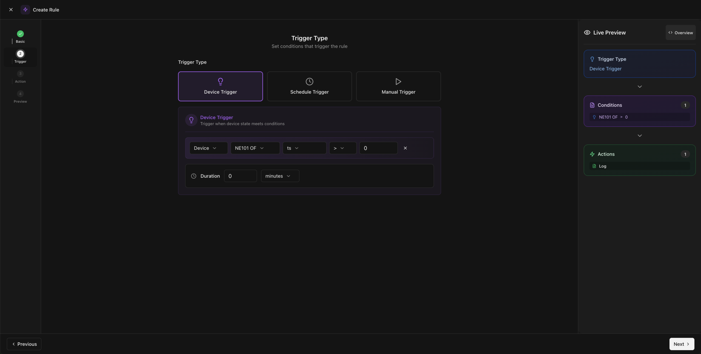
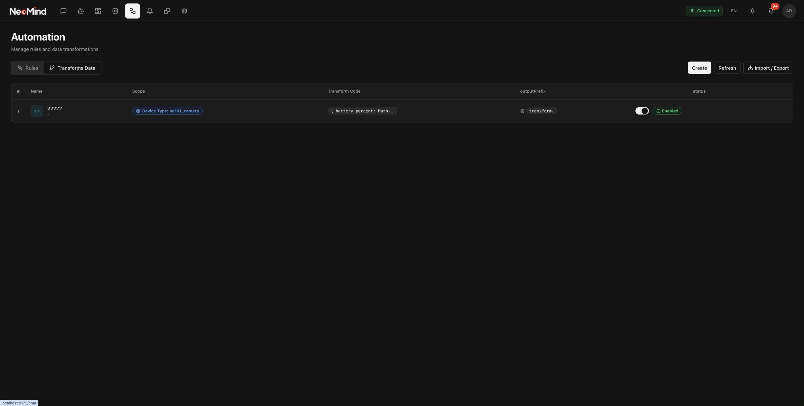
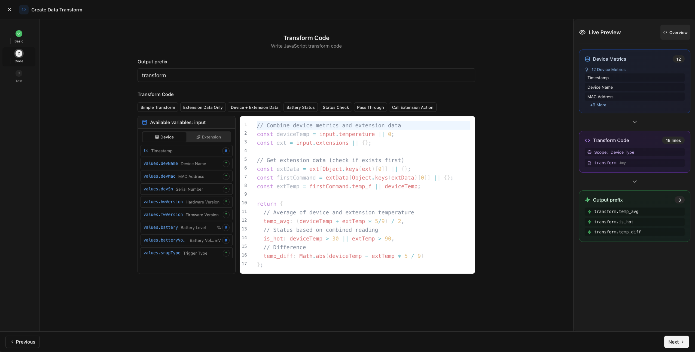

**Messages**
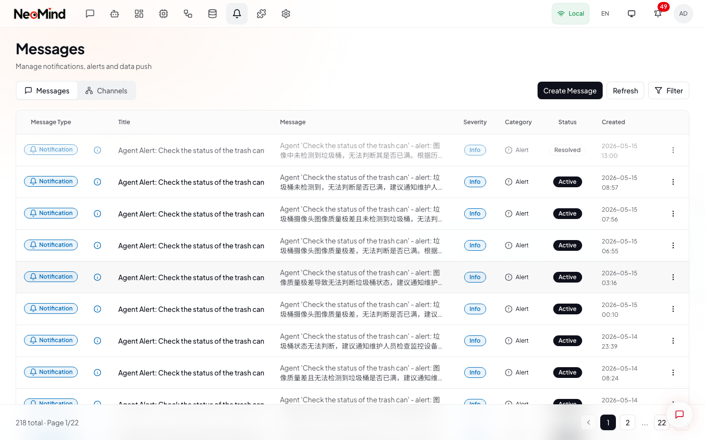

**Extensions**
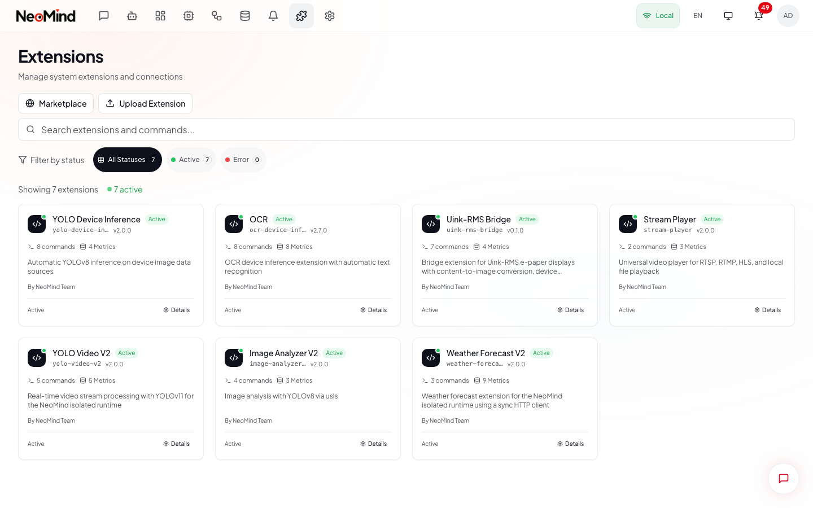

**System**
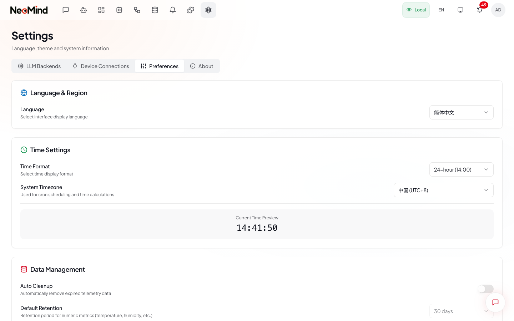

</details>

## Quick Start

Choose your deployment method:

### 📱 Desktop App (Recommended for End Users)

Download the latest release for your platform from [Releases](https://github.com/camthink-ai/NeoMind/releases/latest).

**Supported Platforms:**
- macOS (Apple Silicon + Intel) - `.dmg`
- Windows - `.msi` / `.exe`
- Linux - `.AppImage` / `.deb`

On first launch, a setup wizard will guide you through:
1. Creating an admin account
2. Configuring LLM backend (Ollama recommended for edge deployment)
3. Connecting to your MQTT broker or discovering devices

### 🖥️ Server Binary Deployment

> **All-in-One**: The server serves both API and Web UI. No nginx required.

**What's included:**
- **neomind** - API server binary with built-in static file serving (~50 MB)
- **neomind-extension-runner** - Extension process for sandboxed extensions (~8 MB)
- **neomind-web-{version}.tar.gz** - Frontend static files

**One-line installation (Linux & macOS):**

```bash
curl -fsSL https://raw.githubusercontent.com/camthink-ai/NeoMind/main/scripts/install.sh | sh
```

After installation, access `http://your-server:9375` in your browser.

**Install specific version:**

```bash
curl -fsSL https://raw.githubusercontent.com/camthink-ai/NeoMind/main/scripts/install.sh | VERSION=0.6.10 sh
```

**Custom installation:**

```bash
# Custom directories
curl -fsSL https://raw.githubusercontent.com/camthink-ai/NeoMind/main/scripts/install.sh | INSTALL_DIR=~/.local/bin DATA_DIR=~/.neomind sh

# Skip service installation
curl -fsSL https://raw.githubusercontent.com/camthink-ai/NeoMind/main/scripts/install.sh | NO_SERVICE=true sh

# Use nginx for frontend-backend separation (port 80)
curl -fsSL https://raw.githubusercontent.com/camthink-ai/NeoMind/main/scripts/install.sh | USE_NGINX=true sh
```

**Supported platforms:**
- Linux (x86_64/amd64, aarch64/arm64)
- macOS (Intel, Apple Silicon)

**What the script does:**
1. Detects your OS and architecture automatically
2. Downloads the server binary and frontend static files
3. Installs to `/usr/local/bin` (or custom directory)
4. Creates systemd service (Linux) or launchd service (macOS)
5. Starts the service — access Web UI at `http://your-server:9375`

**Manual installation:**

```bash
# 1. Download server binary and frontend (replace VERSION and PLATFORM)
# PLATFORM: linux-amd64, linux-arm64, darwin-arm64
VERSION=0.6.10

wget https://github.com/camthink-ai/NeoMind/releases/download/v${VERSION}/neomind-server-linux-amd64.tar.gz
wget https://github.com/camthink-ai/NeoMind/releases/download/v${VERSION}/neomind-web-${VERSION}.tar.gz

# 2. Extract and install server
tar xzf neomind-server-linux-amd64.tar.gz
sudo install -m 755 neomind /usr/local/bin/
sudo install -m 755 neomind-extension-runner /usr/local/bin/

# 3. Deploy frontend to nginx
sudo mkdir -p /var/www/neomind
sudo tar xzf neomind-web-${VERSION}.tar.gz -C /var/www/neomind

# 4. Start the API server
./neomind serve
```

**Nginx configuration** (required for Web UI):

```nginx
server {
    listen 80;
    server_name _;

    root /var/www/neomind;
    index index.html;

    # SPA routing
    location / {
        try_files $uri $uri/ /index.html;
    }

    # API reverse proxy
    location /api/ {
        proxy_pass http://127.0.0.1:9375/api/;
        proxy_http_version 1.1;
        proxy_set_header Upgrade $http_upgrade;
        proxy_set_header Connection "upgrade";
        proxy_set_header Host $host;
        proxy_set_header X-Real-IP $remote_addr;
        proxy_read_timeout 86400;
    }
}
```

**Access the application:**
- Web UI: http://your-server (port 80 via nginx)
- API: http://localhost:9375/api
- API Docs: http://localhost:9375/api/docs

### 💻 Development Mode

#### Prerequisites

- Rust 1.85+
- Node.js 20+
- Ollama (local LLM) or OpenAI API key

#### 1. Install Ollama

```bash
# Linux/macOS
curl -fsSL https://ollama.com/install.sh | sh

# Pull a lightweight model
ollama pull qwen2.5:3b
```

#### 2. Start Backend

```bash
# Clone repository
git clone https://github.com/camthink-ai/NeoMind.git
cd NeoMind

# Build and run API server
cargo run -p neomind-cli -- serve
```

The server will start on `http://localhost:9375` by default.

#### 3. Start Frontend

```bash
cd web
npm install
npm run dev
```

Open `http://localhost:5173` in your browser.

#### 4. Build Desktop App

```bash
cd web
npm install
npm run tauri:build
```

The installer will be in `web/src-tauri/target/release/bundle/`

---

## Deployment Options

| Method | Use Case | Platforms |
|--------|----------|-----------|
| **Desktop App** | End-user desktop application (all-in-one) | macOS, Windows, Linux |
| **Server Binary** | Server/headless deployment (all-in-one, no nginx needed) | Linux (amd64/arm64), macOS |
| **One-line Install** | Quick server setup — Web UI served by the server itself | `curl -fsSL ... \| sh` |

---

## Configuration

| File | Description |
|------|-------------|
| `config.minimal.toml` | Minimal config for quick start |
| `config.toml` | Full configuration (created from minimal) |

### LLM Backend Support

| Backend | Feature Flag | Default Endpoint |
|---------|--------------|------------------|
| Ollama | `ollama` | `http://localhost:11434` |
| OpenAI | `openai` | `https://api.openai.com/v1` |
| Anthropic | `anthropic` | `https://api.anthropic.com/v1` |
| Google | `google` | `https://generativelanguage.googleapis.com/v1beta` |
| xAI | `xai` | `https://api.x.ai/v1` |
| Qwen (阿里云) | `cloud` | `https://dashscope.aliyuncs.com/compatible-mode/v1` |
| DeepSeek | `cloud` | `https://api.deepseek.com/v1` |
| GLM (智谱) | `cloud` | `https://open.bigmodel.cn/api/paas/v4` |
| MiniMax | `cloud` | `https://api.minimax.chat/v1` |

> **Note**: Qwen, DeepSeek, GLM, and MiniMax use OpenAI-compatible APIs and are enabled via the `cloud` feature.

### Environment Variables

| Variable | Default | Description |
|----------|---------|-------------|
| `RUST_LOG` | `info` | Log level (trace, debug, info, warn, error) |
| `NEOMIND_DATA_DIR` | `/var/lib/neomind` | Data directory |
| `NEOMIND_BIND_ADDR` | `0.0.0.0:9375` | Bind address |
| `SERVER_PORT` | `9375` | API server port |

---

## Architecture

```
┌─────────────────────────────────────────────────────────────────────────┐
│                      Desktop App / Web UI                                │
│                       React + TypeScript                                 │
└─────────────────────────────────┬───────────────────────────────────────┘
                                  │ REST API / WebSocket / SSE
                                  ▼
┌─────────────────────────────────────────────────────────────────────────┐
│                           API Gateway                                    │
│                        Axum Web Server                                   │
│  ┌──────────┐ ┌──────────┐ ┌──────────┐ ┌──────────┐ ┌──────────┐     │
│  │  Auth    │ │ Devices  │ │Automations│ │Messages │ │Extensions│     │
│  └──────────┘ └──────────┘ └──────────┘ └──────────┘ └──────────┘     │
└─────────────────────────────────┬───────────────────────────────────────┘
                                  │
                                  ▼
┌─────────────────────────────────────────────────────────────────────────┐
│                          Event Bus                                       │
│              Pub/Sub for decoupled component communication               │
└────────┬───────────────┬───────────────┬───────────────┬────────────────┘
         │               │               │               │
         ▼               ▼               ▼               ▼
┌─────────────┐  ┌─────────────┐  ┌─────────────┐  ┌─────────────────────┐
│  Devices    │  │ Automation  │  │ LLM Agent   │  │    Extensions       │
│  (MQTT)     │  │   Engine    │  │             │  │                     │
│             │  │             │  │ ┌─────────┐ │  │ ┌─────────────────┐ │
│ ┌─────────┐ │  │ ┌─────────┐ │  │ │  Chat   │ │  │ │ExtensionContext │ │
│ │Metrics  │ │  │ │  Rules  │ │  │ │         │ │  │ │  (Capability)   │ │
│ │         │ │  │ │         │ │  │ ├─────────┤ │  │ └────────┬────────┘ │
│ ├─────────┤ │  │ ├─────────┤ │  │ │  Tools  │ │  │          │          │
│ │Commands │ │  │ │Transform│ │  │ │         │ │  │          ▼          │
│ └─────────┘ │  │ └─────────┘ │  │ ├─────────┤ │  │ ┌─────────────────┐ │
│             │  │             │  │ │ Memory  │ │  │ │  Capabilities   │ │
└─────────────┘  └─────────────┘  │ └─────────┘ │  │ │ Device/Storage/ │ │
                                 └─────────────┘  │ │ Event/Rule/...  │ │
                                                  │ └─────────────────┘ │
                                                  │                     │
                                                  │  Process Isolation  │
                                                  │  (.so/.dylib/.wasm) │
                                                  └─────────────────────┘
                                  │
                                  ▼
┌─────────────────────────────────────────────────────────────────────────┐
│                        Storage Layer                                     │
│  ┌──────────────┐ ┌──────────────┐ ┌──────────────┐ ┌──────────────┐   │
│  │  Time-Series │ │    State     │ │    LLM       │ │   Vector     │   │
│  │   (redb)     │ │   (redb)     │ │   Memory     │ │   Search     │   │
│  └──────────────┘ └──────────────┘ └──────────────┘ └──────────────┘   │
└─────────────────────────────────────────────────────────────────────────┘
```

---

## Project Structure

```
neomind/
├── crates/
│   ├── neomind-core/          # Core traits and type definitions
│   ├── neomind-api/           # Web API server (Axum)
│   ├── neomind-agent/         # AI Agent with tool calling, LLM backends (includes merged LLM module)
│   ├── neomind-devices/       # Device management (MQTT)
│   ├── neomind-storage/       # Storage system (redb)
│   ├── neomind-messages/      # Unified messaging and notification
│   ├── neomind-rules/         # Rule engine for automation
│   ├── neomind-extension-sdk/ # SDK for building extensions
│   ├── neomind-extension-runner/ # Extension process isolation runner
│   └── neomind-cli/           # Command-line interface
├── web/               # React frontend + Tauri desktop app
│   ├── src/           # TypeScript source
│   └── src-tauri/     # Rust backend for desktop
├── scripts/           # Deployment scripts
│   ├── install.sh     # Server installation script
│   └── neomind.service # systemd service file
├── docs/              # Documentation
└── config.*.toml      # Configuration files
```

---

## Tech Stack

### Backend
- **Language**: Rust 1.85+
- **Async Runtime**: Tokio
- **Web Framework**: Axum
- **Storage**: redb (embedded key-value database)
- **Serialization**: serde / serde_json
- **Logging**: tracing

### Frontend
- **Framework**: React 18 + TypeScript
- **Build**: Vite
- **UI**: Tailwind CSS + Radix UI
- **Desktop**: Tauri 2.x
- **State**: Zustand

---

## API Endpoints

| Category | Endpoints |
|----------|-----------|
| **Health** | `/api/health`, `/api/health/status`, `/api/health/live`, `/api/health/ready` |
| **Auth** | `/api/auth/login`, `/api/auth/register`, `/api/auth/status` |
| **Setup** | `/api/setup/status`, `/api/setup/initialize`, `/api/setup/llm-config` |
| **Devices** | `/api/devices`, `/api/devices/:id`, `/api/devices/discover` |
| **Device Types** | `/api/device-types`, `/api/device-types/:id` |
| **Automations** | `/api/automations`, `/api/automations/:id`, `/api/automations/templates` |
| **Rules** | `/api/rules`, `/api/rules/:id`, `/api/rules/:id/test` |
| **Transforms** | `/api/automations/transforms`, `/api/automations/transforms/:id` |
| **Sessions** | `/api/sessions`, `/api/sessions/:id`, `/api/sessions/:id/chat` |
| **Chat** | `/api/chat` (WebSocket) |
| **LLM Backends** | `/api/llm-backends`, `/api/llm-backends/:id`, `/api/llm-backends/types` |
| **Ollama Models** | `/api/llm-backends/ollama/models` |
| **Memory** | `/api/memory/*` (memory operations) |
| **Tools** | `/api/tools`, `/api/tools/:name/execute` |
| **Messages** | `/api/messages`, `/api/messages/:id`, `/api/messages/channels` |
| **Extensions** | `/api/extensions` (dynamic extensions) |
| **Capabilities** | `/api/capabilities`, `/api/capabilities/:name` |
| **Events** | `/api/events/stream` (SSE), `/api/events/ws` (WebSocket) |
| **Stats** | `/api/stats/system`, `/api/stats/devices`, `/api/stats/rules` |
| **Dashboards** | `/api/dashboards`, `/api/dashboards/:id`, `/api/dashboards/templates` |
| **Search** | `/api/search` |

Full API documentation available at `/api/docs` when server is running.

---


## CLI Tools

NeoMind provides a command-line interface for service management and operations.

### Installation

The CLI is included with NeoMind. Run it using:

```bash
cargo run -p neomind-cli -- <command>
```

Or build and install it system-wide:

```bash
cargo build --release -p neomind-cli
cargo install --path crates/neomind-cli
```

### Available Commands

#### Health Check

Check system health status:

```bash
neomind health
```

This checks:
- Server status
- Database connection
- LLM backend availability
- Extensions directory

#### Log Viewing

View and filter system logs:

```bash
# View all logs
neomind logs

# Filter by log level (ERROR, WARN, INFO, DEBUG)
neomind logs --level ERROR

# Follow logs in real-time
neomind logs --follow

# Show last N lines
neomind logs --tail 100

# Show logs from the last duration
neomind logs --since 1h
```

#### Extension Management

Manage NeoMind extensions:

```bash
# List installed extensions
neomind extension list

# Create a new extension scaffold
neomind extension create my-extension

# Install a .nep package
neomind extension install my-extension-1.0.0.nep

# Uninstall an extension
neomind extension uninstall my-extension

# Validate package format
neomind extension validate my-extension-1.0.0.nep

# Get extension info
neomind extension info my-extension
```

#### Server Management

Start and manage the NeoMind server:

```bash
# Start server
neomind serve

# Start on specific host/port
neomind serve --host 0.0.0.0 --port 9375
```

### Environment Variables

The CLI respects these environment variables:

| Variable | Description | Default |
|----------|-------------|---------|
| `NEOMIND_SERVER_URL` | Server API URL | `http://localhost:9375` |
| `NEOMIND_LOG_LEVEL` | Log level | `info` |
| `NEOMIND_DATA_DIR` | Data directory | `~/.neomind` |

---

## Extension Development

Create dynamic extensions for NeoMind using the Extension SDK V2:

### Capability-Based Access Control

Extensions use a capability-based access control system to interact with system resources:

| Capability | Description |
|------------|-------------|
| `device_metrics_read` | Read device metrics and state |
| `device_metrics_write` | Write device metrics (virtual sensors) |
| `device_control` | Send commands to devices |
| `storage_query` | Query telemetry storage |
| `event_publish` | Publish events to EventBus |
| `rule_engine` | Access automation rules |
| `agent_invoke` | Invoke AI agent capabilities |
| `extension_manage` | Manage other extensions |

### Basic Extension Example

```rust
use neomind_extension_sdk::prelude::*;
use std::sync::atomic::{AtomicI64, Ordering};

pub struct MyExtension {
    counter: AtomicI64,
}

impl MyExtension {
    pub fn new() -> Self {
        Self { counter: AtomicI64::new(0) }
    }
}

#[async_trait]
impl Extension for MyExtension {
    fn metadata(&self) -> &ExtensionMetadata {
        static META: std::sync::OnceLock<ExtensionMetadata> = std::sync::OnceLock::new();
        META.get_or_init(|| ExtensionMetadata {
            id: "my-extension".to_string(),
            name: "My Extension".to_string(),
            version: Version::parse("1.0.0").unwrap(),
            description: Some("My custom extension".to_string()),
            author: Some("Your Name".to_string()),
            ..Default::default()
        })
    }

    async fn execute_command(&self, cmd: &str, args: &Value) -> Result<Value> {
        match cmd {
            "increment" => {
                let amount = args.get("amount").and_then(|v| v.as_i64()).unwrap_or(1);
                let new_value = self.counter.fetch_add(amount, Ordering::SeqCst) + amount;
                Ok(json!({ "counter": new_value }))
            }
            _ => Err(ExtensionError::CommandNotFound(cmd.to_string())),
        }
    }

    fn produce_metrics(&self) -> Result<Vec<ExtensionMetricValue>> {
        Ok(vec![ExtensionMetricValue {
            name: "counter".to_string(),
            value: ParamMetricValue::Integer(self.counter.load(Ordering::SeqCst)),
            timestamp: chrono::Utc::now().timestamp_millis(),
        }])
    }
}

// Export FFI - just one line!
neomind_extension_sdk::neomind_export!(MyExtension);
```

See [Extension Development Guide](docs/guides/en/extension-system.md) for details.

---

## Usage Examples

### Query Device Status

```
User: What's the temperature at home today?
LLM: The living room is currently at 26°C, bedroom at 24°C.
     Today's average is 25.3°C, with a high of 28°C at 3 PM.
```

### Create Automation Rule

```
User: Turn on the AC when temperature exceeds 30 degrees
LLM: I've created a rule for you:
     "When living room temperature > 30°C for 5 minutes,
     turn on AC and set to 26°C"
     Confirm?
```

### Natural Language to Automation

```
User: Turn on the AC when living room temperature exceeds 30 degrees
     ↓
[Intent Recognition → Device Matching → Action Generation → Rule Creation]
     ↓
Executable automation rule
```

---

## Development Commands

```bash
# Build workspace
cargo build

# Build with release optimizations
cargo build --release

# Run tests
cargo test

# Run tests for specific crate
cargo test -p neomind-agent
cargo test -p neomind-core
cargo test -p neomind-api
cargo test -p neomind-storage

# Check compilation without building
cargo check

# Format code
cargo fmt

# Lint
cargo clippy

# Run API server (default port: 9375)
cargo run -p neomind-cli -- serve

# Run with custom host and port
cargo run -p neomind-cli -- serve --host 0.0.0.0 --port 9375
```

---

## Data Directory

Desktop app stores data in platform-specific locations:

| Platform | Data Directory |
|----------|---------------|
| macOS | `~/Library/Application Support/NeoMind/data/` |
| Windows | `%APPDATA%/NeoMind/data/` |
| Linux | `~/.config/NeoMind/data/` |

Key database files:
- `telemetry.redb` - Unified time-series storage (device + extension metrics)
- `sessions.redb` - Chat history and sessions
- `devices.redb` - Device registry
- `extensions.redb` - Extension registry (V2)
- `automations.redb` - Automation definitions
- `agents.redb` - Agent execution records

---

## Monitoring

**Health Check:**
```bash
curl http://localhost:9375/api/health
```

**Status:**
```bash
curl http://localhost:9375/api/health/status
```

---

## Documentation

- **[Development Guide](CLAUDE.md)** - Development and architecture documentation
- **[Extension Development](docs/guides/en/extension-system.md)** - Build your first extension
- **[Module Guides](docs/guides/)** - Detailed module documentation

---

## Core Concepts

### Device Type Definition

Device types define available metrics and commands:

```json
{
  "type_id": "temperature_sensor",
  "name": "Temperature Sensor",
  "uplink": [
    { "name": "temperature", "type": "float", "unit": "°C" }
  ],
  "downlink": []
}
```

### DSL (Domain Specific Language)

Human-readable automation rule language:

```
RULE "Auto AC on High Temp"
WHEN device("living_room").temperature > 30
FOR 5m
DO
  device("ac").power_on()
  device("ac").set_temperature(26)
END
```

---

## Contributing

Contributions are welcome! Please feel free to submit a Pull Request.

---

## License

Apache-2.0, See [LICENSE](LICENSE) for the full text.
