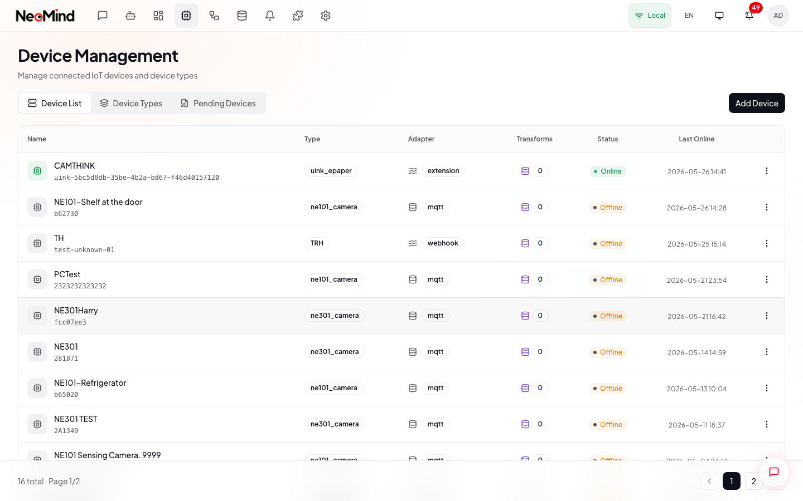
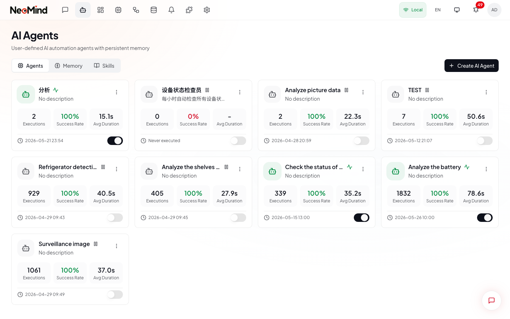
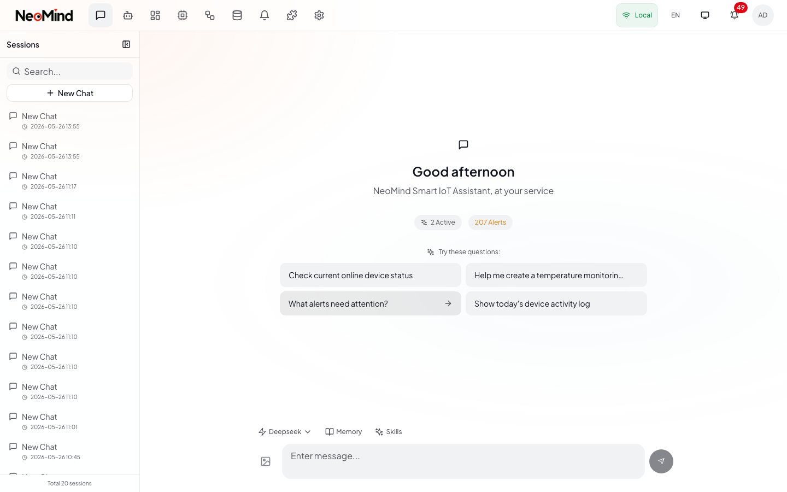

<p align="center">
  
</p>

<h3 align="center">面向物联网自动化的边缘 AI 平台</h3>

<p align="center">
  基于 Rust 的边缘智能 — 连接设备、运行 AI 智能体、自动化一切。
</p>

<p align="center">
  <a href="https://github.com/camthink-ai/NeoMind/actions/workflows/build.yml">
    
  </a>
  
  
  
  
</p>

<br/>

<div align="center">
  <table>
    <tr>
      <td align="center" width="35%">
        
        <br/><sub><b>仪表板</b></sub>
      </td>
      <td align="center" width="35%">
        
        <br/><sub><b>深色模式</b></sub>
      </td>
      <td align="center" width="30%" rowspan="2">
        
        <br/><sub><b>移动端</b></sub>
      </td>
    </tr>
    <tr>
      <td align="center">
        
        <br/><sub><b>AI 对话</b></sub>
      </td>
      <td align="center">
        
        <br/><sub><b>设备管理</b></sub>
      </td>
    </tr>
  </table>
</div>

<br/>

## NeoMind 是什么？

NeoMind 是一个**边缘部署的 AI 平台**，将智能带入物联网。它在本地硬件上直接运行 LLM 驱动的智能体，通过 MQTT/BLE/Webhook 连接设备，利用规则引擎实现自动化响应，并在实时仪表板上可视化一切 — 无需依赖云服务。

**核心理念**：用自然语言与你的设备对话。AI 理解你的意图，查询设备状态，创建自动化规则，并自主执行操作。

## 核心特性

### AI 智能
- **自然语言对话** — 用自然语言查询和控制所有已连接设备
- **自主智能体** — 定时 AI 智能体，独立监控、分析和处理设备数据
- **10+ LLM 后端** — Ollama、OpenAI、Anthropic、Google、xAI、Qwen、DeepSeek、GLM、MiniMax 及任何 OpenAI 兼容接口
- **记忆系统** — 多层级记忆（用户画像、知识库、任务记录、系统演化），支持自动提取和压缩
- **技能系统** — YAML+Markdown 技能，引导智能体在特定场景下的行为
- **多模态** — 支持图片上传和视觉分析

### 设备管理
- **MQTT 协议** — 主要设备集成方式，支持嵌入式 Broker、mTLS 和 CA 证书
- **BLE 配网** — 通过蓝牙零接触设备设置（Tauri 原生 + Web Bluetooth）
- **HTTP/Webhook** — 灵活的 REST 设备适配器
- **自动发现** — 自动检测设备、注册类型，AI 辅助设备入板
- **命令队列** — 向设备发送控制命令，支持参数验证和执行跟踪
- **自定义设备类型** — 通过 JSON 定义设备指标和命令

### 自动化
- **DSL 规则引擎** — 人类可读的规则语言：`WHEN device("sensor").temperature > 30 DO device("ac").power_on()`
- **数据转换** — 基于 JavaScript 的数据转换，创建虚拟指标
- **定时智能体** — 基于时间和事件驱动的 AI 智能体执行
- **事件总线** — 发布/订阅架构，组件间解耦通信

### 仪表板与可视化
- **拖拽式构建器** — 可视化仪表板编辑器，响应式网格布局
- **丰富组件** — 数值卡片、图表、仪表盘、表格、VLM 视觉组件
- **实时更新** — WebSocket/SSE 实时数据推送到仪表板
- **仪表板分享** — 带过期时间的公开链接
- **自定义组件** — 构建并发布你自己的仪表板组件

### 通知与数据推送
- **7 种通知渠道** — Webhook、邮件、Telegram、企业微信、钉钉、Slack、飞书
- **数据推送** — 通过 Webhook 或 MQTT 将遥测数据转发到外部系统
- **投递追踪** — 指数退避重试逻辑、投递历史和日志管理
- **消息去重** — 防止高频触发造成的通知风暴

### 平台能力
- **多实例管理** — 从单一界面连接和管理多个 NeoMind 后端
- **扩展系统** — Native 和 WASM 扩展，进程隔离和基于能力的权限控制
- **跨平台桌面** — 通过 Tauri 提供 macOS、Windows、Linux 原生应用
- **移动端适配** — 针对手机和平板优化的响应式 Web 界面
- **国际化** — 支持中文和英文
- **深色模式** — 系统自适应的深色/浅色主题
- **API 密钥认证** — JWT 的替代方案，适合程序化访问
- **CLI 工具** — 全功能命令行界面

## 生态系统

NeoMind 是一个模块化的生态系统，每个关注点都有专门的仓库：

| 仓库 | 用途 |
|------|------|
| **[NeoMind](https://github.com/camthink-ai/NeoMind)** | 核心平台（本仓库）— 后端、前端、桌面应用 |
| **[NeoMind-Extensions](https://github.com/camthink-ai/NeoMind-Extensions)** | 官方扩展市场 — 天气、YOLO 检测、OCR、人脸识别、视频流 |
| **[NeoMind-DeviceTypes](https://github.com/camthink-ai/NeoMind-DeviceTypes)** | 设备类型定义 — 标准化的 IoT 硬件指标和命令 |
| **[NeoMind-Dashboard-Components](https://github.com/camthink-ai/NeoMind-Dashboard-Components)** | 仪表板组件市场 — 社区贡献的 React 组件 |

### 可用扩展

| 扩展 | 说明 |
|------|------|
| **天气预报** | 通过 Open-Meteo API 获取实时天气数据。提供温度、湿度、风速和降水量等指标，可作为仪表板和自动化规则的数据源。支持可配置的地理位置和轮询间隔。 |
| **图像分析** | 基于 YOLOv11 的上传图片目标检测。可识别人、车辆、动物等 80+ 种 COCO 类别，返回边界框、置信度和类别标签等结构化数据。 |
| **YOLO 视频** | 实时视频流（RTSP/RTMP/HLS）目标检测。可配置帧率处理，采用丢弃中间帧队列实现低延迟。支持叠加渲染和检测计数指标。 |
| **YOLO 设备推理** | 自动对设备摄像头画面运行 YOLO 检测。绑定 NE301/NE101 摄像头流，将检测结果发布为设备指标。支持检测到特定目标时触发 AI 告警。 |
| **人脸识别** | 基于 ArcFace 的人脸识别，支持注册和匹配。支持人脸库管理、摄像头实时检测，以及基于置信度阈值的门禁场景匹配。 |
| **OCR 设备推理** | 基于 PP-OCRv4 的设备摄像头文字识别。从图片和视频帧中提取文本，支持多语言识别。适用于仪表读数、车牌识别和文档处理。 |
| **流媒体播放器** | 仪表板视频播放组件，支持 RTSP、RTMP 和 HLS 协议。提供低延迟播放、截图捕获、全屏模式和设备指标叠加显示。 |

### 支持设备

NE301（边缘 AI 摄像头）和 NE101（感知摄像头）。完整设备类型定义请查看 [NeoMind-DeviceTypes](https://github.com/camthink-ai/NeoMind-DeviceTypes)。

### 参与生态共建

我们欢迎社区贡献，共同丰富 NeoMind 生态系统：

- **[开发扩展](https://github.com/camthink-ai/NeoMind-Extensions)** — 为新的数据源、AI 模型或集成创建扩展。参考 [扩展开发指南](docs/guides/zh/extension-system.md) 快速上手，然后向市场提交 PR。
- **[添加设备类型](https://github.com/camthink-ai/NeoMind-DeviceTypes)** — 为你的 IoT 硬件定义指标和命令，让其他人开箱即用。只需添加一个 JSON 文件。
- **[创建仪表板组件](https://github.com/camthink-ai/NeoMind-Dashboard-Components)** — 构建可复用的 React 仪表板组件（图表、仪表盘、地图等），与社区分享。

## 快速开始

### 桌面应用（推荐）

从 [GitHub Releases](https://github.com/camthink-ai/NeoMind/releases/latest) 下载最新版本。

| 平台 | 格式 |
|------|------|
| macOS (Apple Silicon + Intel) | `.dmg` |
| Windows | `.msi` / `.exe` |
| Linux | `.AppImage` / `.deb` |

首次启动时，设置向导会引导你创建管理员账户、配置 LLM 后端、连接设备。

### 服务器部署

一键安装（Linux & macOS）：

```bash
curl -fsSL https://raw.githubusercontent.com/camthink-ai/NeoMind/main/scripts/install.sh | sh
```

安装后访问 `http://your-server:9375`。

<details>
<summary>更多安装选项</summary>

**Docker 部署：**

```bash
git clone https://github.com/camthink-ai/NeoMind.git
cd NeoMind
docker compose up -d
```

**指定版本：**
```bash
curl -fsSL https://raw.githubusercontent.com/camthink-ai/NeoMind/main/scripts/install.sh | VERSION=0.8.10 sh
```

**自定义目录：**
```bash
curl -fsSL ... | INSTALL_DIR=~/.local/bin DATA_DIR=~/.neomind sh
```

**仅后端（无 Web UI）：**
```bash
curl -fsSL ... | NO_WEB=true sh
```

**使用 nginx 反向代理（端口 80）：**
```bash
curl -fsSL ... | USE_NGINX=true sh
```

**手动安装：**
```bash
VERSION=0.8.10
wget https://github.com/camthink-ai/NeoMind/releases/download/v${VERSION}/neomind-server-linux-amd64.tar.gz
wget https://github.com/camthink-ai/NeoMind/releases/download/v${VERSION}/neomind-web-${VERSION}.tar.gz
tar xzf neomind-server-linux-amd64.tar.gz
sudo install -m 755 neomind /usr/local/bin/
sudo install -m 755 neomind-extension-runner /usr/local/bin/
sudo mkdir -p /var/www/neomind
sudo tar xzf neomind-web-${VERSION}.tar.gz -C /var/www/neomind
./neomind serve
```

**Nginx 配置：**
```nginx
server {
    listen 80;
    root /var/www/neomind;
    index index.html;
    location / { try_files $uri $uri/ /index.html; }
    location /api/ {
        proxy_pass http://127.0.0.1:9375/api/;
        proxy_http_version 1.1;
        proxy_set_header Upgrade $http_upgrade;
        proxy_set_header Connection "upgrade";
    }
}
```

</details>

### 开发模式

**环境要求：** Rust 1.85+、Node.js 20+、Ollama（或其他 LLM 后端）

```bash
# 克隆
git clone https://github.com/camthink-ai/NeoMind.git
cd NeoMind

# 启动后端（端口 9375）
cargo run -p neomind-cli -- serve

# 启动前端开发服务器（端口 5173）
cd web && npm install && npm run dev

# 构建桌面应用
cd web && npm run tauri:build
```

## 系统架构

```
┌──────────────────────────────────────────────────────────────┐
│                    桌面应用 / Web 界面                         │
│                    React 18 + TypeScript                      │
├──────────────────────────────────────────────────────────────┤
│                    Tauri 2.x / 浏览器                         │
└────────────────────────┬─────────────────────────────────────┘
                         │ REST / WebSocket / SSE
                         ▼
┌──────────────────────────────────────────────────────────────┐
│                         API 网关                              │
│                      Axum Web 服务器                          │
│  ┌────────┐ ┌────────┐ ┌────────┐ ┌────────┐ ┌────────┐    │
│  │ 认证   │ │ 设备   │ │ 自动化 │ │ 消息   │ │ 扩展   │    │
│  └────────┘ └────────┘ └────────┘ └────────┘ └────────┘    │
└────────────────────────┬─────────────────────────────────────┘
                         │ 事件总线
          ┌──────────────┼──────────────┬────────────────┐
          ▼              ▼              ▼                ▼
   ┌──────────┐  ┌──────────┐  ┌──────────┐  ┌──────────────────┐
   │ 设备管理 │  │  自动化  │  │ AI 智能体│  │     扩展系统     │
   │          │  │          │  │          │  │                  │
   │ MQTT     │  │ 规则     │  │ 对话     │  │ 进程隔离         │
   │ BLE      │  │ 数据转换 │  │ 工具调用 │  │ Native + WASM   │
   │ Webhook  │  │ 智能体   │  │ 记忆系统 │  │ 能力权限         │
   └──────────┘  └──────────┘  └──────────┘  └──────────────────┘
          │              │              │                │
          └──────────────┴──────────────┴────────────────┘
                         │
                         ▼
   ┌─────────────────────────────────────────────────────────┐
   │                       存储层                             │
   │  ┌────────────┐ ┌────────────┐ ┌──────────┐ ┌────────┐ │
   │  │  时序数据  │ │   状态     │ │ LLM 记忆 │ │ 推送   │ │
   │  │  (redb)    │ │  (redb)    │ │          │ │ 日志   │ │
   │  └────────────┘ └────────────┘ └──────────┘ └────────┘ │
   └─────────────────────────────────────────────────────────┘
```

## 项目结构

```
NeoMind/
├── crates/
│   ├── neomind-core/            # 核心 traits 和类型系统
│   ├── neomind-api/             # Web API 服务器（Axum）
│   ├── neomind-agent/           # AI 智能体、工具调用、LLM 后端
│   ├── neomind-devices/         # 设备管理（MQTT、BLE、Webhook）
│   ├── neomind-storage/         # 存储层（redb）
│   ├── neomind-messages/        # 通知系统（7 种渠道）
│   ├── neomind-rules/           # DSL 规则引擎
│   ├── neomind-data-push/       # 数据推送到外部系统
│   ├── neomind-extension-sdk/   # 扩展开发 SDK
│   ├── neomind-extension-runner/# 扩展进程隔离运行器
│   └── neomind-cli/             # 命令行工具
├── web/
│   ├── src/                     # React 前端（TypeScript）
│   └── src-tauri/               # Tauri 桌面后端（Rust）
├── scripts/                     # 部署脚本
├── docs/                        # 文档
├── deploy/                      # 部署配置（nginx、systemd）
├── Dockerfile                   # 多阶段 Docker 构建
├── docker-compose.yml           # Docker Compose 配置
└── .env.example                 # 环境变量模板
```

## 更多截图

<details>
<summary>点击展开</summary>

<br/>

<table>
  <tr>
    <td><b>登录</b></td>
    <td><b>AI 对话</b></td>
  </tr>
  <tr>
    <td></td>
    <td></td>
  </tr>
  <tr>
    <td><b>AI 智能体</b></td>
    <td><b>规则引擎</b></td>
  </tr>
  <tr>
    <td></td>
    <td></td>
  </tr>
  <tr>
    <td><b>数据转换</b></td>
    <td><b>消息通知</b></td>
  </tr>
  <tr>
    <td></td>
    <td></td>
  </tr>
  <tr>
    <td><b>扩展系统</b></td>
    <td><b>数据推送</b></td>
  </tr>
  <tr>
    <td></td>
    <td></td>
  </tr>
  <tr>
    <td><b>LLM 后端</b></td>
    <td><b>移动端</b></td>
  </tr>
  <tr>
    <td></td>
    <td></td>
  </tr>
</table>

</details>

## 配置

### LLM 后端

| 后端 | 端点 |
|------|------|
| Ollama | `http://localhost:11434` |
| OpenAI | `https://api.openai.com/v1` |
| Anthropic | `https://api.anthropic.com/v1` |
| Google | `https://generativelanguage.googleapis.com/v1beta` |
| xAI | `https://api.x.ai/v1` |
| Qwen | `https://dashscope.aliyuncs.com/compatible-mode/v1` |
| DeepSeek | `https://api.deepseek.com/v1` |
| GLM | `https://open.bigmodel.cn/api/paas/v4` |
| MiniMax | `https://api.minimax.chat/v1` |

### 环境变量

| 变量 | 默认值 | 说明 |
|------|--------|------|
| `RUST_LOG` | `info` | 日志级别（trace、debug、info、warn、error） |
| `NEOMIND_DATA_DIR` | `/var/lib/neomind` | 数据目录 |
| `NEOMIND_BIND_ADDR` | `0.0.0.0:9375` | 服务器绑定地址 |
| `SERVER_PORT` | `9375` | API 服务器端口 |

## CLI 参考

```bash
neomind serve                          # 启动 API 服务器
neomind health                        # 系统健康检查
neomind device list                   # 列出设备
neomind device create --name "..."    # 创建设备
neomind rule list                     # 列出自动化规则
neomind extension list                # 列出扩展
neomind extension install file.nep    # 安装扩展
neomind agent list                    # 列出 AI 智能体
neomind message list                  # 列出消息
neomind system info                   # 系统状态和网络信息
neomind api-key create                # 创建 API 密钥
```

## 扩展开发

使用 Rust SDK 构建进程隔离的扩展：

```rust
use neomind_extension_sdk::prelude::*;

pub struct MyExtension;

#[async_trait]
impl Extension for MyExtension {
    fn metadata(&self) -> &ExtensionMetadata {
        static META: OnceLock<ExtensionMetadata> = OnceLock::new();
        META.get_or_init(|| {
            ExtensionMetadata::new("my-extension", "我的扩展", "1.0.0")
                .with_description("我的自定义扩展")
                .with_author("你的名字")
        })
    }

    async fn execute_command(&self, cmd: &str, args: &Value) -> Result<Value> {
        match cmd {
            "do_something" => Ok(json!({ "result": "done" })),
            _ => Err(ExtensionError::CommandNotFound(cmd.to_string())),
        }
    }

    fn produce_metrics(&self) -> Result<Vec<ExtensionMetricValue>> {
        Ok(vec![])
    }
}

neomind_export!(MyExtension);
```

详见 [扩展开发指南](docs/guides/zh/extension-system.md) 和 [NeoMind-Extensions](https://github.com/camthink-ai/NeoMind-Extensions)。

## 文档

| 资源 | 说明 |
|------|------|
| [CLAUDE.md](CLAUDE.md) | 开发指南和代码规范 |
| [CHANGELOG.md](CHANGELOG.md) | 版本历史和发布说明 |
| [模块文档](docs/guides/zh/) | 详细的模块文档 |
| [扩展指南](docs/guides/zh/extension-system.md) | 构建你的第一个扩展 |
| [API 参考](docs/guides/zh/14-api.md) | REST/WebSocket API 文档 |
| [前端规范](web/DESIGN_SPEC.md) | UI 设计系统和组件标准 |

## 技术栈

| 层级 | 技术 |
|------|------|
| **后端** | Rust、Axum、Tokio、redb |
| **前端** | React 18、TypeScript、Tailwind CSS、Zustand、Radix UI |
| **桌面** | Tauri 2.x |
| **AI/LLM** | Ollama、OpenAI、Anthropic 及 6+ 其他后端 |
| **IoT** | MQTT（嵌入式 Broker）、BLE、HTTP/Webhook |
| **扩展** | Native（.so/.dylib/.dll）、WASM、进程隔离 |

## 贡献

欢迎贡献！请随时提交 Pull Request。

## 许可证

[Apache-2.0](LICENSE)
