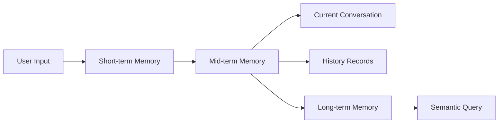

# Memory Module

**Package**: `neomind-memory`
**Version**: 0.5.8
**Completion**: 85%
**Purpose**: Three-tier memory system (short-term/mid-term/long-term)

## Overview

The Memory module implements a tiered memory architecture for managing conversation history, session data, and knowledge base.

## Module Structure

```
crates/memory/src/
├── lib.rs                      # Public interface
├── short_term.rs               # Short-term memory
├── mid_term.rs                 # Mid-term memory
├── long_term.rs                # Long-term memory
├── tiered.rs                  # Unified interface
├── unified.rs                  # Unified interface
├── semantic.rs                 # Semantic search
├── bm25.rs                     # BM25全文搜索
├── embeddings.rs               # Embedding vectors
├── importance.rs               # Importance scoring
├── compression.rs              # Memory compression
├── graph.rs                    # Knowledge graph
├── budget.rs                   # Token budget
```

## Three-Tier Architecture



### 1. ShortTermMemory (STM)

Current conversation context window.

```rust
pub struct ShortTermMemory {
    /// Maximum message count
    pub max_messages: usize,

    /// Maximum token count
    pub max_tokens: usize,

    /// Message list
    pub messages: Vec<MemoryMessage>,

    /// Time-to-live
    pub ttl: Duration,
}
```

```rust
pub struct MemoryMessage {
    /// Role
    pub role: MessageRole,

    /// Content
    pub content: String,

    /// Is thinking content
    pub is_thinking: bool,

    /// Timestamp
    pub timestamp: i64,
}
```

```rust
impl ShortTermMemory {
    /// Add message
    pub fn add_message(&mut self, role: &str, content: &str) -> Result<()>;

    /// Get messages
    pub fn get_messages(&self) -> Vec<MemoryMessage>;

    /// Clear
    pub fn clear(&mut self);

    /// Token count
    pub fn count_tokens(&self) -> usize;

    /// Compact to token limit
    pub fn compact(&mut self) -> Result<()>;
}
```

### 2. MidTermMemory (MTM)

Recent session history with semantic search.

```rust
pub struct MidTermMemory {
    /// Storage backend
    pub store: Arc<SessionStore>,

    /// Semantic search
    pub semantic: Arc<SemanticSearch>,
}
```

```rust
pub struct ConversationEntry {
    /// Session ID
    pub session_id: String,

    /// User input
    pub user_input: String,

    /// AI response
    pub assistant_response: String,

    /// Timestamp
    pub timestamp: i64,

    /// Embedding vector
    pub embedding: Option<Vec<f32>>,
}
```

```rust
impl MidTermMemory {
    /// Add conversation
    pub async fn add_conversation(
        &self,
        session_id: &str,
        user_input: &str,
        assistant_response: &str,
    ) -> Result<()>;

    /// Search history
    pub async fn search(
        &self,
        query: &str,
        limit: usize,
    ) -> Result<Vec<SearchResult>>;

    /// Get session history
    pub async fn get_history(
        &self,
        session_id: &str,
    ) -> Result<Vec<ConversationEntry>>;
}
```

### 3. LongTermMemory (LTM)

Persistent knowledge base including device knowledge, troubleshooting guides, and best practices.

```rust
pub struct LongTermMemory {
    /// Storage backend
    pub store: Arc<KnowledgeStore>,

    /// Semantic search
    pub semantic: Arc<SemanticSearch>,
}
```

```rust
pub struct KnowledgeEntry {
    /// Knowledge ID
    pub id: String,

    /// Title
    pub title: String,

    /// Content
    pub content: String,

    /// Category
    pub category: KnowledgeCategory,

    /// Tags
    pub tags: Vec<String>,

    /// Metadata
    pub metadata: serde_json::Value,

    /// Created at
    pub created_at: i64,

    /// Updated at
    pub updated_at: i64,
}
```

```rust
pub enum KnowledgeCategory {
    DeviceManual,
    Troubleshooting,
    BestPractice,
    Configuration,
    ApiDocumentation,
    Custom(String),
}
```

```rust
impl LongTermMemory {
    /// Add knowledge
    pub async fn add_knowledge(&mut self, entry: KnowledgeEntry) -> Result<()>;

    /// Search knowledge
    pub async fn search(
        &self,
        query: &str,
        category: Option<KnowledgeCategory>,
        limit: usize,
    ) -> Result<Vec<KnowledgeEntry>>;

    /// Get knowledge
    pub async fn get(&self, id: &str) -> Option<KnowledgeEntry>;

    /// Update knowledge
    pub async fn update(&mut self, entry: KnowledgeEntry) -> Result<()>;

    /// Delete knowledge
    pub async fn delete(&mut self, id: &str) -> Result<()>;
}
```

## Unified Interface

```rust
pub struct TieredMemory {
    /// Short-term memory
    pub short_term: ShortTermMemory,

    /// Mid-term memory
    pub mid_term: Arc<MidTermMemory>,

    /// Long-term memory
    pub long_term: Arc<LongTermMemory>,
}
```

```rust
impl TieredMemory {
    /// Add message (short-term)
    pub fn add_message(&mut self, role: &str, content: &str) -> Result<()>;

    /// Consolidate to mid-term
    pub async fn consolidate(&mut self, session_id: &str) -> Result<()>;

    /// Query all tiers
    pub async fn query_all(
        &self,
        query: &str,
        limit: usize,
    ) -> MemoryQueryResult;

    /// Get statistics
    pub async fn get_stats(&self) -> MemoryStats;
}
```

## Semantic Search

```rust
pub trait SemanticSearch: Send + Sync {
    /// Add document
    async fn add(&self, doc: SemanticDocument) -> Result<()>;

    /// Search
    async fn search(
        &self,
        query: &str,
        limit: usize,
    ) -> Result<Vec<SemanticSearchResult>>;

    /// Remove document
    async fn remove(&self, id: &str) -> Result<()>;
}
```

```rust
pub struct SemanticDocument {
    pub id: String,
    pub text: String,
    pub metadata: serde_json::Value,
}
```

```rust
pub struct SemanticSearchResult {
    pub document: SemanticDocument,
    pub score: f32,
    pub highlight: Option<String>,
}
```

## Embedding Model

```rust
pub enum EmbeddingProvider {
    Local,
    Ollama,
    OpenAI,
}
```

```rust
pub struct EmbeddingModel {
    pub provider: EmbeddingProvider,
    pub model_name: String,
}
```

## BM25 Full-Text Search

```rust
pub struct BM25Index {
    /// Document collection
    documents: HashMap<String, DocumentStats>,

    /// IDF values
    idf: HashMap<String, f32>,

    /// Parameters
    k1: f32,
    b: f32,
}
```

## Importance Scoring

```rust
pub struct ImportanceScorer {
    /// Configuration
    config: ImportanceConfig,
}
```

```rust
pub struct ImportanceConfig {
    /// Frequency weight
    pub frequency_weight: f32,

    /// Recency weight
    pub recency_weight: f32,

    /// Emotional weight
    pub emotional_weight: f32,

    /// Cross-reference weight
    pub cross_ref_weight: f32,

    /// Half-life (days)
    pub decay_halflife: f32,
}
```

```rust
pub enum HeatScore {
    Hot,    // Frequently accessed
    Warm,   // Moderately accessed
    Cold,   // Rarely accessed
}
```

## Memory Compression

```rust
pub struct MemoryCompressor {
    /// Configuration
    config: CompressionConfig,
}
```

```rust
pub enum CompressionMethod {
    /// Summarize
    Summary {
        target_ratio: f32,
    },

    /// Key points extraction
    KeyPoints {
        max_points: usize,
        },

    /// Thematic grouping
    Thematic {
        num_topics: usize,
        },
}
```

## Knowledge Graph

```rust
pub struct MemoryGraph {
    /// Entities
    entities: HashMap<EntityId, Entity>,

    /// Relations
    relations: HashMap<RelationId, Relationship>,
}
```

```rust
pub struct Entity {
    pub id: EntityId,
    pub name: String,
    pub entity_type: EntityType,
    pub properties: HashMap<String, serde_json::Value>,
}
```

```rust
pub enum EntityType {
    Device,
    Sensor,
    Location,
    Person,
    Concept,
    Custom(String),
}
```

## API Endpoints

```
# Memory Stats
GET    /api/memory/stats                     # Memory statistics

# Query
POST   /api/memory/query                    # Query memory

# Short-term
GET    /api/memory/short-term               # Short-term memory
POST   /api/memory/short-term               # Add to short-term
DELETE /api/memory/short-term               # Clear short-term

# Mid-term
GET    /api/memory/mid-term/:session_id      # Session history
POST   /api/memory/consolidate/:session_id   # Consolidate to mid-term

# Long-term
GET    /api/memory/long-term/search         # Search knowledge
GET    /api/memory/long-term/category/:category  # Knowledge by category
POST   /api/memory/long-term                # Add knowledge
GET    /api/memory/long-term/:id                 # Get knowledge
PUT    /api/memory/long-term/:id                 # Update knowledge
DELETE /api/memory/long-term/:id                # Delete knowledge

# Consolidation
POST    /api/memory/consolidate/:session_id   # Consolidate to mid-term
```

## Usage Examples

```rust
use neomind_memory::{TieredMemory, KnowledgeEntry, KnowledgeCategory};

#[tokio::main]
async fn main() -> Result<(), Box<dyn std::error::Error>> {
    let mut memory = TieredMemory::new();

    // Short-term: add messages
    memory.add_message("user", "What is the temperature in the greenhouse?").await?;

    // Mid-term: consolidate
    memory.consolidate("session_1").await?;

    // Long-term: add knowledge
    let entry = KnowledgeEntry::new(
        "Temperature Sensor Manual",
        "DHT22 temperature sensor usage guide...",
        KnowledgeCategory::DeviceManual,
    );
    memory.add_knowledge(entry).await?;

    // Query all tiers
    let results = memory.query_all("temperature", 10).await?;
    println!("Short-term: {} results", results.short_term.len());
    println!("Mid-term: {} results", results.mid_term.len());
    println!("Long-term: {} results", results.long_term.len());

    Ok(())
}
```

## Design Principles

1. **Tiered Storage**: Hot data in front, cold data in back
2. **Semantic Retrieval**: Support vector search and full-text search
3. **Auto-Consolidation**: Short-term automatically consolidates to mid-term
4. **Compressible**: Support memory compression for space efficiency
EOF
