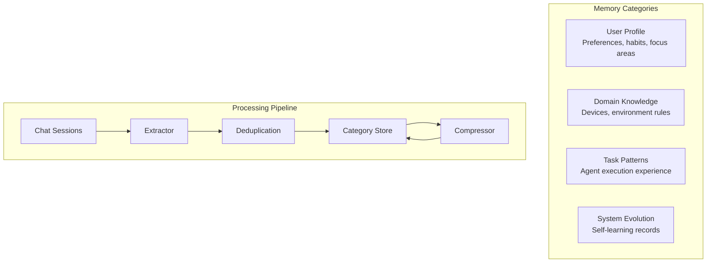

# Memory Module

**Package**: `neomind-agent` (memory submodule)
**Version**: 0.6.4
**Completion**: 95%
**Purpose**: Category-based memory system with LLM-powered extraction and compression

## Overview

The Memory module provides a Markdown-based memory system for AI agents. Based on 2026 research (Voxos.ai, Letta), simple file storage (74% accuracy) outperforms complex graph/RAG systems (68.5%).

### Key Features

- **Category-Based Organization**: Four distinct memory categories for organized storage
- **LLM-Powered Extraction**: Automatic memory extraction from conversations
- **Smart Compression**: LLM-powered summarization and consolidation
- **Deduplication**: Semantic similarity-based duplicate detection
- **Scheduled Tasks**: Background extraction and compression with configurable intervals

## Memory Categories


```mermaid
graph TB
    subgraph "Memory Categories"
        UP[User Profile<br/>Preferences, habits, focus areas]
        DK[Domain Knowledge<br/>Devices, environment rules]
        TP[Task Patterns<br/>Agent execution experience]
        SE[System Evolution<br/>Self-learning records]
    end

    subgraph "Processing Pipeline"
        Chat[Chat Sessions] --> Extract[Extractor]
        Extract --> Dedup[Deduplication]
        Dedup --> Store[Category Store]
        Store --> Compress[Compressor]
        Compress --> Store
    end
```

| Category | Description | Max Entries | File |
|----------|-------------|-------------|------|
| **User Profile** | User preferences, habits, focus areas | 50 | `user_profile.md` |
| **Domain Knowledge** | Device knowledge, environment rules | 100 | `domain_knowledge.md` |
| **Task Patterns** | Task execution patterns, agent experience | 80 | `task_patterns.md` |
| **System Evolution** | System self-learning, adaptation records | 30 | `system_evolution.md` |

## Module Structure

```
crates/neomind-agent/src/memory/
├── mod.rs              # Public interface
├── manager.rs          # MemoryManager - unified entry point
├── extractor.rs        # LLM-powered memory extraction
├── compressor.rs       # LLM-powered compression
├── dedup.rs            # Semantic deduplication
├── scheduler.rs        # Background task scheduling
├── compat.rs           # Backward compatibility layer
├── short_term.rs       # Short-term memory (conversation context)
├── mid_term.rs         # Mid-term memory (session history)
├── long_term.rs        # Long-term memory (knowledge base)
├── tiered.rs           # Unified tiered interface
├── bm25.rs             # Full-text search
└── embeddings.rs       # Embedding vectors
```

## Core Components

### 1. MemoryManager

Unified entry point for all memory operations.

```rust
use neomind_agent::memory::MemoryManager;
use neomind_storage::MemoryCategory;

#[tokio::main]
async fn main() -> Result<(), Box<dyn std::error::Error>> {
    let manager = MemoryManager::new(Default::default());
    manager.init().await?;

    // Read memory
    let profile = manager.read(&MemoryCategory::UserProfile).await?;

    // Write memory
    manager.write(&MemoryCategory::DomainKnowledge, r#"
## Device Information
- Living Room Light: Zigbee device, ID: light_001
- Temperature Sensor: MQTT device, ID: temp_001

## Environment Rules
- Evening mode starts at 18:00
- Night mode starts at 22:00
"#).await?;

    // Get statistics
    let stats = manager.stats(&MemoryCategory::UserProfile).await?;
    println!("Lines: {}, Words: {}", stats.lines, stats.words);

    Ok(())
}
```

### 2. Memory Extractor

LLM-powered extraction from conversations.

```rust
use neomind_agent::memory::{ChatExtractor, MemoryCandidate};

// Extract memories from chat messages
let extractor = ChatExtractor::new(llm_backend);
let candidates = extractor.extract(&messages).await?;

for candidate in candidates {
    println!("Category: {:?}", candidate.category);
    println!("Content: {}", candidate.content);
    println!("Importance: {}", candidate.importance);
}
```

### 3. Memory Compressor

LLM-powered compression for large memory files.

```rust
use neomind_agent::memory::MemoryCompressor;

let compressor = MemoryCompressor::new(llm_backend);

// Compress memories exceeding threshold
let result = compressor.compress(
    &MemoryCategory::TaskPatterns,
    80,  // max entries
).await?;

println!("Original entries: {}", result.original_count);
println!("Compressed entries: {}", result.compressed_count);
println!("Tokens saved: {}", result.tokens_saved);
```

### 4. Memory Scheduler

Background scheduling for extraction and compression.

```rust
use neomind_agent::memory::MemoryScheduler;

let scheduler = MemoryScheduler::new(config, llm_backend);

// Start background tasks
scheduler.start().await?;

// Extraction runs every hour (configurable)
// Compression runs every 24 hours (configurable)
```

## Configuration

```json
{
  "enabled": true,
  "storage_path": "data/memory",
  "extraction": {
    "similarity_threshold": 0.85
  },
  "compression": {
    "decay_period_days": 30,
    "min_importance": 20,
    "max_entries": {
      "user_profile": 50,
      "domain_knowledge": 100,
      "task_patterns": 80,
      "system_evolution": 30
    }
  },
  "llm": {
    "extraction_backend_id": "ollama-qwen",
    "compression_backend_id": "ollama-qwen"
  },
  "schedule": {
    "extraction_enabled": true,
    "extraction_interval_secs": 3600,
    "compression_enabled": true,
    "compression_interval_secs": 86400
  }
}
```

## Memory Entry Format

Memory is stored in Markdown format with importance scores:

```markdown
## Patterns
- 2026-04-01: User prefers evening lights off [importance: 80]
- 2026-04-01: Daily temperature check at 10am [importance: 60]

## Entities
- Device: Living Room Light (light_001)
- Location: Living Room, Bedroom

## Preferences
- Temperature unit: Celsius
- Language: Chinese

## Facts
- 2026-04-01: System uses Clean Architecture
```

## API Endpoints

```
# Category-based API (New)
GET    /api/memory/categories              # List all categories with stats
GET    /api/memory/categories/:category    # Get category content
PUT    /api/memory/categories/:category    # Update category content
POST   /api/memory/categories/:category/entries  # Add memory entry

# Configuration
GET    /api/memory/config                  # Get memory configuration
PUT    /api/memory/config                  # Update configuration

# Operations
POST   /api/memory/extract                 # Trigger manual extraction
POST   /api/memory/compress                # Trigger manual compression

# Legacy API (Backward Compatible)
GET    /api/memory/files                   # List memory files
GET    /api/memory/files/:id               # Get file content
PUT    /api/memory/files/:id               # Update file content
```

## Usage Examples

### Reading Memory in Agent

```rust
use neomind_agent::memory::{MemoryManager, MemoryCategory};

async fn get_user_preferences(manager: &MemoryManager) -> Vec<String> {
    let content = manager.read(&MemoryCategory::UserProfile).await?;
    // Parse preferences from markdown
    parse_preferences(&content)
}
```

### Adding Memory Entry

```bash
# Add a task pattern via API
curl -X POST http://localhost:9375/api/memory/categories/task_patterns/entries \
  -H "Content-Type: application/json" \
  -d '{
    "content": "2026-04-01: Successful temperature regulation with PID controller [importance: 75]",
    "importance": 75
  }'
```

### Manual Extraction Trigger

```bash
# Trigger extraction from specific session
curl -X POST http://localhost:9375/api/memory/extract \
  -H "Content-Type: application/json" \
  -d '{
    "session_id": "session_123",
    "force": false
  }'
```

## Design Principles

1. **Simplicity First**: Markdown files over complex databases
2. **Category Organization**: Four distinct categories for different memory types
3. **LLM Integration**: Automatic extraction and compression using LLM
4. **Importance-Based Pruning**: Keep only valuable memories
5. **Backward Compatible**: Legacy API still works for existing integrations

## Storage Location

Memory files are stored in the data directory:

```
data/memory/
├── user_profile.md        # User preferences and habits
├── domain_knowledge.md    # Device and environment knowledge
├── task_patterns.md       # Task execution patterns
├── system_evolution.md    # System learning records
└── memory_config.json     # Configuration file
```

## Integration with Agents

Agents can access memory through the MemoryManager:

```rust
impl AgentExecutor {
    async fn build_context(&self, session_id: &str) -> Result<AgentContext> {
        // Get relevant memories
        let profile = self.memory_manager.read(&MemoryCategory::UserProfile).await?;
        let domain = self.memory_manager.read(&MemoryCategory::DomainKnowledge).await?;

        // Build context with memory
        let context = AgentContext {
            user_preferences: parse_user_profile(&profile),
            domain_knowledge: parse_domain_knowledge(&domain),
            // ...
        };

        Ok(context)
    }
}
```
