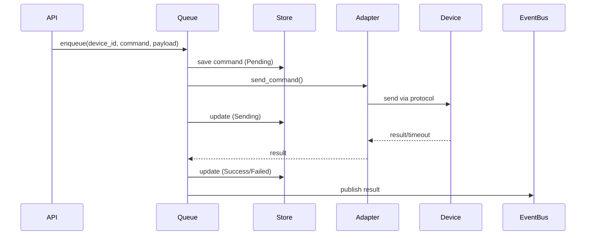

# Commands Module

**Package**: `neomind-commands`
**Version**: 0.5.8
**Completion**: 70%
**Purpose**: Device command queue and downlink adapter

## Overview

The Commands module is responsible for managing device command sending, retry, and status tracking.

## Module Structure

```
crates/commands/src/
├── lib.rs                      # Public interface
├── adapter.rs                  # Downlink adapter
├── queue.rs                    # Command queue
├── store.rs                    # Command storage
└── types.rs                    # Type definitions
```

## Core Types

### 1. DeviceCommand - Device Command

```rust
pub struct DeviceCommand {
    /// Command ID
    pub id: String,

    /// Device ID
    pub device_id: String,

    /// Command name
    pub command: String,

    /// Command parameters
    pub payload: serde_json::Value,

    /// Command status
    pub status: CommandStatus,

    /// Created at
    pub created_at: i64,

    /// Updated at
    pub updated_at: i64,

    /// Executed at
    pub executed_at: Option<i64>,

    /// Retry count
    pub retry_count: u32,

    /// Error message
    pub error: Option<String>,
}

pub enum CommandStatus {
    /// Pending to send
    Pending,

    /// Sending
    Sending,

    /// Sent (waiting for acknowledgment)
    Sent,

    /// Success
    Success,

    /// Failed
    Failed {
        error: String,
        retryable: bool,
    },

    /// Cancelled
    Cancelled,

    /// Timeout
    Timeout,
}
```

### 2. DownlinkAdapter - Downlink Adapter

```rust
#[async_trait]
pub trait DownlinkAdapter: Send + Sync {
    /// Adapter type
    fn adapter_type(&self) -> &str;

    /// Send command
    async fn send_command(
        &self,
        device_id: &str,
        command: &str,
        payload: &serde_json::Value,
    ) -> Result<serde_json::Value>;

    /// Test connection
    async fn test_connection(&self) -> Result<bool>;

    /// Get statistics
    fn stats(&self) -> AdapterStats;
}
```

### 3. Adapter Implementations

#### MQTT Downlink Adapter

```rust
pub struct MqttDownlinkAdapter {
    /// MQTT client
    client: Arc<AsyncClient>,

    /// Command topic template
    topic_template: String,

    /// QoS level
    qos: u8,

    /// Statistics
    stats: Arc<AdapterStats>,
}

pub struct MqttAdapterConfig {
    /// Adapter ID
    pub id: String,

    /// MQTT Broker
    pub broker: String,

    /// Command topic template, {device_id} will be replaced
    pub topic_prefix: String,

    /// QoS
    pub qos: u8,
}
```

#### HTTP Downlink Adapter

```rust
pub struct HttpDownlinkAdapter {
    client: reqwest::Client,
    base_url: String,
    stats: Arc<AdapterStats>,
}

pub struct HttpAdapterConfig {
    pub id: String,
    pub base_url: String,
    pub headers: HashMap<String, String>,
    pub timeout_secs: u64,
}
```

### 4. Command Queue

```rust
pub struct CommandQueue {
    /// Storage backend
    store: Arc<CommandStore>,

    /// Adapter registry
    adapters: Arc<RwLock<HashMap<String, Arc<dyn DownlinkAdapter>>>>,

    /// Event bus
    event_bus: Arc<EventBus>,

    /// Queue configuration
    config: QueueConfig,
}

pub struct QueueConfig {
    /// Queue capacity
    pub capacity: usize,

    /// Worker threads
    pub workers: usize,

    /// Retry policy
    pub retry_policy: RetryPolicy,

    /// Retry interval (milliseconds)
    pub retry_interval_ms: u64,

    /// Max retry count
    pub max_retries: u32,
}

pub enum RetryPolicy {
    /// Fixed interval
    Fixed,

    /// Exponential backoff
    Exponential {
        base_ms: u64,
        max_ms: u64,
        multiplier: f64,
    },

    /// Linear increase
    Linear {
        initial_ms: u64,
        increment_ms: u64,
    },
}
```

### 5. Command Storage

```rust
pub struct CommandStore {
    db: Database,
}

impl CommandStore {
    /// Open storage
    pub fn open(path: impl AsRef<Path>) -> Result<Self>;

    /// Add command
    pub fn add(&self, command: &DeviceCommand) -> Result<()>;

    /// Get command
    pub fn get(&self, id: &str) -> Result<Option<DeviceCommand>>;

    /// Update status
    pub fn update_status(
        &self,
        id: &str,
        status: CommandStatus,
    ) -> Result<()>;

    /// List device commands
    pub fn list_by_device(
        &self,
        device_id: &str,
        limit: usize,
    ) -> Result<Vec<DeviceCommand>>;

    /// List pending commands
    pub fn list_pending(&self) -> Result<Vec<DeviceCommand>>;

    /// Cleanup old commands
    pub fn cleanup(&self, older_than: i64) -> Result<usize>;
}
```

## Command Execution Flow



## API Endpoints

```
# Commands
GET    /api/commands                       # List commands
GET    /api/commands/:id                   # Get command
POST   /api/commands/:id/retry             # Retry command
POST   /api/commands/:id/cancel            # Cancel command
GET    /api/commands/stats                 # Command statistics
POST   /api/commands/cleanup               # Cleanup history
```

## Usage Examples

### Send Command

```rust
use neomind_commands::{CommandQueue, DeviceCommand, CommandStatus};

let command = DeviceCommand {
    id: "cmd_001".to_string(),
    device_id: "relay_1".to_string(),
    command: "turn_on".to_string(),
    payload: serde_json::json!({}),
    status: CommandStatus::Pending,
    created_at: chrono::Utc::now().timestamp(),
    updated_at: chrono::Utc::now().timestamp(),
    executed_at: None,
    retry_count: 0,
    error: None,
};

queue.enqueue(command).await?;
```

### Register Adapter

```rust
use neomind_commands::{MqttDownlinkAdapter, MqttAdapterConfig, DownlinkAdapter};

let config = MqttAdapterConfig {
    id: "main_mqtt".to_string(),
    broker: "tcp://localhost:1883".to_string(),
    topic_prefix: "actuators/{device_id}/command".to_string(),
    qos: 1,
};

let adapter: Arc<dyn DownlinkAdapter> = Arc::new(
    MqttDownlinkAdapter::new(config).await?
);

queue.register_adapter(adapter).await?;
```

## Cleaned Up Features

- ✅ Modbus downlink adapter (not implemented)

## Design Principles

1. **Async Queue**: Commands sent asynchronously, non-blocking
2. **Retry Mechanism**: Failed commands auto-retry
3. **State Tracking**: Complete command lifecycle tracking
4. **Protocol Decoupling**: Support multiple downlink protocols via adapters
