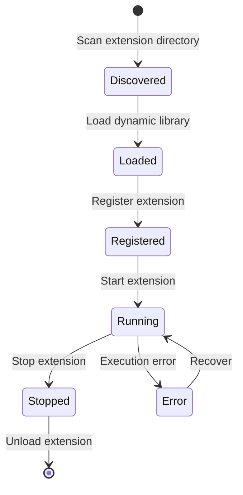

# Extension SDK Module

**Package**: `neomind-extension-sdk`
**Version**: 0.5.8
**Completion**: 85%
**Purpose**: Dynamic extension development SDK

## ⚠️ Important Changes (v0.5.x)

**Extension System (V2) is now unified**. This SDK supports two extension development modes:

1. **V2 Extension** - Recommended, uses standard device types
2. **Legacy Plugin** - Backward compatible

See [Extension Migration Guide](../../architecture/plugin-migration.md) for details.

## Overview

The Extension SDK provides the macros, types, and tools needed to develop NeoMind dynamic extensions.

## Module Structure

```
crates/neomind-extension-sdk/src/
├── lib.rs                      # Public interface
├── macros.rs                   # Procedural macros
├── descriptor.rs               # Plugin descriptor (Legacy)
├── types.rs                    # Extension type definitions
└── error.rs                    # Error types
```

## V2 Extension System

### Core Trait

```rust
/// Extension trait - all extensions must implement
pub trait Extension: Send + Sync {
    /// Get extension metadata
    fn metadata(&self) -> &ExtensionMetadata;

    /// Get metric definitions provided by extension
    fn metrics(&self) -> &[MetricDefinition] {
        &[]
    }

    /// Get command definitions provided by extension
    fn commands(&self) -> &[ExtensionCommand] {
        &[]
    }

    /// Execute command
    fn execute_command(&self, command: &str, _args: &Value) -> Result<Value, ExtensionError> {
        Err(ExtensionError::UnsupportedCommand {
            command: command.to_string(),
        })
    }

    /// Health check
    fn health_check(&self) -> Result<bool, ExtensionError> {
        Ok(true)
    }
}
```

### ExtensionMetadata

```rust
pub struct ExtensionMetadata {
    /// Extension ID (e.g., "com.example.my_extension")
    pub id: String,
    /// Extension name
    pub name: String,
    /// Extension version
    pub version: String,
    /// Extension description
    pub description: Option<String>,
    /// Author
    pub author: Option<String>,
    /// Homepage URL
    pub homepage: Option<String>,
    /// License
    pub license: Option<String>,
    /// File path (set after loading)
    #[serde(skip)]
    pub file_path: Option<std::path::PathBuf>,
}
```

### MetricDefinition - Metric Definition

```rust
pub struct MetricDefinition {
    /// Metric name
    pub name: String,
    /// Display name
    pub display_name: String,
    /// Data type
    pub data_type: MetricDataType,
    /// Measurement unit
    pub unit: String,
    /// Minimum value
    pub min: Option<f64>,
    /// Maximum value
    pub max: Option<f64>,
    /// Is required
    pub required: bool,
}

pub enum MetricDataType {
    Float,
    Integer,
    Boolean,
    String,
    Binary,
    Enum { options: Vec<String> },
}
```

### ExtensionCommand - Command Definition

```rust
pub struct ExtensionCommand {
    /// Command name
    pub name: String,
    /// Display name
    pub display_name: String,
    /// Payload template
    pub payload_template: String,
    /// Command parameters
    pub parameters: Vec<ParameterDefinition>,
    /// Fixed values
    pub fixed_values: serde_json::Map<String, Value>,
    /// AI hints
    pub llm_hints: String,
    /// Parameter groups
    pub parameter_groups: Vec<ParameterGroup>,
}

pub struct ParameterDefinition {
    pub name: String,
    pub display_name: String,
    pub description: String,
    pub param_type: MetricDataType,
    pub required: bool,
    pub default_value: Option<Value>,
    pub min: Option<f64>,
    pub max: Option<f64>,
    pub options: Vec<String>,
}
```

## Macro System

### declare_extension! - Declare Extension

```rust
declare_extension!(
    MyExtension,
    metadata: ExtensionMetadata {
        name: "my.extension".to_string(),
        version: "1.0.0".to_string(),
        author: "Your Name".to_string(),
        description: "My extension".to_string(),
    },
);
```

### export_plugin! - Export Plugin (Legacy)

```rust
export_plugin!(
    MyPlugin,
    "my-plugin",
    "1.0.0",
    PluginType::Tool,
    name: "My Tool",
    description: "A sample plugin"
);
```

Generated symbols:
- `neomind_extension_descriptor` / `neomind_plugin_descriptor` - Extension descriptor
- `neomind_extension_create` / `neomind_plugin_create` - Create instance
- `neomind_extension_destroy` / `neomind_plugin_destroy` - Destroy instance

## ABI Version

```rust
/// Current extension ABI version
pub const NEO_EXT_ABI_VERSION: u32 = 2;

/// Backward compatible alias
pub const PLUGIN_ABI_VERSION: u32 = NEO_EXT_ABI_VERSION;
```

## Extension Lifecycle



## Extension Types

| Type | Description | Example |
|------|-------------|---------|
| `DeviceAdapter` | Device protocol adapter | Modbus, LoRaWAN |
| `DataSource` | Data source provider | Weather API, Stock API |
| `AlertChannel` | Alert channel | DingTalk, WeCom, Email |
| `Tool` | AI tool | Custom analysis tool |
| `LlmBackend` | LLM backend | Custom LLM provider |
| `Generic` | Generic extension | Custom functionality |

## API Endpoints

```
# Extensions (V2)
GET    /api/extensions                     # List extensions
POST   /api/extensions                     # Register extension
GET    /api/extensions/:id                 # Get extension
DELETE /api/extensions/:id                 # Delete extension
POST   /api/extensions/:id/start           # Start extension
POST   /api/extensions/:id/stop            # Stop extension
GET    /api/extensions/:id/health          # Health check
POST   /api/extensions/:id/command         # Execute command
GET    /api/extensions/:id/stats           # Get stats
POST   /api/extensions/discover            # Discover extensions
GET    /api/extensions/types               # Extension types

# Extension Metrics
GET    /api/extensions/:id/metrics         # List extension metrics
POST   /api/extensions/:id/metrics         # Register metric
DELETE /api/extensions/:id/metrics/:name   # Delete metric
```

## Development Examples

### Minimal Extension (V2)

```rust
use neomind_extension_sdk::prelude::*;

struct MyExtension;

// Declare extension
declare_extension!(
    MyExtension,
    metadata: ExtensionMetadata {
        name: "hello.extension".to_string(),
        version: "1.0.0".to_string(),
        author: "Your Name".to_string(),
        description: "A simple hello extension".to_string(),
    },
);

// Implement trait (for simple extensions, can only implement metadata)
impl Extension for MyExtension {
    fn metadata(&self) -> &ExtensionMetadata {
        static METADATA: ExtensionMetadata = ExtensionMetadata {
            id: "hello.extension".to_string(),
            name: "Hello Extension".to_string(),
            version: "1.0.0".to_string(),
            description: Some("A simple hello extension".to_string()),
            author: Some("Your Name".to_string()),
            homepage: None,
            license: None,
            file_path: None,
        };
        &METADATA
    }
}
```

### Data Source Extension (V2)

```rust
use neomind_extension_sdk::prelude::*;
use serde_json::json;

struct WeatherExtension;

// Metric definitions
const METRICS: &[MetricDefinition] = &[
    MetricDefinition {
        name: "temperature".to_string(),
        display_name: "Temperature".to_string(),
        data_type: MetricDataType::Float,
        unit: "°C".to_string(),
        min: Some(-50.0),
        max: Some(50.0),
        required: true,
    },
    MetricDefinition {
        name: "humidity".to_string(),
        display_name: "Humidity".to_string(),
        data_type: MetricDataType::Integer,
        unit: "%".to_string(),
        min: Some(0.0),
        max: Some(100.0),
        required: true,
    },
];

impl Extension for WeatherExtension {
    fn metadata(&self) -> &ExtensionMetadata {
        // ... return metadata
    }

    fn metrics(&self) -> &[MetricDefinition] {
        METRICS
    }

    fn execute_command(&self, command: &str, args: &Value) -> Result<Value, ExtensionError> {
        match command {
            "refresh" => {
                // Refresh weather data
                Ok(json!({"status": "refreshed"}))
            }
            _ => Err(ExtensionError::CommandNotFound(command.to_string())),
        }
    }
}
```

### Tool Extension (V2)

```rust
use neomind_extension_sdk::prelude::*;

struct CalculatorExtension;

const CALCULATOR_TOOLS: &[ExtensionCommand] = &[
    ExtensionCommand {
        name: "add".to_string(),
        display_name: "Add".to_string(),
        payload_template: "{ \"a\": {{a}}, \"b\": {{b}} }".to_string(),
        parameters: vec![
            ParameterDefinition {
                name: "a".to_string(),
                display_name: "First Number".to_string(),
                description: "First number to add".to_string(),
                param_type: MetricDataType::Float,
                required: true,
                default_value: None,
                min: None,
                max: None,
                options: vec![],
            },
            // ... other parameters
        ],
        fixed_values: serde_json::Map::new(),
        llm_hints: "Adds two numbers together".to_string(),
        parameter_groups: vec![],
    },
    // ... other tools
];

impl Extension for CalculatorExtension {
    fn commands(&self) -> &[ExtensionCommand] {
        CALCULATOR_TOOLS
    }

    fn execute_command(&self, command: &str, args: &Value) -> Result<Value, ExtensionError> {
        match command {
            "add" => {
                let a = args["a"].as_f64().unwrap_or(0.0);
                let b = args["b"].as_f64().unwrap_or(0.0);
                Ok(serde_json::json!({ "result": a + b }))
            }
            _ => Err(ExtensionError::CommandNotFound(command.to_string())),
        }
    }
}
```

## Legacy Plugin Development

### Using Legacy Plugin Trait

```rust
use neomind_extension_sdk::prelude::*;

struct MyPlugin;

export_plugin!(
    MyPlugin,
    "hello",
    "1.0.0",
    PluginType::Tool,
    name: "Hello Tool",
    description: "A simple tool"
);

#[plugin_impl]
impl MyPlugin {
    fn new(config: &Value) -> PluginResult<Self> {
        Ok(MyPlugin {
            config: config.clone(),
        })
    }

    fn handle(&mut self, request: PluginRequest) -> PluginResult<PluginResponse> {
        match request.command.as_str() {
            Some("hello") => Ok(PluginResponse::success(json!({"message": "Hello!"}))),
            _ => Ok(PluginResponse::error("Unknown command")),
        }
    }
}
```

## Current Status

| Feature | Status | Description |
|---------|--------|-------------|
| Extension trait (V2) | ✅ | Complete implementation |
| Macro definitions | ✅ | declare_extension, export_plugin, etc. |
| Type definitions | ✅ | Complete type system |
| FFI interface | ✅ | C ABI compatible |
| Native loader | ✅ | .so/.dylib/.dll support |
| WASM loader | 🟡 | Framework exists, execution environment TBD |

## Design Principles

1. **ABI Stable**: FFI interface backward compatible
2. **Type Safety**: Rust types separated from FFI types
3. **Macro Simplification**: Use macros to hide FFI complexity
4. **Sandbox Isolation**: Support WASM sandbox execution
5. **Device Standard**: V2 uses same type system as devices
