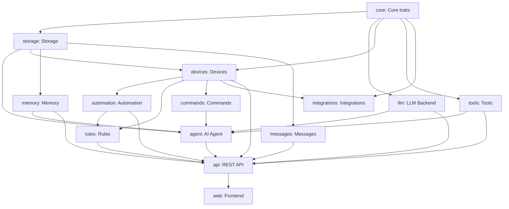

# NeoMind Module Documentation

This directory contains detailed documentation for each module of the NeoMind project in English.

## 目录 / Contents

```
docs/guides/en/
├── README.md                 # This file
├── 01-core.md                # Core module (trait definitions, EventBus, etc.)
├── 02-llm.md                 # LLM backend module
├── 03-agent.md               # AI Agent module
├── 04-devices.md             # Device management module
├── 05-automation.md          # Automation module
├── 06-rules.md               # Rule engine module
├── 07-tools.md               # Tool calling module
├── 08-memory.md              # Memory system module
├── 09-messages.md            # Message notification module
├── 10-storage.md             # Storage layer module
├── 11-integrations.md        # Integration module
├── 12-commands.md            # Command queue module
├── 13-extension-sdk.md        # Extension SDK module
├── 14-api.md                 # REST API module
├── 15-web.md                 # Frontend module
└── 16-extension-dev.md        # Extension development guide
```

## Module Dependencies



## Quick Navigation

| Module | Status | Purpose |
|---------|---------|---------|
| [Core](01-core.md) | 90% | Core trait definitions, event bus, DataSourceId |
| [LLM](02-llm.md) | 90% | Multi-backend LLM support |
| [Agent](03-agent.md) | 90% | AI chat agent, extension metrics collection |
| [Devices](04-devices.md) | 85% | Device management & adapters |
| [Automation](05-automation.md) | 75% | Data transformation & automation |
| [Rules](06-rules.md) | 75% | DSL rule engine |
| [Tools](07-tools.md) | 80% | Function calling tools |
| [Memory](08-memory.md) | 85% | Three-tier memory system |
| [Messages](09-messages.md) | 70% | Message notifications |
| [Storage](10-storage.md) | 95% | Persistent storage, unified time-series DB |
| [Integrations](11-integrations.md) | 65% | External system integration |
| [Commands](12-commands.md) | 70% | Device command queue |
| [Extension SDK](13-extension-sdk.md) | 85% | Extension SDK (V2 unified system) |
| [API](14-api.md) | 90% | REST/WebSocket API, extension metrics |
| [Web](15-web.md) | 80% | React frontend, Zustand state |
| [Extension Dev](16-extension-dev.md) | New | Extension development tutorial |

## Tech Stack

### Backend
- **Language**: Rust 2024 Edition
- **Runtime**: Tokio (async)
- **Web Framework**: Axum 0.7
- **Storage**: redb 2.1
- **Serialization**: serde + serde_json

### Frontend
- **Language**: TypeScript
- **Framework**: React 18
- **Build**: Vite
- **State**: Zustand
- **UI**: Radix UI + Tailwind CSS
