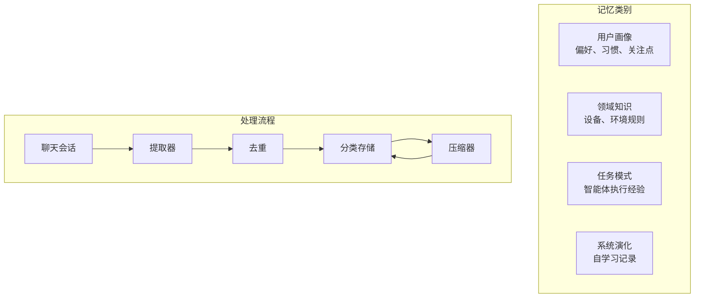

# Memory 模块

**包名**: `neomind-agent` (memory submodule)
**版本**: 0.6.5
**完成度**: 95%
**用途**: 分类记忆系统，支持 LLM 自动提取和压缩

## 概述

Memory 模块为 AI 智能体提供基于 Markdown 的记忆系统。基于 2026 年研究（Voxos.ai, Letta），简单文件存储（74% 准确率）优于复杂的图/RAG 系统（68.5%）。

### 核心特性

- **分类组织**: 四类独立记忆类别，便于有序存储
- **LLM 驱动提取**: 从对话中自动提取记忆
- **智能压缩**: LLM 驱动的摘要和合并
- **去重机制**: 基于语义相似度的重复检测
- **定时任务**: 可配置的后台提取和压缩调度

## 分类记忆



| 类别 | 描述 | 最大条目 | 文件 |
|------|------|---------|------|
| **用户画像** | 用户偏好、习惯、关注点 | 50 | `user_profile.md` |
| **领域知识** | 设备知识、环境规则 | 100 | `domain_knowledge.md` |
| **任务模式** | 任务执行模式、智能体经验 | 80 | `task_patterns.md` |
| **系统演化** | 系统自学习、适应记录 | 30 | `system_evolution.md` |

## 模块结构

```
crates/neomind-agent/src/memory/
├── mod.rs              # 公开接口
├── manager.rs          # MemoryManager - 统一入口
├── extractor.rs        # LLM 驱动的记忆提取
├── compressor.rs       # LLM 驱动的压缩
├── dedup.rs            # 语义去重
├── scheduler.rs        # 后台任务调度
├── compat.rs           # 向后兼容层
├── short_term.rs       # 短期记忆（对话上下文）
├── mid_term.rs         # 中期记忆（会话历史）
├── long_term.rs        # 长期记忆（知识库）
├── tiered.rs           # 统一分层接口
├── bm25.rs             # 全文搜索
└── embeddings.rs       # 嵌入向量
```

## 核心组件

### 1. MemoryManager

所有记忆操作的统一入口。

```rust
use neomind_agent::memory::MemoryManager;
use neomind_storage::MemoryCategory;

#[tokio::main]
async fn main() -> Result<(), Box<dyn std::error::Error>> {
    let manager = MemoryManager::new(Default::default());
    manager.init().await?;

    // 读取记忆
    let profile = manager.read(&MemoryCategory::UserProfile).await?;

    // 写入记忆
    manager.write(&MemoryCategory::DomainKnowledge, r#"
## 设备信息
- 客厅灯: Zigbee 设备, ID: light_001
- 温度传感器: MQTT 设备, ID: temp_001

## 环境规则
- 傍晚模式 18:00 启动
- 夜间模式 22:00 启动
"#).await?;

    // 获取统计
    let stats = manager.stats(&MemoryCategory::UserProfile).await?;
    println!("行数: {}, 字数: {}", stats.lines, stats.words);

    Ok(())
}
```

### 2. Memory Extractor（记忆提取器）

LLM 驱动的对话记忆提取。

```rust
use neomind_agent::memory::{ChatExtractor, MemoryCandidate};

// 从聊天消息中提取记忆
let extractor = ChatExtractor::new(llm_backend);
let candidates = extractor.extract(&messages).await?;

for candidate in candidates {
    println!("类别: {:?}", candidate.category);
    println!("内容: {}", candidate.content);
    println!("重要性: {}", candidate.importance);
}
```

### 3. Memory Compressor（记忆压缩器）

LLM 驱动的大型记忆文件压缩。

```rust
use neomind_agent::memory::MemoryCompressor;

let compressor = MemoryCompressor::new(llm_backend);

// 压缩超出阈值的记忆
let result = compressor.compress(
    &MemoryCategory::TaskPatterns,
    80,  // 最大条目数
).await?;

println!("原始条目: {}", result.original_count);
println!("压缩后条目: {}", result.compressed_count);
println!("节省 Token: {}", result.tokens_saved);
```

### 4. Memory Scheduler（记忆调度器）

后台定时执行提取和压缩。

```rust
use neomind_agent::memory::MemoryScheduler;

let scheduler = MemoryScheduler::new(config, llm_backend);

// 启动后台任务
scheduler.start().await?;

// 提取每小时运行一次（可配置）
// 压缩每 24 小时运行一次（可配置）
```

## 配置说明

```json
{
  "enabled": true,
  "storage_path": "data/memory",
  "extraction": {
    "similarity_threshold": 0.85
  },
  "compression": {
    "decay_period_days": 30,
    "min_importance": 20,
    "max_entries": {
      "user_profile": 50,
      "domain_knowledge": 100,
      "task_patterns": 80,
      "system_evolution": 30
    }
  },
  "llm": {
    "extraction_backend_id": "ollama-qwen",
    "compression_backend_id": "ollama-qwen"
  },
  "schedule": {
    "extraction_enabled": true,
    "extraction_interval_secs": 3600,
    "compression_enabled": true,
    "compression_interval_secs": 86400
  }
}
```

## 记忆条目格式

记忆以 Markdown 格式存储，包含重要性评分：

```markdown
## 模式
- 2026-04-01: 用户喜欢晚上关灯 [重要性: 80]
- 2026-04-01: 每天早上10点检查温度 [重要性: 60]

## 实体
- 设备: 客厅灯 (light_001)
- 位置: 客厅, 卧室

## 偏好
- 温度单位: 摄氏度
- 语言: 中文

## 事实
- 2026-04-01: 系统使用整洁架构
```

## API 端点

```
# 分类 API（新版）
GET    /api/memory/categories              # 列出所有分类及统计
GET    /api/memory/categories/:category    # 获取分类内容
PUT    /api/memory/categories/:category    # 更新分类内容
POST   /api/memory/categories/:category/entries  # 添加记忆条目

# 配置
GET    /api/memory/config                  # 获取记忆配置
PUT    /api/memory/config                  # 更新配置

# 操作
POST   /api/memory/extract                 # 手动触发提取
POST   /api/memory/compress                # 手动触发压缩

# 旧版 API（向后兼容）
GET    /api/memory/files                   # 列出记忆文件
GET    /api/memory/files/:id               # 获取文件内容
PUT    /api/memory/files/:id               # 更新文件内容
```

## 使用示例

### 在智能体中读取记忆

```rust
use neomind_agent::memory::{MemoryManager, MemoryCategory};

async fn get_user_preferences(manager: &MemoryManager) -> Vec<String> {
    let content = manager.read(&MemoryCategory::UserProfile).await?;
    // 从 Markdown 中解析偏好
    parse_preferences(&content)
}
```

### 通过 API 添加记忆条目

```bash
# 通过 API 添加任务模式
curl -X POST http://localhost:9375/api/memory/categories/task_patterns/entries \
  -H "Content-Type: application/json" \
  -d '{
    "content": "2026-04-01: 使用 PID 控制器成功调节温度 [重要性: 75]",
    "importance": 75
  }'
```

### 手动触发提取

```bash
# 从指定会话触发提取
curl -X POST http://localhost:9375/api/memory/extract \
  -H "Content-Type: application/json" \
  -d '{
    "session_id": "session_123",
    "force": false
  }'
```

## 设计原则

1. **简单优先**: 使用 Markdown 文件而非复杂数据库
2. **分类组织**: 四种不同类别存储不同类型记忆
3. **LLM 集成**: 利用 LLM 自动提取和压缩记忆
4. **重要性裁剪**: 基于重要性评分保留关键记忆
5. **向后兼容**: 旧版 API 仍可用于现有集成

## 存储位置

记忆文件存储在 data 目录：

```
data/memory/
├── user_profile.md        # 用户偏好和习惯
├── domain_knowledge.md    # 设备和环境知识
├── task_patterns.md       # 任务执行模式
├── system_evolution.md    # 系统学习记录
└── memory_config.json     # 配置文件
```

## 与智能体集成

智能体可以通过 MemoryManager 访问相关记忆：

```rust
impl AgentExecutor {
    async fn build_context(&self, session_id: &str) -> Result<AgentContext> {
        // 获取相关记忆
        let profile = self.memory_manager.read(&MemoryCategory::UserProfile).await?;
        let domain = self.memory_manager.read(&MemoryCategory::DomainKnowledge).await?;

        // 基于记忆构建上下文
        let context = AgentContext {
            user_preferences: parse_user_profile(&profile),
            domain_knowledge: parse_domain_knowledge(&domain),
            // ...
        };

        Ok(context)
    }
}
```
