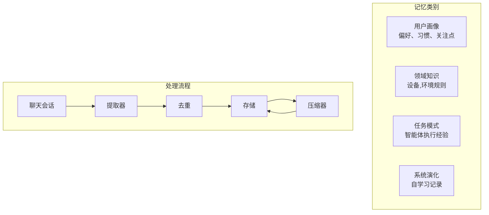

# Memory 模块

**包名**: `neomind-agent` (memory submodule)
**版本**: 0.6.3
**完成度**: 95%
**用途**: 分类记忆系统，支持 LLM 自动提取和压缩
## 概述
Memory 模块为 AI 智能体提供基于 Markdown 的内存系统。基于 2026 年研究（Voxos.ai, Letta），简单文件存储（74% 准确率）优于复杂的图/RAG 系统（68.5%）。
### 核心特性
- **分类组织**: 四类独立记忆类别，便于有序存储
- **LLM 驱动提取**: 从对话中自动提取记忆
- **智能压缩**: LLM 鋱动的摘要和合并
- **去重机制**: 基于语义相似度的重复检测
- **定时任务**: 可配置的后台提取和压缩调度
## 讙类记忆


| 类别 | 描述 | 最大条目 | 文件 |
|------|------|---------|------|
| **用户画像** | 用户偏好、习惯、关注点 | 50 | `user_profile.md` |
| **领域知识** | 设备知识、环境规则 | 100 | `domain_knowledge.md` |
| **任务模式** | 任务执行模式、智能体经验 | 80 | `task_patterns.md` |
| **系统演化** | 系统自学习、适应记录 | 30 | `system_evolution.md` |
## 模块结构
```
crates/neomind-agent/src/memory/
├── mod.rs              # 公开接口
├── manager.rs          # MemoryManager - 统一入口
├── extractor.rs        # LLM 驱动的记忆提取
├── compressor.rs       # LLM 驱动的压缩
├── dedup.rs            # 语义去重
├── scheduler.rs        # 后台任务调度
├── compat.rs           # 向后兼容层
```
## 讙类详解
### 1. 用户画像 (UserProfile)
存储用户相关信息：
```markdown
## 娡式
- 2026-04-01: 用户喜欢晚上关灯 [重要性: 80]
- 2026-04-01: 每天早上10点检查温度 [重要性: 60]
## 娡型
- 2026-04-01: 用户偏好摄氏度单位
- 2026-04-01: 用户使用中文交流
## 模型
- 2026-04-01: 用户拥有客厅和卧室两个重点区域
## 模型
- 2026-04-01: 用户习惯在周末进行系统维护
## 模型
- 2026-04-01: 清理设备缓存可解决性能问题
## 模型
- 2026-04-01: 设备离线时自动重启恢复
## 模型
- 2026-04-01: 查询天气使用 weather 扙展展效率最高
- 2026-04-01: 批量操作设备使用 aggregated 工具
## 模型
- 2026-04-01: v0.6.3 引入分类记忆系统 [重要性: 90]
- 2026-04-01: mTLS 支持提升设备连接安全性 [重要性: 85]
## 存储位置
```
data/memory/
├── user_profile.md        # 用户偏好和习惯
├── domain_knowledge.md    # 设备和环境知识
├── task_patterns.md       # 任务执行模式
├── system_evolution.md    # 系统学习记录
└── memory_config.json     # 配置文件
```
## 配置说明
```json
{
  "enabled": true,
  "storage_path": "data/memory",
  "extraction": {
    "similarity_threshold": 0.85
  },
  "compression": {
    "decay_period_days": 30,
    "min_importance": 20,
    "max_entries": {
    "user_profile": 50,
    "domain_knowledge": 100,
    "task_patterns": 80,
    "system_evolution": 30
  }
  },
  "llm": {
    "extraction_backend_id": "ollama",
    "compression_backend_id": "openai"
  },
  "schedule": {
    "extraction_enabled": true,
    "extraction_interval_secs": 3600,
    "compression_enabled": true,
    "compression_interval_secs": 86400
  }
}
```
## API 端点
```
# 查看所有统计
GET    /api/memory/stats

# 获取分类内容
GET    /api/memory/categories/:category

# 更新分类内容
PUT    /api/memory/categories/:category

# 添加记忆条目
POST   /api/memory/entries

# 触发提取
POST   /api/memory/extract

# 触发压缩
POST   /api/memory/compress

# 导出所有记忆
GET    /api/memory/export

# 获取/更新配置
GET    /api/memory/config
PUT    /api/memory/config
```
## 使用示例
```rust
use neomind_agent::memory::{MemoryManager, MemoryCategory};
use neomind_storage::MemoryConfig;

#[tokio::main]
async fn main() -> Result<(), Box<dyn std::error::Error>> {
    // 创建内存管理器
    let config = MemoryConfig::default();
    let manager = MemoryManager::new(config);

    // 初始化
    manager.init().await?;

    // 读取用户画像
    let profile = manager.read(&MemoryCategory::UserProfile).await?;
    println!("User Profile: {}", profile);

    // 写入新的记忆
    manager.write(
        &MemoryCategory::TaskPatterns,
        "- 2026-04-03: 自动备份成功执行\n"
    ).await?;

    // 获取统计
    let stats = manager.all_stats().await?;
    for (category, stat in stats {
        println!("{}: {} entries, {} bytes",
            category, stat.entry_count, stat.size_bytes);
    }

    Ok(())
}
```
## 与智能体集成
智能体可以通过 MemoryManager 讌问相关记忆：
```rust
impl AgentExecutor {
    async fn build_context(&self, session_id: &str) -> Result<AgentContext> {
        let profile = self.memory_manager
            .read(&MemoryCategory::UserProfile).await?;
        let domain = self.memory_manager
            .read(&MemoryCategory::DomainKnowledge).await?;

        Ok(AgentContext {
            user_preferences: parse_user_profile(&profile),
            domain_knowledge: parse_domain_knowledge(&domain),
            // ...
        })
    }
}
```
## 设计原则
1. **简单优先**: 使用 Markdown 文件而非复杂数据库
2. **分类组织**: 不同类型记忆分开存储，便于管理
3. **LLM 陱动**: 利用 LLM 自动提取和压缩记忆
4. **重要性分级**: 基于重要性评分保留关键记忆
5. **向后兼容**: 保留旧 API 同时支持新分类系统
