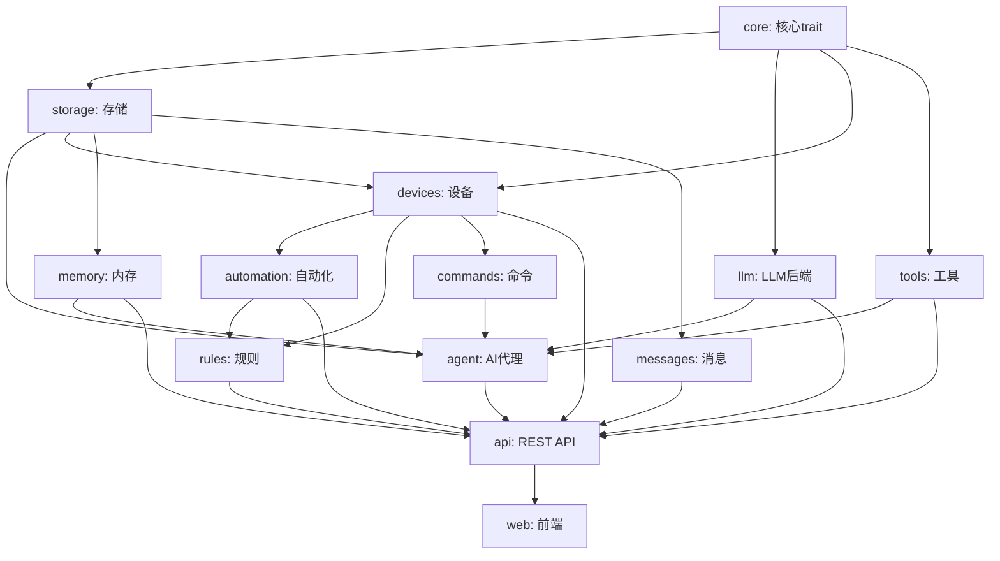

# NeoMind 模块文档

本目录包含 NeoMind 项目各个模块的详细文档。

## 目录结构

```
docs/guides/zh/
├── README.md                 # 本文件
├── 01-core.md                # 核心模块 (trait定义、EventBus等)
├── 02-llm.md                 # LLM后端模块
├── 03-agent.md               # AI Agent模块
├── 04-devices.md             # 设备管理模块
├── 05-automation.md          # 自动化模块
├── 06-rules.md               # 规则引擎模块
├── 07-tools.md               # 工具调用模块
├── 08-memory.md              # 记忆系统模块
├── 09-messages.md            # 消息通知模块
├── 10-storage.md             # 存储层模块
├── 12-commands.md            # 命令队列模块
├── 14-api.md                 # REST API模块
├── 15-web.md                 # 前端模块
└── extension-system.md       # 扩展体系完整指南（推荐）
```

## 模块依赖关系



## 快速导航

| 模块 | 完成度 | 用途 |
|------|--------|------|
| [Core](./01-core.md) | 90% | 核心trait定义、事件总线、DataSourceId |
| [LLM](./02-llm.md) | 90% | 多后端LLM支持 |
| [Agent](./03-agent.md) | 90% | AI会话代理、扩展指标采集 |
| [Devices](./04-devices.md) | 85% | 设备管理与适配器 |
| [Automation](./05-automation.md) | 75% | 数据转换与自动化 |
| [Rules](./06-rules.md) | 75% | DSL规则引擎 |
| [Tools](./07-tools.md) | 80% | 函数调用工具 |
| [Memory](./08-memory.md) | 85% | 分类记忆系统 |
| [Messages](./09-messages.md) | 70% | 消息通知 |
| [Storage](./10-storage.md) | 95% | 持久化存储、统一时序数据库 |
| [Commands](./12-commands.md) | 70% | 设备命令队列 |
| [API](./14-api.md) | 90% | REST/WebSocket API、扩展指标 |
| [Web](./15-web.md) | 80% | React前端、Zustand状态管理 |
| [Extension System](./extension-system.md) | **推荐** | 扩展体系完整指南（架构、开发、能力系统、进程隔离、流式扩展、包格式） |

## 技术栈

### 后端
- **语言**: Rust 2024 Edition
- **运行时**: Tokio (async)
- **Web框架**: Axum 0.7
- **存储**: redb 2.1
- **序列化**: serde + serde_json

### 前端
- **语言**: TypeScript
- **框架**: React 18
- **构建**: Vite
- **状态**: Zustand
- **UI**: Radix UI + Tailwind CSS
