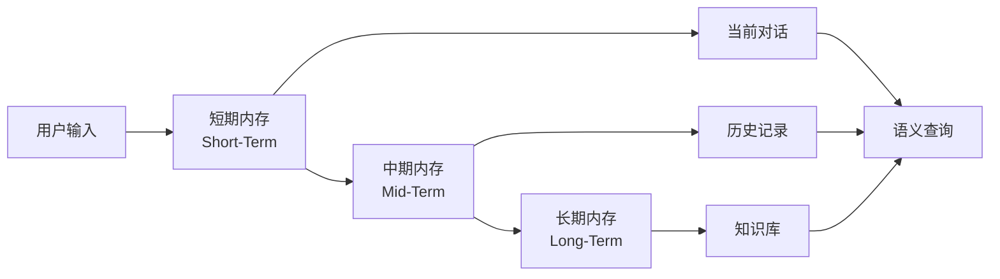

# Memory 模块

**包名**: `neomind-memory`
**版本**: 0.5.8
**完成度**: 85%
**用途**: 三层内存系统（短期/中期/长期）

## 概述

Memory模块实现了分层内存架构，用于管理对话历史、会话数据和知识库。

## 模块结构

```
crates/memory/src/
├── lib.rs                      # 公开接口
├── short_term.rs               # 短期内存
├── mid_term.rs                 # 中期内存
├── long_term.rs                # 长期内存
├── tiered.rs                   # 分层内存
├── unified.rs                  # 统一接口
├── semantic.rs                 # 语义搜索
├── bm25.rs                     # BM25全文搜索
├── embeddings.rs               # 嵌入向量
├── importance.rs               # 重要性评分
├── compression.rs              # 内存压缩
├── graph.rs                    # 知识图谱
└── budget.rs                   # Token预算
```

## 三层内存架构



### 1. 短期内存 (ShortTermMemory)

当前对话的上下文窗口。

```rust
pub struct ShortTermMemory {
    /// 最大消息数
    max_messages: usize,

    /// 最大token数
    max_tokens: usize,

    /// 消息列表
    messages: Vec<MemoryMessage>,
}

pub struct MemoryMessage {
    /// 角色
    pub role: MessageRole,

    /// 内容
    pub content: String,

    /// 是否为thinking内容
    pub is_thinking: bool,

    /// 时间戳
    pub timestamp: i64,
}

impl ShortTermMemory {
    /// 添加消息
    pub fn add_message(&mut self, role: &str, content: &str) -> Result<()>;

    /// 获取消息
    pub fn get_messages(&self) -> Vec<MemoryMessage>;

    /// 清空
    pub fn clear(&mut self);

    /// Token计数
    pub fn count_tokens(&self) -> usize;

    /// 压缩到token限制内
    pub fn compact(&mut self) -> Result<()>;
}
```

### 2. 中期内存 (MidTermMemory)

最近会话历史，支持语义搜索。

```rust
pub struct MidTermMemory {
    /// 存储后端
    store: Arc<SessionStore>,

    /// 语义搜索
    semantic: Arc<SemanticSearch>,
}

pub struct ConversationEntry {
    /// 会话ID
    pub session_id: String,

    /// 用户输入
    pub user_input: String,

    /// AI响应
    pub assistant_response: String,

    /// 时间戳
    pub timestamp: i64,

    /// 嵌入向量
    pub embedding: Option<Vec<f32>>,
}

impl MidTermMemory {
    /// 添加对话
    pub async fn add_conversation(
        &mut self,
        session_id: &str,
        user_input: &str,
        assistant_response: &str,
    ) -> Result<()>;

    /// 搜索历史
    pub async fn search(
        &self,
        query: &str,
        limit: usize,
    ) -> Result<Vec<SearchResult>>;

    /// 获取会话历史
    pub async fn get_history(
        &self,
        session_id: &str,
    ) -> Result<Vec<ConversationEntry>>;
}

pub struct SearchResult {
    /// 匹配的对话
    pub entry: ConversationEntry,

    /// 相关性分数
    pub score: f32,

    /// 高亮片段
    pub highlight: Option<String>,
}
```

### 3. 长期内存 (LongTermMemory)

持久化知识库，包括设备知识、故障案例等。

```rust
pub struct LongTermMemory {
    /// 存储后端
    store: Arc<KnowledgeStore>,

    /// 语义搜索
    semantic: Arc<SemanticSearch>,
}

pub struct KnowledgeEntry {
    /// 知识ID
    pub id: String,

    /// 标题
    pub title: String,

    /// 内容
    pub content: String,

    /// 分类
    pub category: KnowledgeCategory,

    /// 标签
    pub tags: Vec<String>,

    /// 元数据
    pub metadata: serde_json::Value,

    /// 创建时间
    pub created_at: i64,

    /// 更新时间
    pub updated_at: i64,
}

pub enum KnowledgeCategory {
    DeviceManual,
    Troubleshooting,
    BestPractice,
    Configuration,
    ApiDocumentation,
    Custom(String),
}

impl LongTermMemory {
    /// 添加知识
    pub async fn add_knowledge(&mut self, entry: KnowledgeEntry) -> Result<()>;

    /// 搜索知识
    pub async fn search(
        &self,
        query: &str,
        category: Option<KnowledgeCategory>,
        limit: usize,
    ) -> Result<Vec<KnowledgeEntry>>;

    /// 获取知识
    pub async fn get(&self, id: &str) -> Option<KnowledgeEntry>;

    /// 更新知识
    pub async fn update(&mut self, entry: KnowledgeEntry) -> Result<()>;

    /// 删除知识
    pub async fn delete(&mut self, id: &str) -> Result<()>;
}
```

## 统一接口

```rust
pub struct TieredMemory {
    /// 短期内存
    short_term: ShortTermMemory,

    /// 中期内存
    mid_term: Arc<MidTermMemory>,

    /// 长期内存
    long_term: Arc<LongTermMemory>,
}

pub struct MemoryQueryResult {
    /// 短期结果
    pub short_term: Vec<MemoryMessage>,

    /// 中期结果
    pub mid_term: Vec<SearchResult>,

    /// 长期结果
    pub long_term: Vec<KnowledgeEntry>,
}

impl TieredMemory {
    /// 创建新实例
    pub fn new() -> Self;

    /// 添加消息（短期）
    pub fn add_message(&mut self, role: &str, content: &str) -> Result<()>;

    /// 整合到中期
    pub async fn consolidate(&mut self, session_id: &str) -> Result<()>;

    /// 查询所有层
    pub async fn query_all(
        &self,
        query: &str,
        limit: usize,
    ) -> MemoryQueryResult;

    /// 获取统计
    pub async fn get_stats(&self) -> MemoryStats;
}

pub struct MemoryStats {
    pub short_term_messages: usize,
    pub mid_term_entries: usize,
    pub long_term_entries: usize,
}
```

## 语义搜索

```rust
pub trait SemanticSearch: Send + Sync {
    /// 添加文档
    async fn add(&self, doc: SemanticDocument) -> Result<()>;

    /// 搜索
    async fn search(
        &self,
        query: &str,
        limit: usize,
    ) -> Result<Vec<SemanticSearchResult>>;

    /// 删除文档
    async fn remove(&self, id: &str) -> Result<()>;
}

pub struct SemanticDocument {
    pub id: String,
    pub text: String,
    pub metadata: serde_json::Value,
}

pub struct SemanticSearchResult {
    pub document: SemanticDocument,
    pub score: f32,
}
```

## 嵌入模型

```rust
pub enum EmbeddingProvider {
    Local,
    Ollama,
    OpenAI,
}

pub struct EmbeddingModel {
    provider: EmbeddingProvider,
    model_name: String,
}

impl EmbeddingModel {
    /// 创建嵌入模型
    pub fn new(provider: EmbeddingProvider, model: &str) -> Result<Self>;

    /// 生成嵌入向量
    pub async fn embed(&self, text: &str) -> Result<Vec<f32>>;

    /// 批量生成
    pub async fn embed_batch(&self, texts: &[String]) -> Result<Vec<Vec<f32>>>;

    /// 计算相似度
    pub fn similarity(&self, a: &[f32], b: &[f32]) -> f32;
}
```

## BM25全文搜索

```rust
pub struct BM25Index {
    /// 文档集合
    documents: HashMap<String, DocumentStats>,

    /// IDF值
    idf: HashMap<String, f32>,

    /// 参数k1
    k1: f32,

    /// 参数b
    b: f32,
}

pub struct BM25Result {
    pub doc_id: String,
    pub score: f32,
}

impl BM25Index {
    /// 添加文档
    pub fn add_document(&mut self, id: &str, text: &str);

    /// 搜索
    pub fn search(&self, query: &str, limit: usize) -> Vec<BM25Result>;
}
```

## 重要性评分

```rust
pub struct ImportanceScorer {
    /// 配置
    config: ImportanceConfig,

    /// 访问记录
    access_records: Vec<AccessRecord>,
}

pub struct ImportanceConfig {
    /// 频率权重
    pub frequency_weight: f32,

    /// 近期权重
    pub recency_weight: f32,

    /// 情感权重
    pub emotional_weight: f32,

    /// 关联权重
    pub cross_ref_weight: f32,

    /// 半衰期（天数）
    pub decay_halflife: f32,
}

pub enum HeatScore {
    Hot,    // 频繁访问且重要
    Warm,   // 偶尔访问
    Cold,   // 很少访问
}
```

## 内存压缩

```rust
pub struct MemoryCompressor {
    /// 配置
    config: CompressionConfig,
}

pub enum CompressionMethod {
    /// 摘要压缩
    Summary {
        target_ratio: f32,
    },

    /// 关键点提取
    KeyPoints {
        max_points: usize,
    },

    /// 主题分组
    Thematic {
        num_topics: usize,
    },
}

impl MemoryCompressor {
    /// 压缩消息列表
    pub fn compress(
        &self,
        messages: &[MemoryMessage],
        target_tokens: usize,
    ) -> Result<Vec<MemoryMessage>>;
}
```

## 知识图谱

```rust
pub struct MemoryGraph {
    /// 实体
    entities: HashMap<EntityId, Entity>,

    /// 关系
    relations: HashMap<RelationId, Relationship>,
}

pub struct Entity {
    pub id: EntityId,
    pub name: String,
    pub entity_type: EntityType,
    pub properties: HashMap<String, serde_json::Value>,
}

pub enum EntityType {
    Device,
    Sensor,
    Location,
    Person,
    Concept,
    Custom(String),
}

impl MemoryGraph {
    /// 添加实体
    pub fn add_entity(&mut self, entity: Entity) -> Result<()>;

    /// 添加关系
    pub fn add_relation(&mut self, relation: Relationship) -> Result<()>;

    /// 查找路径
    pub fn find_path(
        &self,
        from: &EntityId,
        to: &EntityId,
    ) -> Option<Vec<GraphPath>>;
}
```

## API端点

```
# Memory Stats
GET    /api/memory/stats                     # 内存统计

# Query
POST   /api/memory/query                    # 查询内存
GET    /api/memory/short-term               # 短期内存
POST   /api/memory/short-term               # 添加到短期
DELETE /api/memory/short-term               # 清空短期

# Mid-term
GET    /api/memory/mid-term/:session_id      # 会话历史

# Long-term
GET    /api/memory/long-term/search         # 搜索知识
GET    /api/memory/long-term/category/:category  # 按分类
POST   /api/memory/long-term                # 添加知识

# Consolidation
POST   /api/memory/consolidate/:session_id   # 整合到中期
```

## 使用示例

```rust
use neomind-memory::{TieredMemory, KnowledgeEntry, KnowledgeCategory};

#[tokio::main]
async fn main() -> Result<(), Box<dyn std::error::Error>> {
    let mut memory = TieredMemory::new();

    // 短期：添加消息
    memory.add_message("user", "温室温度是多少？")?;
    memory.add_message("assistant", "当前温室温度为25°C")?;

    // 中期：整合
    memory.consolidate("session_1").await?;

    // 长期：添加知识
    let entry = KnowledgeEntry::new(
        "温度传感器手册",
        "DHT22温度传感器的使用说明...",
        KnowledgeCategory::DeviceManual,
    );
    memory.add_knowledge(entry).await?;

    // 查询所有层
    let results = memory.query_all("温度", 5).await;
    println!("短期: {} 条", results.short_term.len());
    println!("中期: {} 条", results.mid_term.len());
    println!("长期: {} 条", results.long_term.len());

    Ok(())
}
```

## 设计原则

1. **分层存储**: 热数据在前，冷数据在后
2. **语义检索**: 支持向量搜索和全文搜索
3. **自动整合**: 短期自动整合到中期
4. **可压缩**: 支持摘要压缩节省空间
