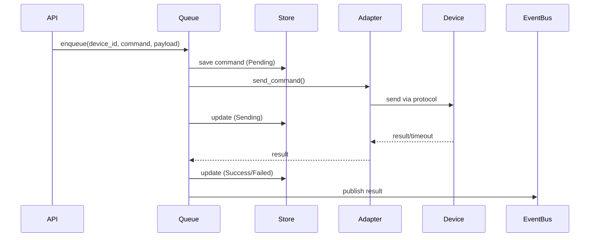

# Commands 模块

**包名**: `neomind-commands`
**版本**: 0.5.8
**完成度**: 70%
**用途**: 设备命令队列和下行适配

## 概述

Commands模块负责管理设备命令的发送、重试和状态跟踪。

## 模块结构

```
crates/commands/src/
├── lib.rs                      # 公开接口
├── adapter.rs                  # 下行适配器
├── queue.rs                    # 命令队列
├── store.rs                    # 命令存储
└── types.rs                    # 类型定义
```

## 核心类型

### 1. DeviceCommand - 设备命令

```rust
pub struct DeviceCommand {
    /// 命令ID
    pub id: String,

    /// 设备ID
    pub device_id: String,

    /// 命令名称
    pub command: String,

    /// 命令参数
    pub payload: serde_json::Value,

    /// 命令状态
    pub status: CommandStatus,

    /// 创建时间
    pub created_at: i64,

    /// 更新时间
    pub updated_at: i64,

    /// 执行时间
    pub executed_at: Option<i64>,

    /// 重试次数
    pub retry_count: u32,

    /// 错误信息
    pub error: Option<String>,
}

pub enum CommandStatus {
    /// 待发送
    Pending,

    /// 发送中
    Sending,

    /// 已发送（等待确认）
    Sent,

    /// 成功
    Success,

    /// 失败
    Failed {
        error: String,
        retryable: bool,
    },

    /// 已取消
    Cancelled,

    /// 超时
    Timeout,
}
```

### 2. DownlinkAdapter - 下行适配器

```rust
#[async_trait]
pub trait DownlinkAdapter: Send + Sync {
    /// 适配器类型
    fn adapter_type(&self) -> &str;

    /// 发送命令
    async fn send_command(
        &self,
        device_id: &str,
        command: &str,
        payload: &serde_json::Value,
    ) -> Result<serde_json::Value>;

    /// 测试连接
    async fn test_connection(&self) -> Result<bool>;

    /// 获取统计
    fn stats(&self) -> AdapterStats;
}
```

### 3. 适配器实现

#### MQTT下行适配器

```rust
pub struct MqttDownlinkAdapter {
    /// MQTT客户端
    client: Arc<AsyncClient>,

    /// 命令主题模板
    topic_template: String,

    /// QoS级别
    qos: u8,

    /// 统计
    stats: Arc<AdapterStats>,
}

pub struct MqttAdapterConfig {
    /// 适配器ID
    pub id: String,

    /// MQTT Broker
    pub broker: String,

    /// 命令主题模板，{device_id}会被替换
    pub topic_prefix: String,

    /// QoS
    pub qos: u8,
}
```

#### HTTP下行适配器

```rust
pub struct HttpDownlinkAdapter {
    client: reqwest::Client,
    base_url: String,
    stats: Arc<AdapterStats>,
}

pub struct HttpAdapterConfig {
    pub id: String,
    pub base_url: String,
    pub headers: HashMap<String, String>,
    pub timeout_secs: u64,
}
```

### 4. 命令队列

```rust
pub struct CommandQueue {
    /// 存储后端
    store: Arc<CommandStore>,

    /// 适配器注册表
    adapters: Arc<RwLock<HashMap<String, Arc<dyn DownlinkAdapter>>>>,

    /// 事件总线
    event_bus: Arc<EventBus>,

    /// 队列配置
    config: QueueConfig,
}

pub struct QueueConfig {
    /// 队列容量
    pub capacity: usize,

    /// 工作线程数
    pub workers: usize,

    /// 重试策略
    pub retry_policy: RetryPolicy,

    /// 重试间隔（毫秒）
    pub retry_interval_ms: u64,

    /// 最大重试次数
    pub max_retries: u32,
}

pub enum RetryPolicy {
    /// 固定间隔
    Fixed,

    /// 指数退避
    Exponential {
        base_ms: u64,
        max_ms: u64,
        multiplier: f64,
    },

    /// 线性增长
    Linear {
        initial_ms: u64,
        increment_ms: u64,
    },
}
```

### 5. 命令存储

```rust
pub struct CommandStore {
    db: Database,
}

impl CommandStore {
    /// 打开存储
    pub fn open(path: impl AsRef<Path>) -> Result<Self>;

    /// 添加命令
    pub fn add(&self, command: &DeviceCommand) -> Result<()>;

    /// 获取命令
    pub fn get(&self, id: &str) -> Result<Option<DeviceCommand>>;

    /// 更新状态
    pub fn update_status(
        &self,
        id: &str,
        status: CommandStatus,
    ) -> Result<()>;

    /// 列出设备命令
    pub fn list_by_device(
        &self,
        device_id: &str,
        limit: usize,
    ) -> Result<Vec<DeviceCommand>>;

    /// 列出待处理命令
    pub fn list_pending(&self) -> Result<Vec<DeviceCommand>>;

    /// 清理旧命令
    pub fn cleanup(&self, older_than: i64) -> Result<usize>;
}
```

## 命令执行流程



## API端点

```
# Commands
GET    /api/commands                       # 列出命令
GET    /api/commands/:id                   # 获取命令
POST   /api/commands/:id/retry             # 重试命令
POST   /api/commands/:id/cancel            # 取消命令
GET    /api/commands/stats                 # 命令统计
POST   /api/commands/cleanup               # 清理历史
```

## 使用示例

### 发送命令

```rust
use neomind-commands::{CommandQueue, DeviceCommand, CommandStatus};

let command = DeviceCommand {
    id: "cmd_001".to_string(),
    device_id: "relay_1".to_string(),
    command: "turn_on".to_string(),
    payload: serde_json::json!({}),
    status: CommandStatus::Pending,
    created_at: chrono::Utc::now().timestamp(),
    updated_at: chrono::Utc::now().timestamp(),
    executed_at: None,
    retry_count: 0,
    error: None,
};

queue.enqueue(command).await?;
```

### 注册适配器

```rust
use neomind-commands::{MqttDownlinkAdapter, MqttAdapterConfig, DownlinkAdapter};

let config = MqttAdapterConfig {
    id: "main_mqtt".to_string(),
    broker: "tcp://localhost:1883".to_string(),
    topic_prefix: "actuators/{device_id}/command".to_string(),
    qos: 1,
};

let adapter: Arc<dyn DownlinkAdapter> = Arc::new(
    MqttDownlinkAdapter::new(config).await?
);

queue.register_adapter(adapter).await?;
```

## 已清理的功能

- ✅ Modbus下行适配器（未实现）

## 设计原则

1. **异步队列**: 命令异步发送，不阻塞主流程
2. **重试机制**: 失败命令自动重试
3. **状态跟踪**: 完整的命令生命周期跟踪
4. **协议解耦**: 通过适配器支持多种下行协议
