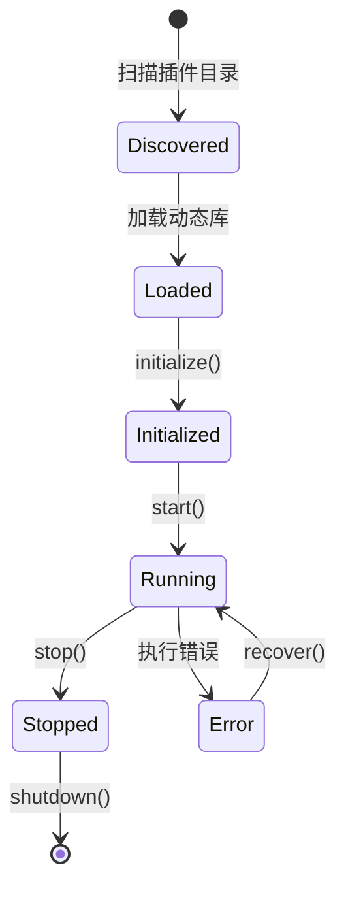

# Plugin/Extension SDK 模块

**包名**: `neomind-extension-sdk`
**版本**: 0.5.8
**完成度**: 60%
**用途**: 动态扩展SDK

## ⚠️ 重要变更 (v0.5.x)

**Plugin系统已迁移到统一的Extension系统**。本SDK现在支持Extension trait开发。

- Plugin API → Extension API (推荐使用)
- 旧的Plugin SDK保持向后兼容
- 新开发请使用 `neomind-extension-sdk` 中的 `Extension` trait

详见 [Plugin迁移文档](../../architecture/plugin-migration.md)。

## 概述

Extension SDK提供了开发NeoMind动态扩展所需的宏、类型和工具。

## 模块结构

```
crates/plugin-sdk/src/
├── lib.rs                      # 公开接口
├── macros.rs                   # 过程宏
├── descriptor.rs               # 插件描述符
├── types.rs                    # 类型定义
└── error.rs                    # 错误类型
```

## 核心概念

### 1. PluginDescriptor - 插件描述符

```rust
pub struct PluginDescriptor {
    /// 插件ID
    pub id: String,

    /// 插件名称
    pub name: String,

    /// 插件版本
    pub version: String,

    /// 插件类型
    pub plugin_type: PluginType,

    /// NeoMind版本要求
    pub required_neomind_version: Option<String>,

    /// 能力标志
    pub capabilities: Vec<PluginCapability>,
}

pub enum PluginType {
    /// LLM提供者
    LlmProvider,

    /// 设备协议
    DeviceProtocol,

    /// 告警通道
    AlertChannel,

    /// 工具
    Tool,

    /// 通用插件
    Generic,
}

pub enum PluginCapability {
    /// 异步执行
    Async,

    /// 线程安全
    ThreadSafe,

    /// 流式支持
    Streaming,

    /// 热重载
    HotReload,
}
```

### 2. Plugin上下文

```rust
pub struct PluginContext {
    /// 插件ID
    pub plugin_id: String,

    /// 配置
    pub config: serde_json::Value,

    /// 数据目录
    pub data_dir: PathBuf,

    /// 日志句柄
    pub log: slog::Logger,
}
```

### 3. Plugin请求/响应

```rust
pub struct PluginRequest {
    /// 请求类型
    pub request_type: String,

    /// 请求数据
    pub data: serde_json::Value,

    /// 元数据
    pub metadata: serde_json::Value,
}

pub struct PluginResponse {
    /// 是否成功
    pub success: bool,

    /// 响应数据
    pub data: serde_json::Value,

    /// 错误信息
    pub error: Option<String>,
}

pub type PluginResult<T> = std::result::Result<T, PluginError>;
```

## 宏系统

### export_plugin! - 导出插件

```rust
export_plugin!(
    MyPlugin,              // 插件类型
    "my-plugin",           // 插件ID
    "1.0.0",              // 版本
    PluginType::Tool       // 插件类型
);
```

生成的符号：
- `neomind_plugin_descriptor` - 插件描述符（静态）
- `neomind_plugin_create` - 创建插件实例
- `neomind_plugin_destroy` - 销毁插件实例

### plugin_impl! - 实现插件

```rust
#[plugin_impl]
impl MyPlugin {
    fn new(config: &Value) -> PluginResult<Self> {
        Ok(MyPlugin {
            config: config.clone(),
        })
    }

    fn handle(&mut self, request: PluginRequest) -> PluginResult<PluginResponse> {
        // 处理请求
        Ok(PluginResponse::success(json!({"status": "ok"})))
    }
}
```

### descriptor! - 描述符宏

```rust
descriptor! {
    id: "my-tool",
    version: "1.0.0",
    plugin_type: PluginType::Tool,
    name: "My Tool",
    description: "A sample plugin tool",
    author: "Your Name"
}
```

## ABI版本

```rust
pub const PLUGIN_ABI_VERSION: &str = "1.0";

/// C插件描述符（FFI兼容）
#[repr(C)]
pub struct CPluginDescriptor {
    /// ABI版本
    pub abi_version: *const u8,

    /// 插件ID
    pub id: *const u8,

    /// 插件名称
    pub name: *const u8,

    /// 插件版本
    pub version: *const u8,

    /// 插件类型
    pub plugin_type: u32,
}
```

## FFI函数

```rust
/// 创建插件实例
#[no_mangle]
pub extern "C" fn neomind_plugin_create(
    config_json: *const u8,
    config_len: usize,
) -> *mut ();

/// 销毁插件实例
#[no_mangle]
pub extern "C" fn neomind_plugin_destroy(instance: *mut ());
```

## 插件生命周期



## 工具函数

```rust
/// 从JSON配置创建插件
pub unsafe fn create_plugin<P>(
    config_json: *const u8,
    config_len: usize,
) -> *mut ()
where
    P: 'static,
{
    // 解析配置
    // 创建实例
    // 返回指针
}

/// 销毁插件
pub unsafe fn destroy_plugin<P>(instance: *mut ())
where
    P: 'static,
{
    // 重建Box并drop
}
```

## 插件类型

| 类型 | 说明 | 示例 |
|------|------|------|
| `LlmProvider` | LLM后端 | 通义千问、DeepSeek |
| `DeviceProtocol` | 设备协议 | Modbus、LoRaWAN |
| `AlertChannel` | 告警通道 | 钉钉、企业微信 |
| `Tool` | AI工具 | 自定义分析工具 |
| `Generic` | 通用插件 | 自定义功能 |

## API端点

```
# Extensions (替代Plugin API)
GET    /api/extensions                     # 列出扩展
POST   /api/extensions                     # 注册扩展
GET    /api/extensions/:id                 # 获取扩展
DELETE /api/extensions/:id                 # 删除扩展
POST   /api/extensions/:id/start           # 启动扩展
POST   /api/extensions/:id/stop            # 停止扩展
GET    /api/extensions/:id/health          # 健康检查
POST   /api/extensions/:id/command         # 执行命令
GET    /api/extensions/:id/stats           # 获取统计
POST   /api/extensions/discover            # 发现扩展
GET    /api/extensions/types               # 扩展类型
```

## 开发示例

### 最小插件

```rust
use neomind_plugin_sdk::prelude::*;

struct MyPlugin {
    name: String,
}

export_plugin!(MyPlugin, "hello", "1.0.0", PluginType::Tool);
```

### 带功能的插件

```rust
use neomind_plugin_sdk::prelude::*;
use serde_json::json;

struct CalculatorPlugin;

export_plugin!(
    CalculatorPlugin,
    "calculator",
    "1.0.0",
    PluginType::Tool,
    name: "计算器",
    description: "提供基本的数学计算功能"
);

impl CalculatorPlugin {
    fn add(&self, a: f64, b: f64) -> f64 {
        a + b
    }
}
```

## 当前状态

| 功能 | 状态 | 说明 |
|------|------|------|
| 宏定义 | ✅ | export_plugin、descriptor等 |
| 类型定义 | ✅ | 完整的类型系统 |
| FFI接口 | ✅ | C ABI兼容 |
| Native加载器 | 🟡 | 元数据解析完成，实际加载待实现 |
| WASM加载器 | 🟡 | 框架存在，执行环境待完善 |

## 设计原则

1. **ABI稳定**: FFI接口向后兼容
2. **类型安全**: Rust类型与FFI类型分离
3. **宏简化**: 使用宏隐藏FFI复杂性
4. **沙箱隔离**: 支持WASM沙箱执行
