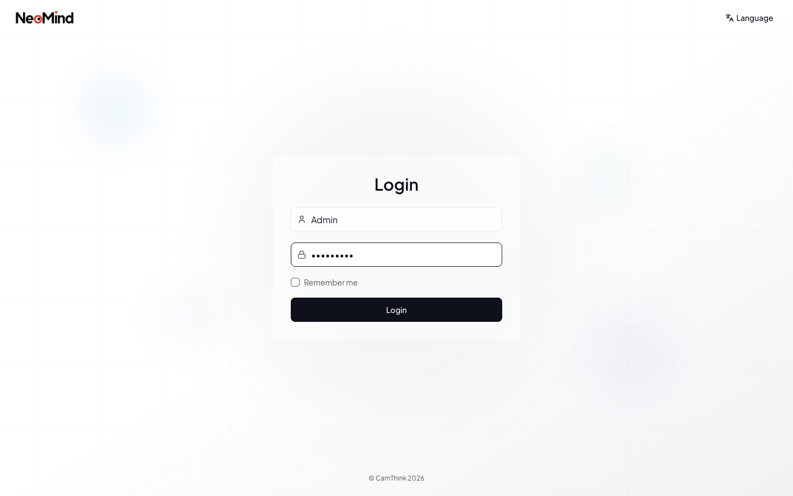

# Installation

NeoMind runs as a desktop application or a headless server. Choose the path that fits your use case:

- **Desktop** — personal use, local development, or edge devices with a display
- **Server** — Raspberry Pi, edge gateways, cloud VMs, or any headless environment

---

## System Requirements

| Component | Minimum | Recommended |
|-----------|---------|-------------|
| **OS** | macOS 12+, Windows 10+, Ubuntu 20.04+ | macOS 14+, Windows 11, Ubuntu 22.04+ |
| **RAM** | 1 GB (server only) | 2 GB (desktop); 8 GB+ for local LLM |
| **Disk** | 200 MB (app) + 500 MB (data) | 2 GB (with data retention) |
| **Network** | Any (cloud LLM needs internet) | Stable connection |
| **Ports** | 9375 (API), 1883 (MQTT) | Same |

> NeoMind is lightweight — a typical server uses ~50 MB RAM. Running local LLMs through Ollama requires extra RAM/VRAM (a 4B model needs ~3 GB). Cloud LLM providers have no local resource cost.

---

## Desktop Installation

The desktop app bundles the backend, frontend, and Tauri 2.x runtime into a single installer — the fastest way to get started.

### Step 1 — Download

Go to [GitHub Releases](https://github.com/camthink-ai/NeoMind/releases/latest) and download the installer for your platform:

| Platform | File |
|----------|------|
| macOS (Apple Silicon) | `NeoMind_{version}_aarch64.dmg` |
| macOS (Intel) | `NeoMind_{version}_x64.dmg` |
| Windows | `NeoMind_{version}_x64-setup.exe` or `.msi` |
| Linux (universal) | `NeoMind_{version}_amd64.AppImage` |
| Linux (Debian/Ubuntu) | `neomind_{version}_amd64.deb` |

### Step 2 — Install

**macOS:** Double-click the `.dmg`, drag **NeoMind** into **Applications**. On first launch, macOS may warn about a downloaded app — click **Open**.

**Windows:** Run the `.exe` or `.msi` installer. If SmartScreen appears, click **More info** then **Run anyway**.

**Linux (AppImage):**

```bash
chmod +x NeoMind_*.AppImage
./NeoMind_*.AppImage
```

**Linux (deb):**

```bash
sudo dpkg -i neomind_${version}_amd64.deb
sudo apt-get install -f
```

### Step 3 — First Launch & Login

Launch NeoMind. The app starts its built-in server and opens the web UI automatically.

If this is a fresh install, you will be taken to the **setup wizard** at `/setup` to create the admin account. If an account already exists, you will see the login page:


Use the **Language** selector in the top-right corner to switch the interface language.



**Setup wizard — Create admin account:**

| Field | Requirement |
|-------|-------------|
| **Username** | 3 characters minimum. Cannot be changed after creation. |
| **Email** | Optional. Used for notifications and password recovery. |
| **Password** | 8 characters minimum, must contain both letters and numbers. |
| **Timezone** | Auto-detected from your browser. Affects scheduled tasks and time displays. |

After creating the admin account, you are directed to **Settings > LLM Backends** to add your first AI model. See [LLM Settings](./02-settings.md) for per-provider instructions.

> **Quick start**: Install [Ollama](https://ollama.com), run `ollama pull qwen3:8b`, then add an Ollama backend pointing to `http://localhost:11434` with model `qwen3:8b`.

---

## Server Installation

Server mode runs NeoMind as a headless background service. The workflow is: install, start, open the web UI, create admin account.

### Option A — One-Line Install (Recommended)

```bash
curl -fsSL https://raw.githubusercontent.com/camthink-ai/NeoMind/main/scripts/install.sh | sh
```

This script detects your OS and architecture, downloads the latest binary to `/usr/local/bin` (or `~/.local/bin` without sudo), and places the web UI under `/var/www/neomind`.

**Environment variable overrides:**

| Variable | Default | Description |
|----------|---------|-------------|
| `VERSION` | Latest | Specific version, e.g. `0.8.0` |
| `INSTALL_DIR` | `/usr/local/bin` | Binary install directory |
| `DATA_DIR` | `/var/lib/neomind` | Data storage directory |
| `USE_NGINX` | `false` | Install and configure Nginx reverse proxy |

```bash
curl -fsSL https://raw.githubusercontent.com/camthink-ai/NeoMind/main/scripts/install.sh \
  | VERSION=0.8.0 INSTALL_DIR=~/.local/bin DATA_DIR=~/.neomind sh
```

### Option B — Manual Binary

```bash
VERSION=0.8.0

# Download and extract
wget https://github.com/camthink-ai/NeoMind/releases/download/v${VERSION}/neomind-server-linux-amd64.tar.gz
tar xzf neomind-server-linux-amd64.tar.gz
sudo install -m 755 neomind /usr/local/bin/
sudo install -m 755 neomind-extension-runner /usr/local/bin/

# Web UI
wget https://github.com/camthink-ai/NeoMind/releases/download/v${VERSION}/neomind-web-${VERSION}.tar.gz
sudo mkdir -p /var/www/neomind
sudo tar xzf neomind-web-${VERSION}.tar.gz -C /var/www/neomind

# Data directory
sudo mkdir -p /var/lib/neomind
```

### Option C — Build from Source

Prerequisites: Rust 1.85+, Node.js 20+

```bash
git clone https://github.com/camthink-ai/NeoMind.git
cd NeoMind
cargo build --release
cd web && npm install && npm run build && cd ..
cargo run --release -p neomind-cli -- serve
```

Binaries are in `target/release/`, web assets in `web/dist/`.

### Run as a systemd Service (Linux)

For production, run NeoMind under systemd so it starts on boot and restarts on failure.

**1. Create the service file:**

```bash
sudo tee /etc/systemd/system/neomind.service > /dev/null <<EOF
[Unit]
Description=NeoMind Edge AI Platform
After=network.target

[Service]
Type=simple
User=neomind
Group=neomind
WorkingDirectory=/var/lib/neomind
ExecStart=/usr/local/bin/neomind serve
Restart=on-failure
RestartSec=10
Environment=RUST_LOG=info
Environment=NEOMIND_DATA_DIR=/var/lib/neomind
Environment=NEOMIND_BIND_ADDR=0.0.0.0:9375

[Install]
WantedBy=multi-user.target
EOF
```

**2. Create the service user and start:**

```bash
sudo useradd --system --home-dir /var/lib/neomind --shell /usr/sbin/nologin neomind
sudo chown -R neomind:neomind /var/lib/neomind
sudo systemctl daemon-reload
sudo systemctl enable neomind
sudo systemctl start neomind
sudo systemctl status neomind
```

### First Access (Server)

After starting the server, open `http://your-server:9375` in a browser. On first visit you will see the setup wizard — the same flow as the desktop first launch.

---

## Network Configuration

### Default Ports

| Port | Protocol | Service | Purpose |
|------|----------|---------|---------|
| 9375 | HTTP | API Server | REST API, WebSocket, SSE |
| 1883 | MQTT | Embedded Broker | Device telemetry (if enabled) |
| 11434 | HTTP | Ollama (external) | Local LLM backend (separate app) |

### Firewall

**Desktop / localhost** — no changes needed.

**Server / remote access:**

```bash
# UFW (Ubuntu)
sudo ufw allow 9375/tcp    # API server
sudo ufw allow 1883/tcp    # MQTT broker

# firewalld (CentOS/RHEL)
sudo firewall-cmd --permanent --add-port=9375/tcp
sudo firewall-cmd --permanent --add-port=1883/tcp
sudo firewall-cmd --reload
```

### Nginx Reverse Proxy with SSL

For production, place NeoMind behind Nginx with HTTPS:

```nginx
server {
    listen 443 ssl http2;
    server_name neomind.example.com;

    ssl_certificate     /etc/ssl/certs/neomind.crt;
    ssl_certificate_key /etc/ssl/private/neomind.key;

    root /var/www/neomind;
    index index.html;

    location / {
        try_files $uri $uri/ /index.html;
    }

    location /api/ {
        proxy_pass http://127.0.0.1:9375/api/;
        proxy_http_version 1.1;
        proxy_set_header Host $host;
        proxy_set_header X-Real-IP $remote_addr;
        proxy_set_header X-Forwarded-For $proxy_add_x_forwarded_for;
        proxy_set_header X-Forwarded-Proto $scheme;
        proxy_set_header Upgrade $http_upgrade;
        proxy_set_header Connection "upgrade";
        proxy_read_timeout 86400;
    }
}

server {
    listen 80;
    server_name neomind.example.com;
    return 301 https://$host$request_uri;
}
```

Apply with `sudo nginx -t && sudo systemctl reload nginx`.

### Environment Variables

| Variable | Default | Description |
|----------|---------|-------------|
| `RUST_LOG` | `info` | Log level: trace, debug, info, warn, error |
| `NEOMIND_DATA_DIR` | `./data` | Data storage directory |
| `NEOMIND_BIND_ADDR` | `0.0.0.0:9375` | Server bind address |
| `SERVER_PORT` | `9375` | API server port |

---

## Verifying Installation

After installation, confirm everything works:

```bash
neomind health              # Expected: Status: healthy
curl http://localhost:9375/api/health
mosquitto_pub -h localhost -p 1883 -t "test" -m "hello"  # MQTT check
```

Then open the web UI at `http://localhost:9375` (desktop) or `http://your-server:9375` (server).

---

## Upgrading

### Desktop

The desktop app checks for updates automatically. When notified, download the new installer from [GitHub Releases](https://github.com/camthink-ai/NeoMind/releases/latest) and install over the existing version. Data and configuration are preserved.

### Server (One-Line Install)

```bash
curl -fsSL https://raw.githubusercontent.com/camthink-ai/NeoMind/main/scripts/install.sh | VERSION=0.8.0 sh
sudo systemctl restart neomind
```

### Server (Manual Binary)

```bash
VERSION=0.8.0
sudo systemctl stop neomind
sudo cp -r /var/lib/neomind /var/lib/neomind.bak   # backup

wget https://github.com/camthink-ai/NeoMind/releases/download/v${VERSION}/neomind-server-linux-amd64.tar.gz
tar xzf neomind-server-linux-amd64.tar.gz
sudo install -m 755 neomind /usr/local/bin/
sudo install -m 755 neomind-extension-runner /usr/local/bin/

wget https://github.com/camthink-ai/NeoMind/releases/download/v${VERSION}/neomind-web-${VERSION}.tar.gz
sudo rm -rf /var/www/neomind/*
sudo tar xzf neomind-web-${VERSION}.tar.gz -C /var/www/neomind

sudo systemctl start neomind
```

> Always back up your data directory before upgrading. NeoMind uses redb databases that are forward-compatible but may not be backward-compatible.

---

[Next: Settings >](./02-settings.md)
