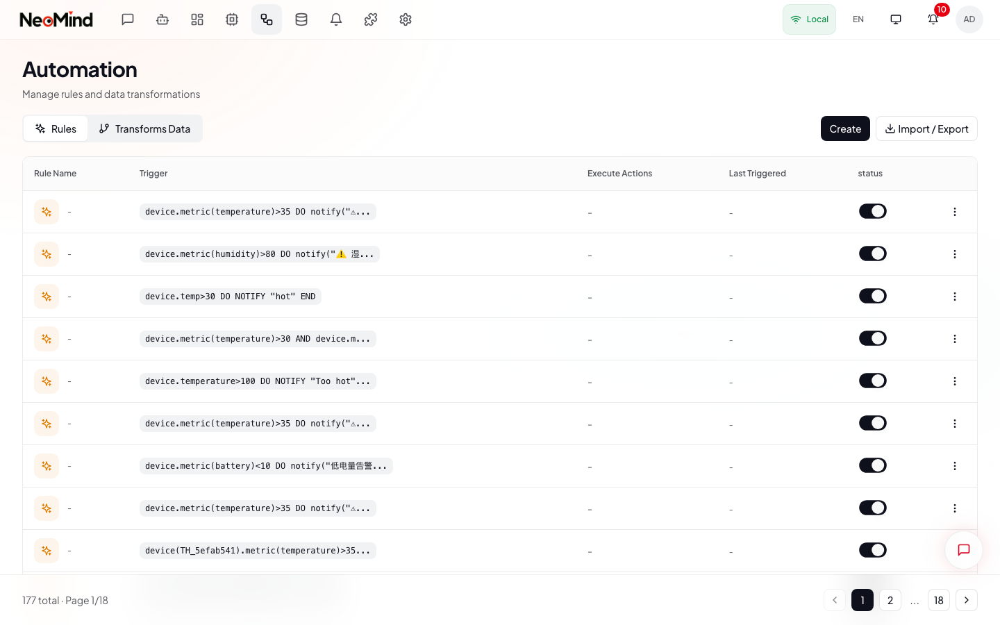
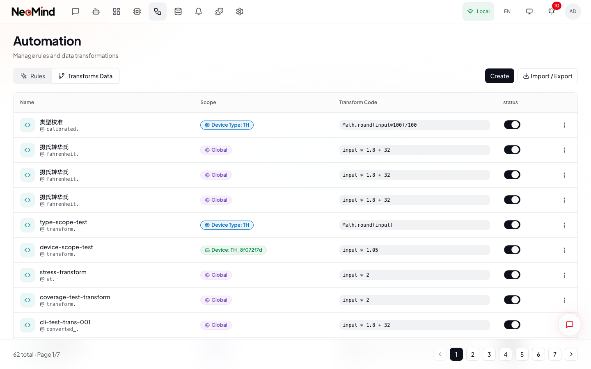

# Automation

The Automation page provides two tools for processing device and extension data: **Rules** (event-driven actions) and **Transforms** (data conversion pipelines).

---

## Automation Page

Navigate to **Automation** in the top navigation bar. The page opens on the **Rules** tab by default. Switch between tabs using the tab bar (1) at the top. Click **Create** (2) to add a new rule or transform depending on the active tab. Use the **Import / Export** (3) dropdown to bulk-manage rules or transforms as JSON files.



> **What you see above**: The Automation > Rules tab. Each rule row shows its name, condition summary, action type, and enabled status. The toggle switch on each row enables or disables the rule. The action menu (three dots) provides Edit, Execute, and Delete options.

---

### Rules Tab

Rules monitor device or extension metrics and trigger actions when conditions are met.

#### Creating a Rule

1. On the **Rules** tab, click **Create** in the top-right corner.
2. The rule builder opens as a full-screen dialog with a sidebar stepper showing four steps: **Basic Info**, **Trigger**, **Action**, and **Review**.

**Step 1 -- Basic Info**

3. Enter a **Rule Name** (e.g., "High Temperature Alert").
4. (Optional) Add a **Description**.

**Step 2 -- Trigger Configuration**

5. Choose the **Trigger Type**:
   - **Data Change** -- triggers when a metric value meets a condition.
   - **Schedule** -- triggers on a cron schedule (e.g., every 5 minutes).
6. For **Data Change** triggers, configure:
   - **Source Type** -- Device or Extension.
   - **Source** -- select the specific device or extension.
   - **Metric** -- the metric field to monitor (e.g., `temperature`).
   - **Operator** -- comparison operator (`>`, `<`, `=`, `>=`, `<=`, `!=`).
   - **Threshold** -- the value to compare against (e.g., `35`).
   - **Duration** -- how long the condition must hold before triggering (e.g., `300` seconds = 5 minutes). Leave at 0 for instant triggering.

**Step 3 -- Action Configuration**

7. Select an **Action Type**:

| Action Type | Purpose | Key Parameters |
|-------------|---------|----------------|
| **NOTIFY** | Send a notification message | Channel, message template |
| **EXECUTE** | Send a command to a device | Device, command, parameters |
| **LOG** | Write a log entry | Severity level, message |
| **SET** | Set a device property | Device, property, value |
| **ALERT** | Create a system alert | Title, message, severity |
| **HTTP** | Send an HTTP request | Method, URL, headers, body |

8. Fill in the action parameters. For NOTIFY, select a notification channel and write the message template. For HTTP, enter the target URL and optional headers.
9. Click **Add Action** to chain multiple actions on the same rule.

**Step 4 -- Review**

10. Review the rule summary showing name, condition, and actions.
11. Click **Save** to create the rule. It is enabled by default.

#### Managing Rules

- **Toggle** -- Click the switch on any rule row to enable or disable it. Disabled rules are not evaluated but retain their configuration.
- **Edit** -- Open the action menu (three dots) and select **Edit** to reopen the rule builder with all fields pre-filled.
- **Execute** -- Select **Execute** from the action menu to manually trigger a rule and run its actions immediately, regardless of whether the condition is met.
- **Delete** -- Select **Delete** from the action menu and confirm.
- **Import / Export** -- Use the dropdown in the tab bar to export all rules as a JSON file or import rules from a previously exported file.

---

### Transforms Tab

Switch to the **Transforms** tab. Transforms convert raw device or extension data into derived metrics using JavaScript expressions, producing new virtual metrics available across the platform.



> **What you see above**: The Transforms tab. Each transform row shows its name, input data source, output prefix, and enabled status. The toggle switch enables or disables the transform. The action menu provides Edit, Export, and Delete options.

#### Creating a Transform

1. On the **Transforms** tab, click **Create**.
2. The transform builder opens as a full-screen dialog.

3. **Name** -- Enter a descriptive name (e.g., "Celsius to Fahrenheit").
4. **Description** -- (Optional) explain what the transform does.
5. **Input Scope** -- Configure what data feeds into the transform:
   - **Data Source** -- Select the device metric or extension output to transform (e.g., `device:sensor-01:temperature`).
   - The scope can be a single source or a broader pattern.
6. **JavaScript Expression** -- Write the transformation logic. The input value is available as `value`. The expression must return a number or string.

| Example Expression | Input | Output | Description |
|---------------------|-------|--------|-------------|
| `value * 9/5 + 32` | 25 | 77 | Celsius to Fahrenheit |
| `Math.round(value * 100) / 100` | 3.14159 | 3.14 | Round to 2 decimals |
| `value > 100 ? 1 : 0` | 150 | 1 | Binary threshold |
| `Math.max(0, Math.min(100, ((value - 3000) / 1200) * 100))` | 3600 | 50 | Battery % from millivolts |

7. **Test** -- Click the **Test** button to enter a sample value and see the expression output immediately. Adjust and re-test until correct.
8. **Output Prefix** -- Set the prefix for the output metric ID (e.g., `transform:sensor-01`). The full output ID becomes `transform:sensor-01:temperature_f`.
9. Click **Save**.

#### Using Transformed Data

Transformed metrics are first-class data sources:

- **Dashboards** -- Add transform outputs as chart or value widgets.
- **Rules** -- Reference `transform:{id}:{field}` as the metric source in rule conditions.
- **Data Explorer** (under the **Data** page in the top navigation bar) -- Browse and query transform outputs alongside raw metrics.
- **Data Push** (under the **Data** page in the top navigation bar) -- Forward transformed data to external systems.

#### Managing Transforms

- **Toggle** -- Enable or disable a transform. Disabled transforms stop processing but retain their configuration.
- **Edit** -- Reopen the builder to modify the expression, scope, or output.
- **Export** -- Download a single transform as a JSON file.
- **Delete** -- Remove the transform permanently.
- **Import / Export** -- Bulk import or export transforms via the dropdown in the tab bar.

---

## Related: Data Page

The **Data** page in the top navigation bar (at `/data`) provides additional tools for exploring and forwarding your telemetry data:

- **Data Explorer** -- Browse all telemetry data sources across devices, extensions, and transforms in a unified, filterable table with history charts and export.
- **Data Push** -- Forward telemetry to external systems (InfluxDB, TimescaleDB, custom endpoints) via Webhook (HTTP) or MQTT.

See the Data page documentation for full details.

---

## Appendix: Rule JSON Format

Advanced users can create rules directly via CLI (`--json`) or REST API. This is useful for version control, bulk import, and complex multi-condition rules.

### Basic Structure

```json
{
  "name": "<rule name>",
  "trigger": {"trigger_type": "schedule", "cron": "<cron expression>"},
  "condition": { "<condition_type>": "..." },
  "for_duration": <milliseconds>,
  "actions": [ { "<type>": "..." } ]
}
```

### Condition Types

| Type | Fields | Example |
|------|--------|---------|
| `comparison` | `source`, `operator`, `threshold` | `{"condition_type":"comparison","source":"device:sensor:temp","operator":"greater_than","threshold":30}` |
| `range` | `source`, `min`, `max` | `{"condition_type":"range","source":"device:sensor:temp","min":18,"max":25}` |
| `logical` | `operator` (and/or/not), `conditions` | `{"condition_type":"logical","operator":"and","conditions":[...]}` |

**Operators**: `greater_than`, `less_than`, `greater_equal`, `less_equal`, `equal`, `not_equal`

### Action Types

| Type | Fields | Example |
|------|--------|---------|
| `notify` | `message`, `severity` | `{"type":"notify","message":"Too hot: {value}","severity":"critical"}` |
| `execute` | `target`, `target_type`, `command`, `params` | `{"type":"execute","target":"fan","target_type":"device","command":"on","params":{"speed":100}}` |
| `trigger_agent` | `agent_id`, `input` | `{"type":"trigger_agent","agent_id":"analyzer","input":"Check temp"}` |

**Severities**: `info`, `warning`, `critical`, `emergency`

### Complete Example

```bash
neomind rule create --json '{
  "name": "Temperature Alert",
  "condition": {"condition_type": "comparison", "source": "device:sensor:temperature", "operator": "greater_than", "threshold": 50},
  "for_duration": 120000,
  "actions": [
    {"type": "notify", "message": "Critical: {value}C", "severity": "critical"},
    {"type": "execute", "target": "fan", "target_type": "device", "command": "set_speed", "params": {"speed": 100}}
  ]
}'
```

### API and CLI

```bash
# Create a rule via API
curl -X POST http://localhost:9375/api/rules \
  -H "Content-Type: application/json" \
  -d '{"name":"Alert","condition":{"condition_type":"comparison","source":"device:sensor:temp","operator":"greater_than","threshold":30},"actions":[{"type":"notify","message":"High temperature","severity":"warning"}]}'

# CLI commands (rules are enabled by default)
neomind rule list
neomind rule create --json '{"name":"Alert","condition":{"condition_type":"comparison","source":"device:sensor:temp","operator":"greater_than","threshold":30},"actions":[{"type":"notify","message":"Hot","severity":"warning"}]}'
neomind rule disable <rule_id>
neomind rule enable <rule_id>
neomind rule delete <rule_id>
```

---

[< Back to Device Management](./04-devices.md) | [Next: Agents >](./06-agents.md)
