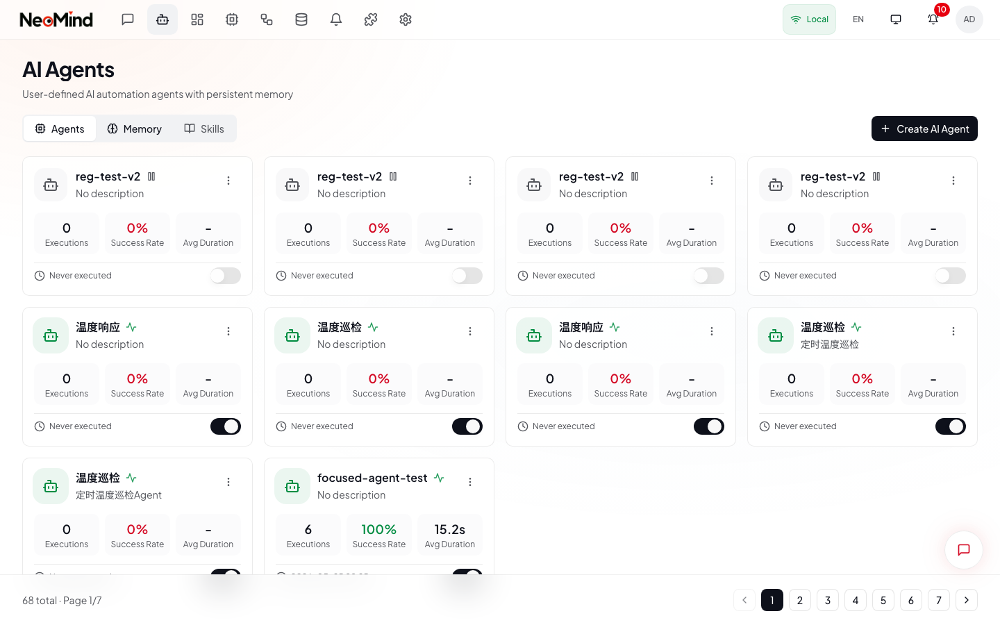
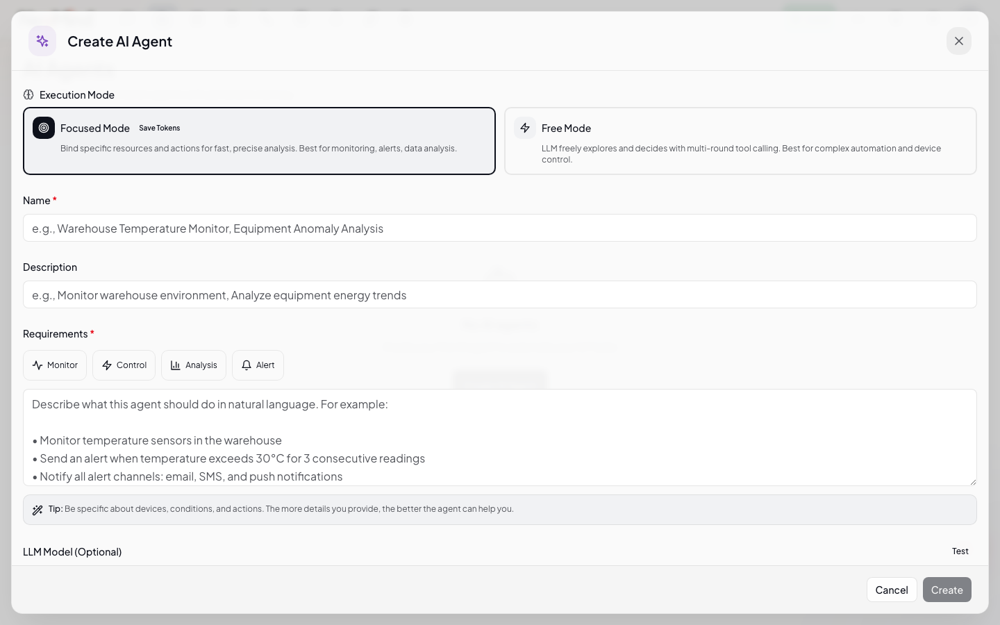
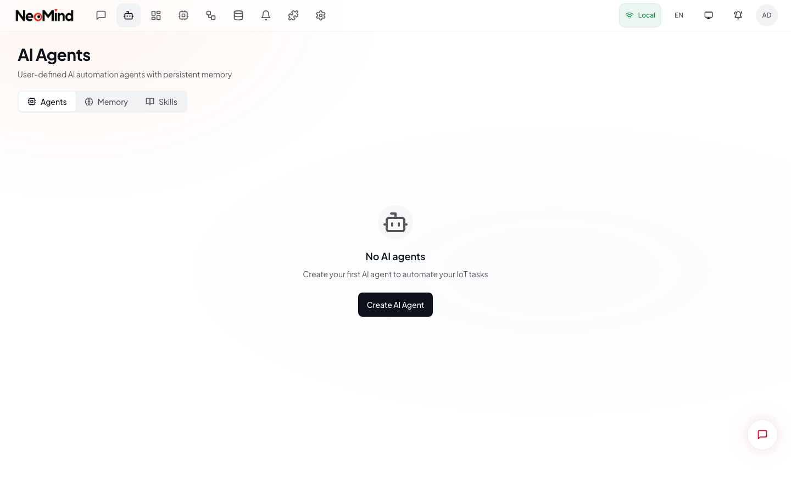

# AI Agents

> Build autonomous agents that monitor, analyze, and act on your IoT data on a schedule or in response to events.

---

## Prerequisites

Before creating an AI Agent, make sure you have:

- At least one **LLM backend** configured and tested in [Settings](./02-settings.md)
- (Optional) Devices connected and sending telemetry data
- (Optional) Extensions installed for additional data sources

Agents can run without devices or extensions -- use **Free mode** for general-purpose tasks that work with the entire platform.

---

## 1. Open the Agents Page

Navigate to **Agents** in the main navigation. The page has three tabs at the top:

| Tab | Purpose |
|-----|---------|
| **Agents** | List of all configured agents |
| **Memory** | Global memory store shared across agents |
| **Skills** | Skill guides that teach agents how to perform operations |



> **(1)** The three main tabs -- Agents, Memory, Skills. **(2)** The **Create AI Agent** button opens the full-screen agent builder. **(3)** When no agents exist yet, the page shows an empty state prompting you to create your first agent.

---

## 2. Create an Agent

Click **Create AI Agent** to open the full-screen agent builder dialog.



> **(1)** **Basic Info** section -- name, description, and system prompt. **(2)** **LLM Backend** selector -- choose from configured backends. **(3)** **Execution Mode** -- Focused, Free, Chat, or Reactive. **(4)** **Schedule** -- interval, cron, or event-driven. **(5)** **Resource Binding** -- bind devices, extensions, or metrics. **(6)** **Create** button saves the agent.

### 2.1 Basic Info

| Field | Required | Description |
|-------|----------|-------------|
| **Name** | Yes | A display name (e.g., "Greenhouse Monitor") |
| **Description** | No | Brief summary of the agent's purpose |
| **System Prompt** | Yes | The core instructions that define the agent's behavior, analysis style, and decision criteria |
| **LLM Backend** | Yes | Which AI model to use, selected from backends configured in Settings |

**Writing an effective system prompt** -- a good prompt includes:

- **Role definition**: "You are a greenhouse monitoring agent..."
- **Data context**: "You will receive temperature and humidity readings every 5 minutes..."
- **Decision criteria**: "If temperature exceeds 35 C for more than 10 minutes, trigger an alert..."
- **Action instructions**: "When alerting, include the current value, the threshold, and a recommended action..."
- **Output format**: "Present your analysis as a table with columns: Metric, Value, Status, Recommendation"

### 2.2 Execution Mode

Choose how the agent operates:

| Mode | How It Works | Best For |
|------|-------------|----------|
| **Focused** | Analyzes only bound resources. Single-pass, token-efficient. | Monitoring specific devices, periodic analysis, alerting |
| **Free** | Full access to all platform resources. Multi-round reasoning (up to 20 tool iterations). | Complex automation, exploratory analysis, cross-device correlation |
| **Chat** | Interactive conversation mode, responds to user messages in real-time. | Conversational assistance, on-demand Q&A |
| **Reactive** | Triggers automatically when bound events fire (device data changes, alerts). | Event-driven automation, instant response to anomalies |

**Quick guide**:

| You Want To... | Choose | Why |
|----------------|--------|-----|
| Monitor 3 sensors every 5 min | **Focused** | Only sees bound devices, lower token cost |
| Let AI explore everything freely | **Free** | Can discover and use any resource |
| Have an interactive AI assistant | **Chat** | Runs as a conversation with custom instructions |
| React when a sensor triggers | **Reactive** | Runs only when the bound event fires |

### 2.3 Schedule

Define when and how often the agent runs:

| Type | Configuration | Example |
|------|--------------|---------|
| **Interval** | Run every N minutes or hours | Every 5 min (`300s`), every hour (`3600s`) |
| **Cron** | Standard cron expression | Daily at 9 AM (`0 9 * * *`), Weekdays 8:30 AM (`30 8 * * 1-5`) |
| **Event** | Trigger on device data changes | When a bound device reports a new reading |

Common cron expressions:

| Schedule | Expression |
|----------|-----------|
| Every 5 minutes | `*/5 * * * *` |
| Every hour at :00 | `0 * * * *` |
| Daily at 9:00 AM | `0 9 * * *` |
| Weekdays at 8:30 AM | `30 8 * * 1-5` |
| Every Monday 10:00 AM | `0 10 * * 1` |

### 2.4 Resource Binding

For **Focused** mode, bind the specific resources the agent should analyze:

| Resource | Description | Example |
|----------|------------|---------|
| **Devices** | Devices the agent can access and control | Temperature sensor, fan actuator |
| **Extensions** | Extension data to include in context | Weather forecast, object detection results |
| **Metrics** | Specific data fields to monitor | Temperature, humidity, pressure |

Resources use the DataSourceId format: `{type}:{id}:{field}`

Examples:
- `device:greenhouse-sensor-01:temperature` -- device metric
- `extension:weather:temp` -- extension data

For **Free** mode, resource binding is optional -- the agent has access to all platform resources by default.

### 2.5 Save

Click **Create** at the bottom of the builder. The agent appears on the Agents page and begins running according to its schedule.

---

## 3. Manage Agents

After creating agents, the Agents page shows a card grid.



> **(1)** Each agent card shows name, description, and current status. **(2)** The **toggle switch** enables or disables the agent -- disabled agents stop executing. **(3)** **Last execution** time and result. **(4)** **Schedule** info shows next run time or interval.

### Agent Card Actions

| Action | How To |
|--------|--------|
| **Enable / Disable** | Click the toggle switch on the agent card |
| **Run Now** | Click the play button to trigger an immediate execution |
| **View History** | Click the clock icon to see all past executions |
| **Edit** | Click the pencil icon to modify configuration |
| **Delete** | Click the trash icon and confirm (permanent, cannot undo) |

### Agent Detail Panel

Click anywhere on an agent card (not on an action icon) to open the full-screen detail panel. This shows:

- **Agent info**: name, description, execution mode, schedule, and resource bindings
- **Execution history**: a timeline of recent runs with status, duration, and token usage
- **Quick actions**: Edit and Execute buttons at the top of the panel

---

## 4. Check Execution Results

Click an execution in the history (from the agent card or detail panel) to see detailed results.

### Execution Timeline

A chronological list of every step the agent performed:

| Element | Description |
|---------|------------|
| **Step number** | Order of execution |
| **Tool call** | Which tool was invoked (device query, rule creation, etc.) |
| **Parameters** | Input arguments for the tool |
| **Result** | Output from the tool execution |
| **Duration** | Time taken for this step |

### AI Reasoning

The reasoning section shows the agent's thought process:

- **Thinking content**: Internal reasoning (visible for thinking models like qwen3.x or deepseek-r1)
- **Decision summary**: Why the agent chose specific actions
- **Data analysis**: How the agent interpreted the data

### Performance Metrics

| Metric | Description |
|--------|------------|
| **Duration** | Total wall-clock time from start to finish |
| **Tokens (Input)** | Tokens sent to the LLM, including context and tool results |
| **Tokens (Output)** | Tokens generated by the LLM |
| **Tool Calls** | Number of tool invocations during execution |
| **Status** | Success, Failed, or Partial |

---

## 5. Agent Memory

Click the **Memory** tab at the top of the Agents page to open the global memory store. This is a system-wide knowledge base shared across all agents.

> **Note**: The Memory tab is NOT per-agent -- it is a shared store at the platform level. All agents can read and contribute to it.

Each memory entry contains:

| Field | Description |
|-------|------------|
| **Category** | Type: device behavior, pattern, preference, fact, user profile |
| **Content** | The stored knowledge |
| **Source** | Which agent execution created this memory |
| **Created** | When the memory was recorded |
| **Relevance** | How frequently this memory is used |

You can search memories by keyword, filter by category, or sort by date and relevance. To manage memories: click **View** to read full content, **Delete** to remove a single entry, or **Clear All** to reset the entire memory store.

> **Tip**: Memory persists across agent executions and survives server restarts. If memories become outdated (for example, after replacing a sensor), clear them so agents do not rely on stale information.

---

## 6. Agent Skills

Click the **Skills** tab at the top of the Agents page to manage skill guides -- structured instructions that teach agents how to perform specific operations. Skills are Markdown documents with YAML frontmatter that define triggers, categories, and execution rules.

> **Note**: Skills are shared at the platform level -- any agent can use any skill. Skills are injected into the agent's system prompt context when their trigger keywords match the user's intent or the agent's task.

### Skills Table

The Skills tab displays a table of all configured skills:

| Column | Description |
|--------|-------------|
| **Name** | Skill name, displayed with a category-specific icon and color |
| **Category** | One of: Device, Rule, Agent, Message, Extension, General |
| **Priority** | Numeric priority (0-100); higher values are preferred when multiple skills match |
| **Keywords** | Trigger keywords that activate the skill (first 3 shown, with count for more) |
| **Size** | Size of the skill body in bytes |

### Creating a Skill

1. Click **Create Skill** (or **Add Skill**) at the top of the Skills tab.
2. A full-screen dialog opens with a **CodeMirror editor** pre-loaded with a Markdown template.
3. Edit the **YAML frontmatter** at the top:

```yaml
---
id: my-skill
name: My Skill
category: general
priority: 50
token_budget: 500
triggers:
  keywords: [example, keyword]
  tool_target:
    tool: example
    actions: [action1, action2]
anti_triggers:
  keywords: [exclude, these]
---
```

| Frontmatter Field | Required | Description |
|-------------------|----------|-------------|
| `id` | Yes | Unique identifier for the skill |
| `name` | Yes | Display name shown in the Skills table |
| `category` | Yes | Skill category: `device`, `rule`, `agent`, `message`, `extension`, or `general` |
| `priority` | No | Priority 0-100 (default: 50). Higher priority skills are preferred |
| `token_budget` | No | Maximum tokens for the skill body (default: 500) |
| `triggers.keywords` | Yes | Keywords that activate this skill |
| `triggers.tool_target` | No | Tool and actions this skill guides |
| `anti_triggers.keywords` | No | Keywords that prevent this skill from activating |

4. Write the **skill body** below the frontmatter in Markdown. This is the instruction content injected into the agent's context when the skill activates. Include:
   - **Purpose**: What the skill does
   - **Prerequisites**: What must be true before following the skill
   - **Steps**: Numbered instructions for the agent to follow
   - **Common Errors**: Known pitfalls and solutions

5. Click **Save** to create the skill.

### Managing Skills

- **View** -- Click the eye icon to read the full skill content in a dialog
- **Edit** -- Click the pencil icon to reopen the editor with the skill pre-loaded
- **Delete** -- Click the trash icon to permanently remove the skill
- Skills are paginated (10 per page) and support search and category filtering

---

## Tips

### Optimizing Performance

- **Use Focused mode** when possible -- fewer tokens, more predictable results
- **Set appropriate intervals** -- intervals under 60 seconds can strain the LLM backend
- **Bind only needed resources** -- fewer resources means less context and lower token usage
- **Choose the right model** -- fast models (qwen3:4b) for simple monitoring, capable models (gpt-4o) for complex reasoning
- **Monitor token usage** -- check execution details to understand costs

### Example Prompts

**Anomaly Detection** (Focused, Interval 5 min):

```
You are an anomaly detection agent. Analyze the latest readings from
the bound sensors. Compare current values against the normal range.
If any value is outside the normal range, generate an alert with the
metric name, current value, and expected range.
```

**Daily Report** (Free, Cron daily 9 AM):

```
You are a daily reporting agent. Collect the last 24 hours of data
from all devices. Generate a summary including:
1. Average, min, and max for each metric
2. Number of alerts triggered
3. Device uptime percentage
4. Any anomalies or trends worth noting
Present the report in formatted markdown.
```

**Reactive Alert Handler** (Reactive, Event-driven):

```
You are a reactive alert handler. When an alert is triggered, immediately
analyze the situation by querying the relevant devices. Determine the
root cause and take corrective action if possible. If automatic action
is not appropriate, send a detailed notification.
```

---

[< Back to Automation](./05-automation.md) | [Index](./README.md) | [Next: Dashboards >](./07-dashboard.md)
