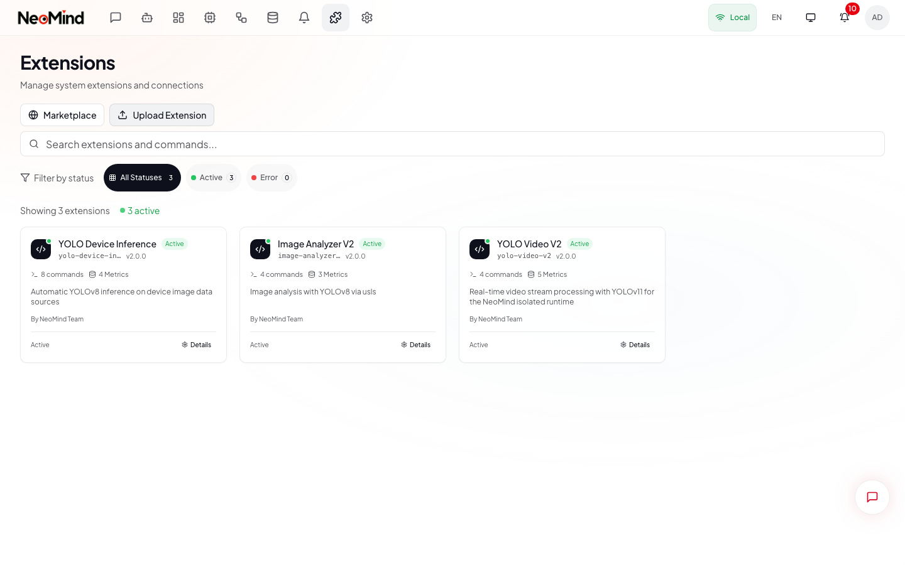

# Extensions

> Install and manage extensions to add weather data, AI vision, OCR, video analytics, and more to your NeoMind platform.

---

## Opening the Extensions Page

1. Click **Extensions** in the top navigation bar to open the extensions management page
2. The page displays all installed extensions as cards in a grid layout
3. Each card shows the extension icon, name, ID, version, status (Active/Error), command count, and metric count



> **What you see above**: The Extensions page. Each card (1) shows the extension name, status badge, and capability summary (commands and metrics). Hover a card to reveal the context menu (2) for Details, Reload, and Uninstall actions.

Two buttons are available in the page header:

- **Marketplace** -- browse and install extensions from the NeoMind-Extensions repository
- **Upload** -- upload a local `.nep` extension package file

---

## Installing from the Marketplace

### Step 1: Open the Marketplace

1. Click **Marketplace** in the page header
2. The full-screen Marketplace dialog opens and loads available extensions from the repository

### Step 2: Browse or Search

1. Use the **search bar** to filter extensions by name, description, or ID
2. Click a **category button** (e.g., "AI", "Data Source") to filter by type
3. Each extension card shows: name, version, description, categories, and author
4. Already-installed extensions display an **Installed** badge and are not clickable

### Step 3: View Details and Install

1. Click **View Details** on an extension card (or click the card itself)
2. The detail view shows:
   - **Tools** -- AI agent tools the extension provides
   - **Metrics** -- data fields with data type and unit
   - **Commands** -- commands you can execute from the UI
   - **Requirements** -- network access, API keys needed
3. Click **Install** in the dialog footer
4. Wait for the download and installation to complete
5. The dialog closes automatically and the extension appears on the Extensions page

---

## Configuring an Installed Extension

### Step 1: Open Extension Details

1. On the Extensions page, click the **Details** button on an extension card (or use the context menu)
2. A full-screen dialog opens with a sidebar containing five sections

### Step 2: Configure Settings

1. Click **Configuration** in the sidebar
2. The configuration form loads with the extension's schema-driven fields
3. Fill in the required settings (common fields include API keys, polling intervals, endpoints)
4. Click **Save & Reload** to apply the configuration and restart the extension

### Other Sections in Extension Details

| Section | Purpose |
|---------|---------|
| **Overview** | Basic info (ID, name, version, state, description), health status, file path |
| **Configuration** | Schema-driven settings form with Save & Reload |
| **Commands** | Execute extension commands with parameter forms and result display |
| **Metrics** | View metric definitions with expandable history tables (1h / 24h / 7d / 30d) |
| **Logs** | Real-time log viewer with level filtering, refresh, and clear |

---

## Extension States

| State | Meaning |
|-------|---------|
| **Active** (Running) | Extension is running and providing data |
| **Error** | Extension failed to start; check Logs for details |
| **Uninstalled** | Removed from the system entirely |

To troubleshoot an extension in Error state: open its details, go to **Logs**, and review error messages. Use **Reload** in the header to attempt a restart.

---

## Available Extensions

| Extension | Description | Key Metrics | Config Required |
|-----------|-------------|-------------|-----------------|
| **Weather Forecast** | Real-time weather via Open-Meteo API | `temp`, `humidity`, `wind_speed`, `precipitation` | Location (lat/lon) |
| **Image Analyzer** | YOLOv11 object detection on images | `objects`, `count`, `classes` | None |
| **YOLO Video** | Real-time video stream detection | `objects`, `count`, `fps` | RTSP/RTMP/HLS URL |
| **YOLO Device** | Detection on device camera feeds | `objects`, `count` | Device binding |
| **Face Recognition** | ArcFace face recognition | `faces`, `matches`, `confidence` | Face database |
| **OCR Device** | PP-OCRv4 text recognition | `text`, `confidence` | Device binding |
| **Stream Player** | Video player dashboard component | (widget only) | Stream URL |

### Extension Types

- **Data Source**: provides metrics (e.g., Weather Forecast supplies temperature, humidity)
- **AI/Vision**: adds ML inference capabilities (e.g., YOLO Video for object detection)
- **Integration**: connects external services and protocols
- **Widget**: provides custom dashboard components (e.g., Stream Player)

---

## Using Extension Data

Extension data is available throughout NeoMind via the DataSourceId format:

```
extension:{extension_id}:{metric_name}
```

### DataSourceId Examples

| Data Source ID | Extension | Field | Description |
|---------------|-----------|-------|-------------|
| `extension:weather:temp` | Weather Forecast | Temperature | Current temperature |
| `extension:weather:humidity` | Weather Forecast | Humidity | Current humidity % |
| `extension:weather:wind_speed` | Weather Forecast | Wind Speed | Current wind speed |
| `extension:yolo:count` | YOLO Detection | Count | Objects in last frame |
| `extension:yolo-video:count` | YOLO Video | Count | Objects in latest frame |
| `extension:ocr:text` | OCR Device | Text | Latest extracted text |

### In Dashboards

1. Edit a dashboard and click **Add Widget**
2. In the widget's data source settings, enter the extension DataSourceId (e.g., `extension:weather:temp`)
3. Configure display options (unit, thresholds, colors)
4. Save the widget -- it displays live extension data

### In Rules

Reference extension metrics in rule DSL using the standard DataSourceId:

```
RULE weather_rain_alert
  WHEN EXTENSION weather.condition = "Rain"
  DO
    NOTIFY(channel="telegram", message="Rain detected!")
  END
END
```

### In Transforms

Create transforms that process extension data alongside device data:

1. Go to **Automation > Transforms** and create a new transform
2. Set the input to an extension field (e.g., `extension:weather:temp`)
3. Write a transformation expression
4. The output becomes a new virtual data source for dashboards and rules

---

## Managing Extensions

### Reload

Use **Reload** (in the card context menu or the details header) to restart an extension without losing configuration.

### Uninstall

1. Open the card context menu (hover the card, click the three-dot icon)
2. Select **Uninstall**
3. Confirm the action in the dialog -- this removes all extension files and cannot be undone

### Upload a Local Extension

1. Click **Upload** in the page header
2. Select a `.nep` extension package file
3. The extension is installed and appears in the grid

---

## Tips

- **Install only what you need** -- each running extension uses system resources
- **Check Logs** for extensions in Error state before reinstalling
- **Use Save & Reload** after changing configuration -- edits are not applied until the extension restarts
- **Extensions that crash repeatedly** are automatically stopped to prevent resource drain
- **Combine extension and device data** for the most powerful automations (e.g., weather + soil moisture = smart irrigation)

---

[Previous: Notifications](08-notifications.md) | [Index](README.md)
