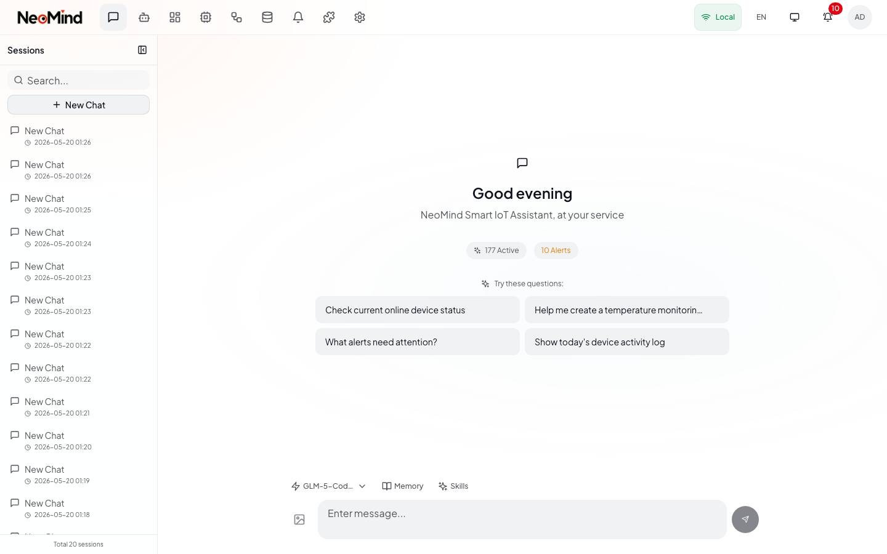

# NeoMind User Guide

> **Version**: v0.8.4 | **License**: Apache 2.0 | **Platform**: macOS, Windows, Linux

NeoMind is an Edge AI Platform for IoT. Connect your devices, run AI agents for monitoring and automation, and visualize everything on real-time dashboards -- all powered by Rust for maximum performance on edge hardware.

---

## Table of Contents

| # | Guide | Description |
|---|-------|-------------|
| 1 | [Installation](01-installation.md) | System requirements, desktop and server setup, network configuration |
| 2 | [Settings](02-settings.md) | LLM backends, general preferences, data retention policies |
| 3 | [AI Chat](03-chat.md) | Conversations, image upload, memory and skills, tool execution |
| 4 | [Device Management](04-devices.md) | MQTT and webhook devices, commands, auto-discovery, device types |
| 4a | [Device Connection](04a-device-connection.md) | **Deep dive**: MQTT topics, webhook auth, TLS/mTLS, BLE provisioning, code examples (Python/ESP32/Node.js) |
| 5 | [Automation](05-automation.md) | Rules, transforms, data explorer, data push to external systems |
| 6 | [AI Agents](06-agents.md) | Agent builder, execution modes, scheduling, memory, prompt engineering |
| 7 | [Dashboards](07-dashboard.md) | Widgets, layout editing, data source binding, public sharing |
| 8 | [Notifications](08-notifications.md) | 7 notification channels, setup guides, message lifecycle, retry logic |
| 9 | [Extensions](09-extensions.md) | Extension marketplace, data sources, community extensions |

---

## Quick Start

Follow these four steps to go from zero to your first AI conversation.

### Step 1 -- Install and Launch

**Desktop (recommended):** Download the latest release from [GitHub Releases](https://github.com/camthink-ai/NeoMind/releases/latest) (.dmg / .msi / .AppImage). Launch the app -- it starts a local backend on port 9375 automatically.

**Server:** One-line install on Linux or macOS:

```bash
curl -fsSL https://raw.githubusercontent.com/camthink-ai/NeoMind/main/scripts/install.sh | sh
```

Then open `http://localhost:9375` in your browser. See the full [Installation Guide](01-installation.md) for more options.

### Step 2 -- Create Admin Account

On first launch (when no admin account exists), NeoMind shows the setup page:


① **Username** -- Admin login name (min 3 characters). ② **Password** -- Min 8 characters, must include both letters and numbers. ③ **Confirm Password** -- Must match the password above. ④ **Timezone** -- Auto-detected from your browser; change if needed. ⑤ Click **Create Account** to finish.

> If the setup page does not appear, the server is already configured. Navigate to `http://localhost:9375` and log in with existing credentials.

### Step 3 -- Configure LLM Backend

AI features require at least one LLM (Large Language Model) backend.

1. Open **Settings** from the top navigation bar, then select the **LLM Backends** tab.
2. Click **Add Backend**.
3. Choose a provider and fill in the required fields.
4. Click **Test Connection** to verify, then **Save**.


**Recommended for beginners -- Ollama (free, local, private):**

```bash
# Install Ollama from https://ollama.com, then:
ollama pull qwen3:8b
```

Add an Ollama backend in Settings pointing to `http://localhost:11434` with model name `qwen3:8b`. No API key needed.

**Supported providers:**

| Provider | API Key | Default Endpoint | Notes |
|----------|---------|-------------------|-------|
| **Ollama** | No | `http://localhost:11434` | Free, local. Best for getting started. |
| **OpenAI** | Yes | `https://api.openai.com/v1` | GPT-4o, GPT-4o-mini |
| **Anthropic** | Yes | `https://api.anthropic.com/v1` | Claude models |
| **Google** | Yes | -- | Gemini models |
| **xAI** | Yes | `https://api.x.ai/v1` | Grok models |
| **Qwen** | Yes | `https://dashscope.aliyuncs.com/compatible-mode/v1` | Alibaba Qwen series |
| **DeepSeek** | Yes | `https://api.deepseek.com/v1` | DeepSeek V3/R1 |
| **GLM** | Yes | `https://open.bigmodel.cn/api/paas/v4` | Zhipu AI models |
| **MiniMax** | Yes | -- | MiniMax models |
| **LlamaCpp** | No | `http://localhost:8080` | Self-hosted, advanced users |

### Step 4 -- Start Chatting

Click **Chat** in the navigation bar, type a message, and press **Enter**.



① **New Conversation** -- Start a fresh chat session. ② **Session History** -- Switch between past conversations. ③ **Message Input** -- Type your message or paste an image for visual analysis. ④ **AI Response** -- Streaming reply from your configured LLM.

> The AI can control devices, query data, and manage your IoT setup in natural language. Try: "Show me all my devices" or "Create a rule that alerts me when temperature exceeds 30 degrees."

---

## What's Next

After completing the quick start, explore the guides above in order:

1. **Connect devices** via MQTT, webhook, or BLE -- see [Device Management](04-devices.md) and [Device Connection](04a-device-connection.md).
2. **Build dashboards** with drag-and-drop widgets -- see [Dashboards](07-dashboard.md).
3. **Automate** with the rule engine and data transforms -- see [Automation](05-automation.md).
4. **Deploy AI agents** that run on schedules and act autonomously -- see [AI Agents](06-agents.md).
5. **Install extensions** for weather, YOLO detection, OCR, and more -- see [Extensions](09-extensions.md).

---

## Mobile Access

NeoMind's web interface is fully responsive. Open `http://your-server:9375` on your phone or tablet.


---

## Appendix

### A. Keyboard Shortcuts

| Shortcut | Action |
|----------|--------|
| `Enter` | Send chat message |
| `Shift + Enter` | Insert a new line in chat |
| `Escape` | Close current dialog or overlay |

### B. API Quick Reference

**Base URL**: `http://localhost:9375/api`

**Authentication**: Bearer token in the `Authorization` header. Obtain via the login endpoint.

| Endpoint | Method | Description |
|----------|--------|-------------|
| `/chat/sessions` | `GET` | List all chat sessions |
| `/devices` | `GET` / `POST` | List or create devices |
| `/devices/{id}` | `GET` / `PATCH` / `DELETE` | Get, update, or delete a device |
| `/rules` | `GET` / `POST` | List or create rules |
| `/automations` | `GET` / `POST` | List or create transforms |
| `/push/targets` | `GET` / `POST` | List or create data push targets |
| `/agents` | `GET` / `POST` | List or create AI agents |
| `/agents/{id}/run` | `POST` | Manually trigger an agent execution |
| `/messages/channels` | `GET` / `POST` | List or create notification channels |
| `/extensions` | `GET` | List installed extensions |
| `/settings` | `GET` / `PATCH` | Get or update settings |
| `/setup/status` | `GET` | Check if initial setup is complete |

**Full API docs**: Navigate to `http://localhost:9375/api/docs` for interactive Swagger UI.

### C. Troubleshooting FAQ

#### AI is not responding

| Check | Action |
|-------|--------|
| LLM backend configured? | Go to **Settings > LLM Backends** and verify at least one backend exists |
| API key valid? | Click **Test Connection** on the LLM backend to verify |
| Ollama running? | Run `ollama serve` and check `http://localhost:11434` |
| Model available? | Run `ollama list`; pull with `ollama pull <model>` |

#### Device is not receiving data

| Check | Action |
|-------|--------|
| MQTT broker accessible? | Verify port 1883 is open and the embedded broker is running |
| Topic format correct? | Ensure the device publishes to `device/{type}/{id}/uplink` |
| Adapter configured? | Check the device's adapter settings (MQTT topic or webhook URL) |
| Auto-discovered? | Check the **Drafts** tab for unrecognized device data |

#### Agent is not executing

| Check | Action |
|-------|--------|
| Agent enabled? | Toggle the agent switch to **on** |
| LLM backend working? | Test the assigned LLM backend in **Settings** |
| Schedule configured? | Verify schedule type and parameters |
| Errors in logs? | Check the execution history for error messages |

#### Dashboard widgets show no data

| Check | Action |
|-------|--------|
| Data source binding correct? | Verify format: `{type}:{id}:{field}` (e.g., `device:sensor-01:temperature`) |
| Device/extension active? | Ensure the referenced entity is online and sending data |
| Data in retention window? | Check if retention settings are filtering out old data |

#### Notifications are not delivered

| Check | Action |
|-------|--------|
| Channel configured? | Use the **Test** button to send a sample message |
| Network connectivity? | Verify the server can reach the notification service URL |
| Credentials valid? | Double-check API keys, tokens, and passwords |
| Delivery logs? | Check the **Messages** page for errors and retry status |

---

## Resources

| Resource | URL |
|----------|-----|
| GitHub Repository | [https://github.com/camthink-ai/NeoMind](https://github.com/camthink-ai/NeoMind) |
| Downloads (Releases) | [https://github.com/camthink-ai/NeoMind/releases](https://github.com/camthink-ai/NeoMind/releases) |
| Extension Marketplace | [https://github.com/camthink-ai/NeoMind-Extensions](https://github.com/camthink-ai/NeoMind-Extensions) |
| Device Types | [https://github.com/camthink-ai/NeoMind-DeviceTypes](https://github.com/camthink-ai/NeoMind-DeviceTypes) |
| Dashboard Components | [https://github.com/camthink-ai/NeoMind-Dashboard-Components](https://github.com/camthink-ai/NeoMind-Dashboard-Components) |
| Report Issues | [https://github.com/camthink-ai/NeoMind/issues](https://github.com/camthink-ai/NeoMind/issues) |

---

&copy; 2026 CamThink. Licensed under [Apache 2.0](https://www.apache.org/licenses/LICENSE-2.0).
