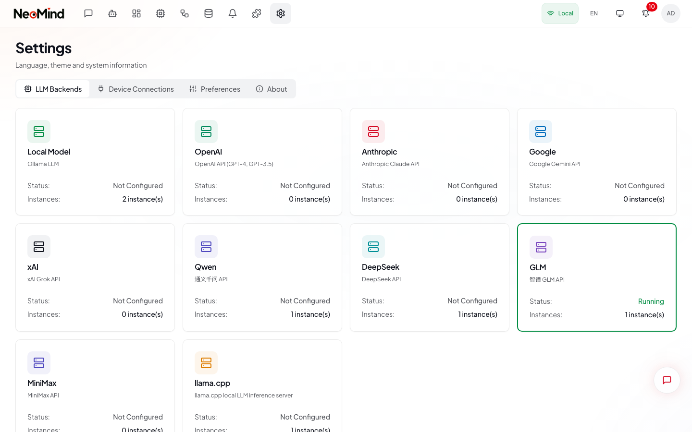
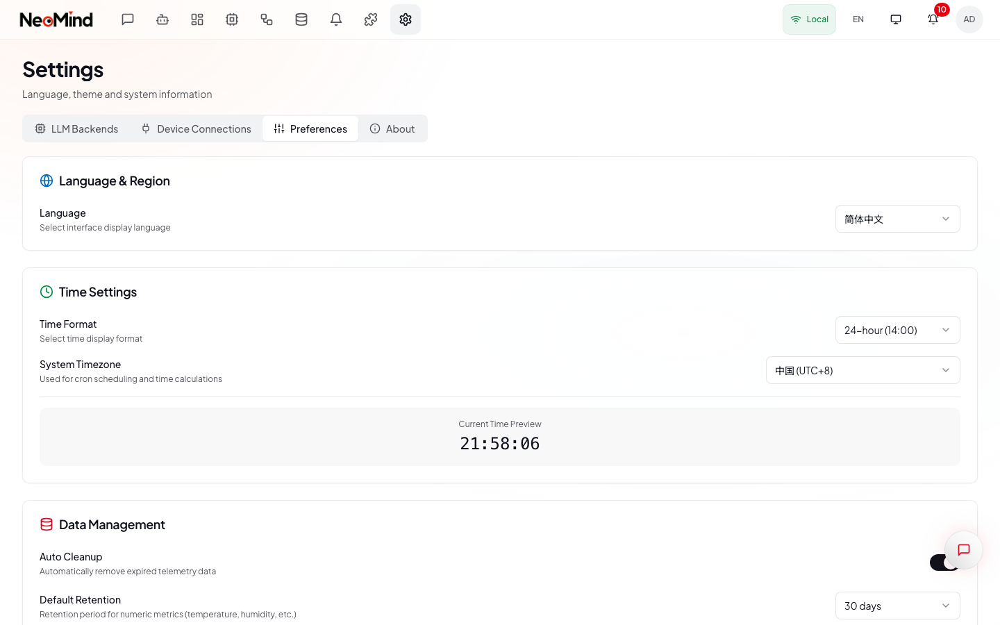

# 系统设置

设置是 AI 模型连接、设备接入、界面偏好和数据管理的控制中心。通过侧边栏导航进入，或直接访问 `/settings`。

设置页面分为四个标签页：**LLM 后端**、**设备连接**、**偏好设置** 和 **关于**。使用顶部的标签栏在各个分区之间切换。

---

## LLM 后端

LLM 后端标签页管理你的 AI 模型连接。NeoMind 支持同时运行多个提供商——例如本地 Ollama 处理快速隐私任务，云端模型处理复杂推理。

1. **提供商卡片网格**——每张卡片代表一个支持的提供商（Ollama、OpenAI、Anthropic 等），显示其名称、状态和已配置的实例数量。
2. **活跃标记**——带有绿色边框和"运行中"状态的提供商卡片表示当前活跃的后端。
3. **点击卡片** 可进入该提供商的详细配置视图。

### 支持的提供商

| 提供商 | 需要 API 密钥 | 默认端点 | 说明 |
|--------|---------------|----------|------|
| **Ollama** | 否 | `http://localhost:11434` | 本地优先；使用 `/api/chat` |
| **llama.cpp** | 否 | `http://127.0.0.1:8080` | 直接集成 llama-server |
| **OpenAI** | 是 | `https://api.openai.com/v1` | 完整 Function Calling 支持 |
| **Anthropic** | 是 | `https://api.anthropic.com/v1` | 支持思考模式 |
| **Google** | 是 | `https://generativelanguage.googleapis.com/v1beta` | 支持视觉和思考 |
| **xAI** | 是 | `https://api.x.ai/v1` | Grok 系列模型 |
| **Qwen** | 是 | `https://dashscope.aliyuncs.com/compatible-mode/v1` | 阿里云；支持视觉 |
| **DeepSeek** | 是 | `https://api.deepseek.com/v1` | 推理模型 |
| **GLM** | 是 | `https://open.bigmodel.cn/api/paas/v4` | 智谱 AI；支持视觉 |
| **MiniMax** | 是 | `https://api.minimax.chat/v1` | 支持视觉 |

### 添加后端

1. 进入 **设置 > LLM 后端**。
2. 点击要配置的提供商卡片（如 **Ollama**）。
3. 在详细视图中，点击 **添加实例**。
4. 填写配置对话框：
   - **名称**——用于标识的标签，如"本地 Ollama"或"GPT-4o 生产环境"。
   - **端点**——API 基础 URL。默认已填入提供商预设值。
   - **模型**——模型标识符，如 `qwen3.5:4b`、`gpt-4o-mini`。
   - **API 密钥**——云服务商必填。Ollama / llama.cpp 无需填写。
   - **Temperature**、**Top P**、**Top K**——可选采样参数。
5. 点击 **测试连接** 验证可达性。成功后会显示响应延迟。
6. 点击 **保存**。

新实例将自动成为活跃后端。

### 测试与管理实例

每个已配置的实例以卡片形式显示在提供商详细视图中。卡片上展示实例名称、模型、端点和测试结果。

- **测试按钮**（试管图标）——发送一个轻量级请求，验证端点是否可达、API 密钥是否有效、模型是否可用。
- **编辑按钮**（铅笔图标）——打开配置对话框，修改端点、模型或 API 密钥。
- **删除按钮**（垃圾桶图标）——确认后移除该实例。

### 连接问题排查

如果连接测试失败：

1. **Ollama**：服务是否在运行？执行 `ollama serve` 并检查 11434 端口。
2. **云服务商**：API 密钥是否有效且未过期？端点是否包含 `/v1`？
3. **llama.cpp**：服务是否已启动？执行 `llama-server -m model.gguf`。
4. **网络**：使用云服务商时，确保出站 HTTPS 连接未被阻止。

---

## 设备连接

设备连接标签页配置 IoT 设备与 NeoMind 的连接方式。支持两种适配器类型：**MQTT**（流式遥测数据）和 **Webhook**（HTTP 推送）。

详细的设备接入配置请参阅 [设备接入](./04a-device-connection.md)。

### MQTT

点击 **MQTT** 卡片可查看内置 Broker 及已添加的外部 Broker。内置 Broker 默认运行在 1883 端口。

- **添加连接** 可注册外部 MQTT Broker，配置自定义地址、端口、认证信息和 TLS 设置。
- **测试** 每个 Broker 以验证连通性。

### Webhook

点击 **Webhook** 卡片可查看 Webhook URL 模板和使用说明。设备通过 HTTP POST 推送数据——无需持久连接。复制 Webhook URL 并将 `{device_id}` 替换为你的设备 ID 即可。

---

## 偏好设置

偏好设置标签页控制语言、时间显示和数据清理策略。

1. **语言**——在中文和英文之间切换。更改后点击 **保存设置** 立即生效。
2. **时间格式**——选择 12 小时制或 24 小时制显示。
3. **系统时区**——选择你的 IANA 时区。用于仪表板图表、规则调度和日志时间戳。
4. **当前时间预览**——以所选时区和格式显示当前时间，方便验证。

更改语言或时间格式后，点击 **保存设置** 应用。点击 **重置** 可放弃更改。

### 数据管理

偏好设置中的数据管理卡片控制自动数据清理：

1. **自动清理**开关——启用或禁用自动清理任务。
2. **默认保留期**——设备遥测数据的存储时长。可选范围从 12 小时到 90 天，或选择"永久"以无限保留。
3. **图片保留期**——上传图片（聊天、仪表板）的保留时长。与遥测数据保留期独立设置。
4. **立即清理**按钮——手动触发一次即时清理，清除过期数据。

| 保留时长 | 适用场景 |
|----------|----------|
| 12 小时 - 3 天 | 资源受限设备、高频传感器 |
| 7 - 30 天 | 日常使用、周趋势分析 |
| 90 天 | 长期分析、低频事件传感器 |
| 永久 | 归档用途；需手动监控磁盘使用 |

> **提示**：对于长期存储需求，可使用数据推送功能将遥测数据转发到外部数据库（InfluxDB、TimescaleDB），同时保持较短的本地保留期。

---

## 关于

关于标签页显示系统信息和版本详情：

- **系统信息**——平台、架构、CPU 核心数、GPU（如检测到）、内存使用情况及可视化进度条。
- **项目信息**——NeoMind 版本号、许可证（Apache-2.0）及 GitHub 仓库链接。
- **检查更新**——仅在桌面端（Tauri）应用中可用。点击可检查是否有新版本。

---

[< 返回安装部署](./01-installation.md) | [下一篇：AI 对话 >](./03-chat.md)
