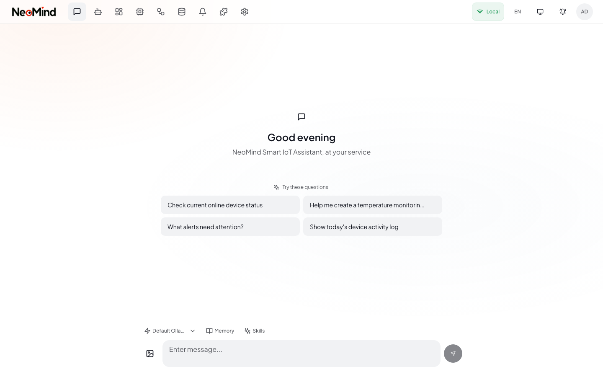
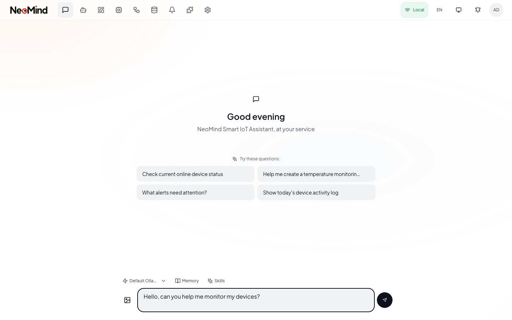

# AI 对话

AI 对话页面（路径 `/` 或 `/chat`）是 NeoMind 的主要入口。你可以通过自然语言查询设备状态、控制执行器、创建自动化规则、分析数据——一切尽在对话之中。

> **界面标注**：① 顶部标题栏，包含菜单按钮、Logo 和用户头像。② 消息历史区域，显示用户消息和 AI 回复。③ 工具调用过程卡片（可折叠），展示设备查询或命令执行详情。④ 输入工具栏，包含模型选择器、附件按钮和技能选择器。⑤ 文本输入框与发送按钮。

---

## 打开对话

有两种方式进入对话页面：

1. **直接导航**：在浏览器中访问 `/` 或 `/chat`。如果当前没有会话，系统会自动创建一个新的。
2. **全局对话按钮**：在其他页面（设备、规则等），点击右下角的浮动对话按钮，会打开全屏对话浮层。浮层拥有独立的会话，不影响主页面。

> **新会话状态**：当会话中没有任何消息时，你会看到一个欢迎区域，其中包含推荐提示词。点击任意推荐即可将其填入输入框，也可以直接输入自己的消息。

---

## 会话管理

### 会话历史抽屉

点击标题栏左上角的**菜单**按钮（汉堡图标），即可打开会话历史抽屉。抽屉从左侧滑入，按时间分组显示所有历史对话：**今天**、**昨天**、**本周**、**更早**。

每条会话条目显示：
- 会话标题（根据第一条消息自动生成，也可手动重命名）
- 最后一条消息的预览
- 相对时间戳
- 消息数量

**搜索**：在抽屉顶部的搜索框中输入关键词，即可按标题或内容过滤会话。

### 切换会话

在抽屉中点击任意会话即可切换。对话区域会加载该会话的完整消息历史。当前活跃的会话会以边框和强调色高亮显示。

### 创建新会话

1. 打开会话抽屉。
2. 点击抽屉顶部的**新建对话**按钮。
3. 系统会打开一个空白会话，显示欢迎区域和推荐提示词。

另外，在完整对话页面中，直接访问 `/chat`（不带会话 ID）也会自动创建新会话。

### 删除会话

1. 在抽屉中将鼠标悬停在某条会话上。
2. 点击右侧出现的**垃圾桶**图标。
3. 在弹出的确认对话框中确认删除。该会话及其所有消息将被永久删除。

---

## 发送消息

### 文本输入

在对话区域底部的文本框中输入你的消息。输入框会随着内容增加自动向上扩展，达到最大高度后停止。

| 按键 | 操作 |
|------|------|
| **Enter** | 发送消息 |
| **Shift+Enter** | 换行（不发送） |
| **Escape** | 关闭推荐面板 |
| **/**（在空输入框开头输入） | 打开命令推荐 |

### 图片附件

你可以附加图片让 AI 进行分析（设备照片、错误截图、示意图等）：

1. 点击输入工具栏中的**图片**按钮。
2. 从文件系统中选择一张或多张图片。
3. 图片缩略图会显示在输入框上方。悬停并点击 X 即可移除附件。
4. 输入可选的文字提示，然后发送。

你也可以将图片文件直接**拖放**到输入区域。支持的格式：PNG、JPEG、WebP（每张最大 10 MB）。

> **注意**：图片分析需要使用支持视觉的模型。如果当前模型不支持图片，附件按钮会显示为禁用状态。支持视觉的模型包括 `gpt-4o`、`qwen2.5-vl`、`qwen3.5`、`gemini-1.5-flash` 等。

### 推荐提示词

在空输入框的开头输入 **/** 即可打开推荐面板。推荐内容会根据你的设备、当前时间和近期活动智能匹配。使用方向键导航，按 Enter 选择。

---

## AI 回复

### 流式文本

AI 回复以 token 为单位逐字流式输出。你可以实时看到答案逐步生成。

### 思考块

对于推理类模型（Qwen3、DeepSeek-R1 等），AI 的内部推理过程会显示在回复上方的**思考**块中。该块可折叠——点击标题即可展开或收起。当 AI 进行多轮推理时，每一轮会标注（R1、R2……）并以不同颜色的标签区分。

### 工具调用过程卡片

当 AI 执行工具（查询设备、创建规则、发送命令等）时，回复文本上方会出现**工具调用过程卡片**。卡片显示：

- 摘要标题，包含工具调用次数和步骤数（例如"3 次工具调用 · 2 个步骤"）
- 每个步骤的工具调用及状态指示：已完成（绿色勾选）、进行中（黄色旋转）、等待中（灰色圆点）
- 展开单个工具调用可查看其参数和格式化 JSON 结果
- 当工具调用超过 4 次且全部完成时，卡片会自动折叠

### 流式进度条

在长时间操作期间，底部会出现进度条，显示当前阶段（思考、收集数据、执行、生成回复）和已用时间。

> **流式输出期间**：输入框被禁用并显示"正在输入"提示。发送按钮呈脉冲闪烁状态，表示流式输出正在进行中。点击替换发送按钮的 X 按钮可取消输出。

---

## 模型选择器

点击输入工具栏中的**模型选择器**按钮（闪电图标加模型名称），可以在对话过程中切换 LLM 后端。每个后端显示：
- 健康状态指示点（绿色表示可用，灰色表示不可用）
- 后端名称和模型标识符
- 后端类型（例如 Ollama、OpenAI 兼容）

当前选中的模型会以勾选标记高亮。切换模型不会丢失对话历史。

---

## 技能选择器

输入工具栏中的**技能**按钮（书本图标）可打开可用技能下拉列表。技能提供针对特定场景的指引，帮助 AI 正确执行复杂的多步骤操作。

使用技能的步骤：
1. 点击输入工具栏中的**技能**按钮。
2. 从下拉列表中选择一个或多个技能。
3. 已激活的技能会以标签形式显示在工具栏下方。点击标签上的 X 可取消选择。
4. 发送消息时，选中的技能会自动包含在 AI 的上下文中。

内置技能覆盖设备接入、仪表盘管理、规则创建、Agent 管理等常见场景。

---

## 多轮对话

AI 会在单个会话内保持完整上下文。你可以通过自然对话构建复杂的工作流：

1. "温室里的温度是多少？"
2. "比昨天高吗？"
3. "如果超过 30 度就打开风扇。"

每条消息都基于之前的上下文——无需重复设备名称或参数。

---

## 快速参考

| 操作 | 方法 |
|------|------|
| 打开会话历史 | 点击标题栏中的菜单按钮 |
| 新建对话 | 在会话抽屉中点击"新建对话" |
| 切换会话 | 在抽屉中点击任意会话 |
| 删除会话 | 悬停后点击垃圾桶图标并确认 |
| 搜索会话 | 在会话抽屉的搜索框中输入关键词 |
| 附加图片 | 点击图片按钮或拖放文件 |
| 切换模型 | 点击输入工具栏中的模型选择器 |
| 激活技能 | 点击技能按钮，从下拉列表中选择 |
| 打开推荐 | 在空输入框中输入 `/` |
| 取消流式输出 | 在输出过程中点击 X 按钮 |

---

[< 返回系统设置](./02-settings.md) | [下一篇：设备管理 >](./04-devices.md)
