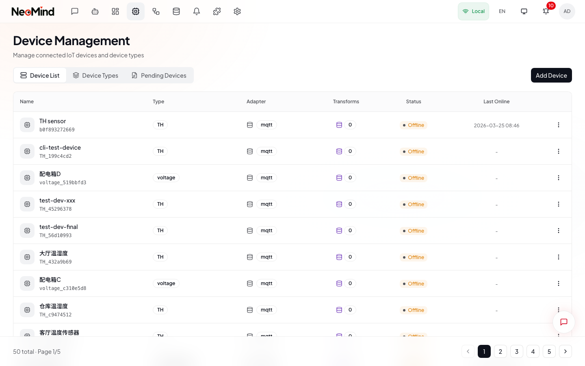
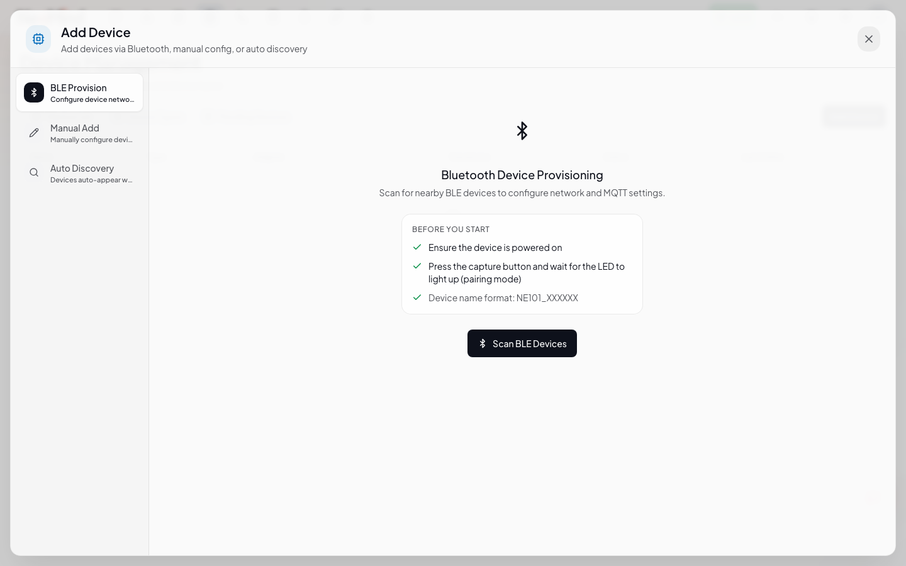
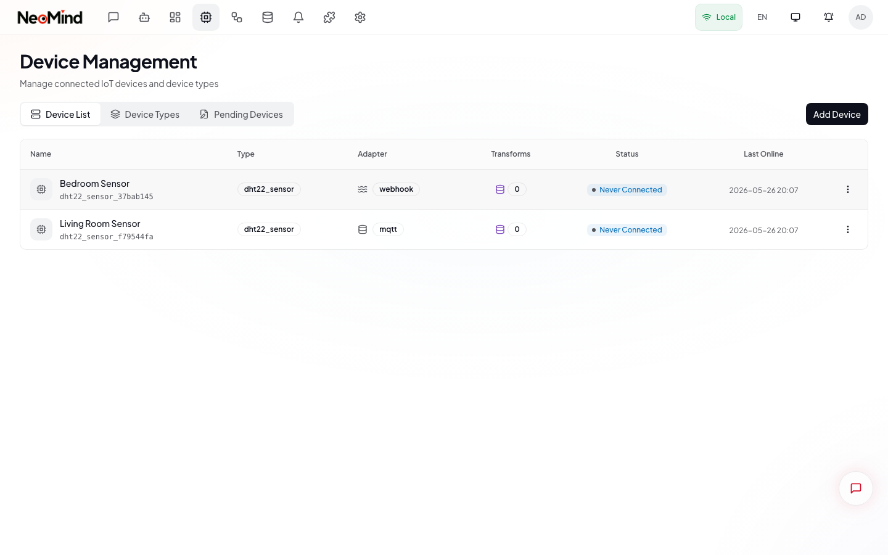
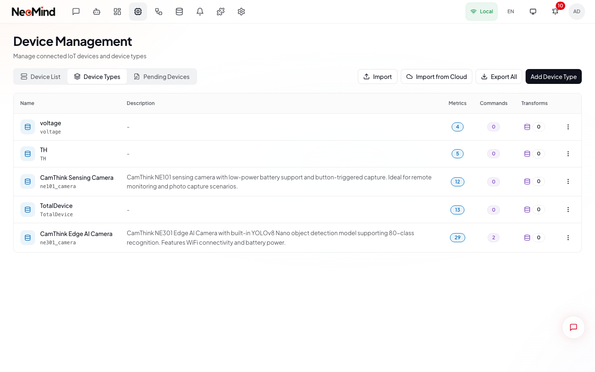

# 设备管理

NeoMind 通过协议适配器连接你的 IoT 设备，采集遥测数据，并支持远程命令控制。本指南将带你了解各页面的具体操作。



> **界面标注**：设备列表页面。每一行显示一台设备，包含**状态指示灯** ①（绿色 = 在线，灰色 = 离线）、**名称和 ID** ②、**类型标签** ③、**适配器** ④（MQTT 或 Webhook）、**数据变换** ⑤，以及**最后活跃时间** ⑥。点击**添加设备** ⑦ 注册新设备。点击任意行可打开设备详情。

---

## 页面概览

设备管理页面位于 `/devices`，包含三个标签页：

| 标签页 | URL | 用途 |
|--------|-----|------|
| **设备** | `/devices` | 所有已注册的设备 |
| **设备类型** | `/devices/types` | 定义指标和命令的模板 |
| **草稿** | `/devices/drafts` | 自动发现后待审批的设备 |

桌面端标签页显示在页面标题栏中，移动端则显示为底部导航栏。

---

## 1. 添加设备

注册新设备的操作步骤：

1. 进入**设备**标签页（默认标签页）。
2. 点击页面标题栏右上角的**添加设备**按钮。
3. 弹出添加设备对话框。



### 对话框字段

按步骤填写以下内容：

**第 1 步 -- 选择设备类型**（必填）

从下拉菜单中选择。设备类型决定了该设备支持哪些指标和命令。如果下拉列表为空，需要先创建设备类型（见第 5 节）。

**第 2 步 -- 设备 ID**（选填）

默认自动生成。点击刷新按钮重新生成，或手动输入自定义 ID。此 ID 将用于 MQTT 主题和 Webhook URL。

**第 3 步 -- 名称**（选填）

便于识别的可读名称。留空则使用设备 ID 或类型名称。

**第 4 步 -- 选择适配器**

从下拉菜单中选择 **MQTT** 或 **Webhook**，下方的配置区域会随之变化。

#### MQTT 配置

选择 MQTT 后，对话框会显示自动生成的主题：

| 字段 | 自动生成的值 |
|------|-------------|
| **遥测主题** | `device/{type}/{id}/uplink` |
| **命令主题** | `device/{type}/{id}/downlink` |

仅当所选设备类型定义了命令时，命令主题字段才会出现。两个主题均可自定义。

将你的硬件或脚本指向遥测主题发布 JSON 数据即可。NeoMind 内嵌的 MQTT 代理监听端口为 `1883`。

#### Webhook 配置

选择 Webhook 后，对话框会显示：

| 字段 | 值 |
|------|-----|
| **Webhook URL** | `http://{server}:9375/api/devices/{id}/webhook` |
| **认证令牌** | 点击钥匙按钮自动生成 `whk_...` 格式的令牌 |

向此 URL 发送 HTTP POST 请求（JSON 格式请求体），并在 `Authorization: Bearer` 请求头中携带令牌。

**第 5 步 -- 点击创建**

设备出现在列表中。在设备开始发送数据之前，状态指示灯显示"离线"。

---

## 2. 查看设备列表

设备标签页以响应式表格展示所有已注册的设备。

### 表格列

| 列名 | 说明 |
|------|------|
| **名称** | 设备显示名称，下方以等宽字体显示设备 ID |
| **类型** | 标签形式显示设备类型标识符 |
| **适配器** | MQTT 或 Webhook，附带图标 |
| **数据变换** | 标签显示已关联的数据变换数量 |
| **状态** | 在线（绿色）或离线（灰色）指示灯 |
| **最后活跃** | 上次收到遥测数据的相对时间戳 |

### 行操作

每行右侧有一个下拉菜单（三点图标），包含：

- **查看详情** -- 打开设备详情视图
- **编辑** -- 打开编辑对话框，修改名称、适配器或配置
- **删除** -- 确认后删除设备

移动端表格会自动切换为卡片布局，点击卡片即可打开详情。

### 分页

列表默认每页显示 10 条记录。移动端使用无限滚动加载。

---

## 3. 设备详情

点击任意设备行（或从下拉菜单中选择"查看详情"）即可打开设备详情视图。URL 变为 `/devices/{deviceId}`。



### 标题栏

标题栏显示：

- **返回按钮** -- 返回设备列表
- **设备图标和名称** -- 名称、类型和设备 ID
- **状态标签** -- 在线或离线，带脉冲指示灯

### 设备信息卡片

顶部附近的信息卡片展示连接详情：

- **连接方式** -- 适配器类型（MQTT 或 Webhook）
- **设备类型** -- 类型标识符
- **最后在线** -- 上次收到数据的时间戳
- **遥测主题** -- MQTT 设备发布数据的主题
- **Webhook URL 和令牌** -- Webhook 设备的 URL 和脱敏令牌

### 实时指标

信息卡片下方，指标以响应式网格展示。每个指标卡片显示：

| 元素 | 说明 |
|------|------|
| **显示名称** | 设备类型定义中的标签 |
| **当前值** | 最新读数，带适当的格式化 |
| **单位** | 数值类型内联显示 |

点击指标卡片可打开全屏历史对话框，以分页表格形式展示带时间戳的数据点。

**虚拟指标**（由数据变换计算得出）以紫色背景和"虚拟"标签区分显示。

### 命令

如果设备类型定义了命令，指标下方会出现命令区域。每个命令以卡片形式展示：

- **命令名称**和显示名称
- **参数标签**显示参数名

点击命令卡片可打开发送命令对话框。

---

## 4. 发送命令

向设备发送命令的步骤：

1. 打开设备详情视图。
2. 在**命令**区域找到目标命令。
3. 点击命令卡片。
4. 在对话框中填写参数。
5. 点击**发送命令**。

### 参数输入

对话框会根据每个参数的数据类型自动适配输入控件：

| 数据类型 | 输入控件 |
|----------|----------|
| **字符串** | 文本输入框 |
| **整数 / 浮点数** | 数字输入框（支持最小/最大值约束） |
| **布尔值** | 是/否切换按钮 |
| **枚举** | 下拉选择框（预定义选项） |
| **二进制** | 文本域（Base64 编码数据） |
| **数组** | 文本域（JSON 数组） |

发送后，结果横幅会显示成功（绿色）或错误（红色）。

> **提示**：你也可以通过 AI 对话发送命令。输入自然语言指令如"把风扇打开"，AI 会自动执行对应命令。

---

## 5. 设备类型

设备类型是定义设备上报哪些指标、支持哪些命令的模板。每台设备必须关联一个类型。

切换到**设备类型**标签页（或导航到 `/devices/types`）。



### 类型表格

| 列名 | 说明 |
|------|------|
| **名称** | 类型显示名称，下方以等宽字体显示标识符 |
| **描述** | 可选的描述文本 |
| **指标** | 指标定义数量（蓝色标签） |
| **命令** | 命令定义数量（紫色标签） |
| **数据变换** | 关联的数据变换 |

### 创建设备类型

1. 在设备类型标签页中，点击**添加设备类型**。
2. 填写定义表单。

支持两种模式：

**完整模式** -- 手动定义每个指标和命令：

- **名称**和**标识符**
- **指标**：分别指定名称、显示名称、数据类型、单位和可选的最小/最大值范围
- **命令**：分别指定名称、显示名称，以及参数的名称、类型和默认值

**简易模式** -- 粘贴示例 JSON 数据，让 AI 自动检测结构：

- AI 会根据你的示例数据推断指标名称、数据类型和建议单位
- 保存前可审查并调整推断结果

### 导入与导出

设备类型标签页标题栏提供额外操作：

- **导入** -- 上传包含一个或多个设备类型定义的 JSON 文件
- **从云端获取** -- 浏览并导入云端共享库中的设备类型
- **全部导出** -- 将所有设备类型下载为 JSON 文件

单个类型可通过行操作菜单导出。

### 设备类型定义示例

```json
{
  "device_type": "dht22_sensor",
  "name": "DHT22 Temperature & Humidity Sensor",
  "metrics": [
    { "name": "temperature", "display_name": "Temperature", "data_type": "float", "unit": "°C", "min": -40.0, "max": 80.0 },
    { "name": "humidity", "display_name": "Humidity", "data_type": "float", "unit": "%", "min": 0.0, "max": 100.0 }
  ]
}
```

---

## 6. 草稿（自动发现）

NeoMind 可以自动检测尚未正式注册但已开始发送 MQTT 数据的设备。

切换到**草稿**标签页（或导航到 `/devices/drafts`）。

### 工作原理

1. 未注册的设备向匹配 `device/{type}/{id}/uplink` 格式的 MQTT 主题发布 JSON 数据。
2. NeoMind 检测到未知设备，创建一条草稿记录。
3. 草稿出现在草稿标签页中，附带已采集的样本数据。
4. 你可以审查草稿并决定批准或拒绝。

### 草稿列表

每条草稿记录显示：

- **状态** -- 待审批（黄色）、已批准（绿色）或已拒绝（红色）
- **设备信息** -- 从 MQTT 主题推断的类型和 ID
- **样本数据** -- 最后接收到的数据预览
- **时间戳** -- 草稿创建时间

### 批准草稿

1. 点击草稿行展开详情。
2. 审查样本数据和 AI 推断的设备类型。
3. 点击**批准**，将草稿转为正式设备。
4. 设备移至设备标签页，开始正常跟踪。

### 自动发现配置

点击草稿标签页中的**配置**按钮可调整以下设置：

| 设置 | 默认值 | 说明 |
|------|--------|------|
| **启用** | 开 | 开关自动发现功能 |
| **最大样本数** | 10 | 每条草稿采集的最大样本数 |
| **保留时间** | 24 小时 | 草稿在自动清理前的保留时长 |

---

## 快速参考

### 支持的适配器

| 适配器 | 协议 | 适用场景 | 连接方式 |
|--------|------|---------|----------|
| **MQTT** | MQTT v5 | 传感器、执行器、微控制器 | TCP 持久连接，端口 1883 |
| **Webhook** | HTTP POST | 支持 REST 的设备、脚本、API | 请求/响应模式 |

### 典型工作流

```
创建设备类型 → 添加设备 → 连接硬件 → 监控指标 → 发送命令
```

1. 定义一个**设备类型**，包含指标和命令。
2. 使用该类型**添加设备**，选择适配器。
3. 配置硬件，将数据发布到生成的主题或 URL。
4. 在**设备详情**视图中监控实时指标。
5. 发送命令远程控制设备。

---

> **下一篇**：MQTT 主题详解、Webhook 认证、TLS/mTLS、以及完整代码示例（Python、ESP32、Node.js），请参阅 **[设备连接技术参考](./04a-device-connection.md)**。

---

[< 返回 AI 对话](./03-chat.md) | [设备连接技术参考 >](./04a-device-connection.md) | [下一篇：自动化 >](./05-automation.md)
