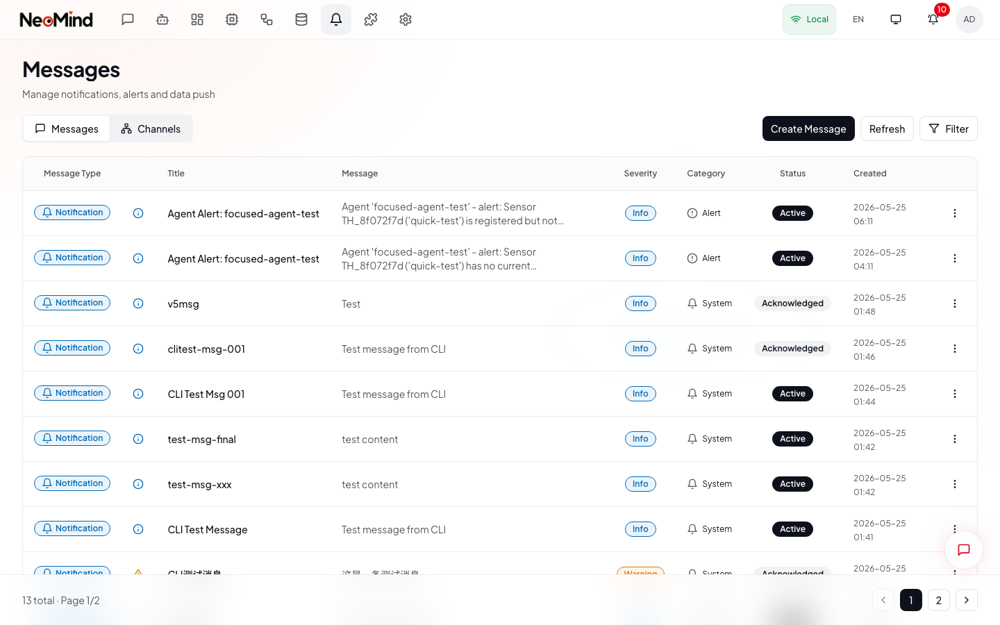

# 消息与通知

> 配置通知通道，追踪消息投递状态。支持 7 大平台：Webhook、邮件、Telegram、企业微信、钉钉、Slack 和飞书。

---

## 概述

**消息**页面（`/messages`）包含两个标签页：

- **消息** -- 投递日志，展示所有已发送通知的状态、严重级别和内容
- **通道** -- 通知通道的配置与管理

所有通知通道均在「通道」标签页中创建、测试和管理。通道创建后，可被自动化规则（NOTIFY 动作）或智能体引用，用于发送告警。

---

## 第 1 步：打开消息页面

1. 在顶部导航栏点击 **消息**。
2. 页面默认打开 **消息** 标签页，展示投递日志。
3. 点击 **通道** 标签页，管理通知通道。

> **上图说明**：消息 > 通道标签页。每行通道（①）显示名称、类型标签、启用/禁用状态和 **测试** 按钮。操作菜单（三点图标）提供查看、编辑、配置过滤器、启用/禁用和删除选项。点击 **创建通道**（②）创建新的通知通道。

---

## 第 2 步：创建通道

1. 在 **通道** 标签页，点击右上角的 **创建通道**。
2. 打开全屏对话框，左侧导航面板列出所有通道类型。移动端通道类型以水平滚动标签形式展示在顶部。

### 选择通道类型

3. 在导航面板中点击以下 7 种通道类型之一：

| 通道类型 | 说明 | 必填字段 |
|---|---|---|
| **Webhook** | 向任意 URL 发送 HTTP POST 请求 | URL |
| **邮件** | 通过 SMTP 发送邮件 | SMTP 服务器、端口、用户名、密码、发件人地址 |
| **Telegram** | 通过 Bot 向聊天发送消息 | Bot Token、Chat ID |
| **企业微信** | 群机器人 Webhook | Webhook Key |
| **钉钉** | 自定义机器人 Webhook | Access Token，可选 Secret |
| **Slack** | Incoming Webhook | Webhook URL |
| **飞书** | 自定义机器人 Webhook | Hook ID，可选 Secret |

4. 输入 **通道名称**（如「运维 Telegram」）。该名称用于在规则中引用通道，也会显示在投递日志中。

---

## 第 3 步：配置通道

每种通道类型有各自的配置表单，请根据所选类型填写必要字段。

### Webhook

| 字段 | 必填 | 说明 |
|---|---|---|
| URL | 是 | 接收 POST 请求的端点地址 |
| 认证类型 | 否 | 无认证、Bearer、Basic、API Key 或自定义请求头 |
| 超时时间 | 否 | 请求超时时间（秒），默认 30 秒 |

选择认证类型后，会出现相应的额外字段：
- **Bearer** -- Token 字段
- **Basic** -- 用户名和密码字段
- **API Key** -- Header 名称（默认 `X-API-Key`）和 API Key 值
- **自定义请求头** -- 可添加多个请求头名称-值对

### 邮件（SMTP）

| 字段 | 必填 | 说明 |
|---|---|---|
| SMTP 服务器 | 是 | 服务器地址（如 `smtp.gmail.com`） |
| SMTP 端口 | 否 | 端口号（TLS 默认 `587`，SSL 默认 `465`） |
| 用户名 | 是 | SMTP 登录名（通常为邮箱地址） |
| 密码 | 是 | SMTP 密码或应用专用密码 |
| 发件人地址 | 是 | 发件人邮箱地址 |

保存后，使用操作菜单中的 **管理收件人** 选项添加接收通知的邮箱地址。

**Gmail 快速配置**：在 Google 账号启用两步验证，在 `myaccount.google.com/apppasswords` 生成应用专用密码，将其作为 SMTP 密码使用。

### Telegram

| 字段 | 必填 | 说明 |
|---|---|---|
| Bot Token | 是 | 从 @BotFather 获取的 Token（格式：`123456789:ABCdef...`） |
| Chat ID | 是 | 目标聊天 ID（群组为 `-100xxx` 格式） |

**配置步骤**：
1. 打开 Telegram，搜索 **@BotFather**，发送 `/newbot`
2. 复制 Bot Token
3. 向机器人发送一条消息，然后访问 `https://api.telegram.org/bot<TOKEN>/getUpdates` 获取 Chat ID
4. 将两者粘贴到 NeoMind 中

### 企业微信

| 字段 | 必填 | 说明 |
|---|---|---|
| Webhook Key | 是 | 群机器人 Webhook URL 中的 key 参数 |

**配置方法**：在企业微信中，打开目标群 > 群设置 > 群机器人 > 添加机器人 > 复制 Webhook URL > 提取其中 `key=` 参数的值。

### 钉钉

| 字段 | 必填 | 说明 |
|---|---|---|
| Access Token | 是 | 自定义机器人 Webhook URL 中的 Token |
| Secret | 否 | HMAC 签名验证密钥（建议启用） |

**配置方法**：在钉钉中，打开目标群 > 群设置 > 智能群助手 > 添加机器人 > 自定义（通过 Webhook）> 选择加签模式，复制 Token 和 Secret。

### Slack

| 字段 | 必填 | 说明 |
|---|---|---|
| Webhook URL | 是 | Slack 应用中的 Incoming Webhook URL |

**配置方法**：前往 `api.slack.com/apps` > Create New App > Incoming Webhooks > Add New Webhook to Workspace > 复制 URL。

### 飞书

| 字段 | 必填 | 说明 |
|---|---|---|
| Hook ID | 是 | 自定义机器人的 Hook ID（Webhook URL 的最后一段路径） |
| Secret | 否 | HMAC 签名验证密钥 |

**配置方法**：在飞书中，打开目标群 > 设置 > 群机器人 > 添加机器人 > 自定义机器人 > 复制 Webhook URL 并提取 Hook ID。

---

## 第 4 步：测试通道

5. 点击 **保存** 创建通道。
6. 在通道列表中，点击通道名称旁的 **测试** 按钮，系统将通过该通道发送一条示例消息。
7. 测试结果会显示在通道名称下方：绿色对勾表示成功，红色叉号表示失败并附带错误信息。

在正式使用前务必进行测试。测试会验证网络连通性、凭据有效性和消息格式。如果测试失败，请根据错误信息排查具体问题。

---

## 第 5 步：管理通道

在 **通道** 标签页中，使用每行通道的操作菜单（三点图标）：

| 操作 | 说明 |
|---|---|
| **查看** | 打开通道详情（名称、类型、配置、状态） |
| **编辑** | 重新打开通道编辑器修改配置 |
| **配置过滤器** | 设置该通道接受的消息来源类型、分类和最低严重级别 |
| **管理收件人** | （仅邮件）添加或移除收件人邮箱地址 |
| **启用 / 禁用** | 切换通道状态而不删除。禁用的通道不会收到消息 |
| **删除** | 永久移除通道 |

**通道过滤器**控制哪些消息会转发到特定通道。例如，你可以配置一个仅接收设备来源的 `critical` 和 `emergency` 严重级别消息的专用通道。

---

## 第 6 步：查看投递日志

切换到 **消息** 标签页查看所有通知消息。

### 消息表格

每条消息记录包含：

| 列 | 说明 |
|---|---|
| 类型 | 通知类型标签 |
| 严重级别 | 严重级别图标和标签：信息、警告、严重、紧急 |
| 标题 | 消息标题 |
| 内容 | 消息正文（截断显示），可附带标签 |
| 分类 | 消息分类（告警、系统、业务、通知） |
| 状态 | 活跃、已确认、已解决、已归档 |
| 时间 | 消息创建时间 |

### 筛选消息

点击标签栏中的 **筛选** 按钮打开筛选面板：
- **严重级别** -- 按信息、警告、严重、紧急筛选
- **状态** -- 按活跃、已确认、已解决、已归档筛选
- **分类** -- 按数据中发现的消息分类筛选

已启用的筛选条件会以可移除标签的形式显示在表格上方。

### 消息操作

点击任意消息的操作菜单（三点图标）或打开其详情对话框：

| 操作 | 说明 |
|---|---|
| **查看详情** | 打开消息详情对话框，展示完整内容、来源、时间、标签和元数据 |
| **确认** | 将活跃消息标记为已查看（状态变为「已确认」） |
| **解决** | 将消息标记为已处理（状态变为「已解决」） |
| **删除** | 永久移除该消息 |

### 投递重试

系统自动重试失败的消息投递：
- **最大重试次数**：3 次
- **重试间隔**：2 分钟，渐进式退避
- **去重**：相同消息（相同标题 + 来源 + 严重级别）在 60 秒窗口内不会重复发送

所有重试均失败的消息会被标记为永久失败。请在投递日志中查看错误详情。

---

## 第 7 步：在自动化规则中使用通道

通道配置完成后，即可在自动化规则中引用，实现条件触发时自动发送告警。

### 规则 NOTIFY 动作

1. 在顶部导航栏进入 **自动化** 页面。
2. 创建或编辑规则（完整流程参见[自动化与数据](05-automation.md)）。
3. 在 **第 3 步 -- 动作配置** 中，选择 **NOTIFY** 作为动作类型。
4. 从下拉列表中选择一个 **通道**（显示所有已启用的通知通道）。
5. 使用变量编写 **消息模板**：

| 变量 | 说明 | 示例 |
|---|---|---|
| `{device_id}` | 触发设备 ID | `sensor-01` |
| `{metric}` | 指标名称 | `temperature` |
| `{value}` | 当前值 | `37.5` |
| `{threshold}` | 规则阈值 | `35` |
| `{rule_name}` | 规则名称 | `high_temp_alert` |
| `{timestamp}` | 触发时间 | `2026-05-26T14:30:00Z` |

6. 点击 **保存** 激活规则。规则触发时，通知会被排队并通过所选通道投递。

---

## 使用建议

- **先测试再使用** -- 创建或编辑通道后务必点击测试
- **从 Webhook 开始** -- 最灵活的通道类型，兼容任何 HTTP 端点
- **配置多通道冗余** -- 关键告警建议配置多个通道（如 Telegram + 邮件），避免单点故障
- **善用过滤器** -- 配置通道过滤器，仅路由相关消息，避免通知疲劳
- **设置持续时间条件** -- 要求条件持续满足一段时间后再触发，减少噪音
- **查看投递日志** -- 消息标签页展示投递状态和错误详情，便于排查问题

---

[上一页：仪表盘](07-dashboard.md) | [目录](README.md) | [下一页：扩展](09-extensions.md)
